<div align="center">


> 提醒：线上服务暂时不可用（服务器过期），本地可按本文档启动体验。  

</div>

## 项目总览

### 访问路径

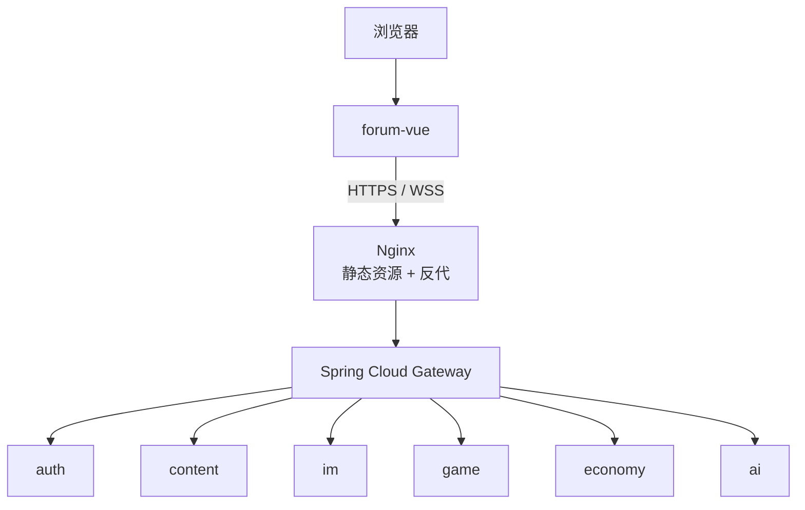

### 六域各自落库

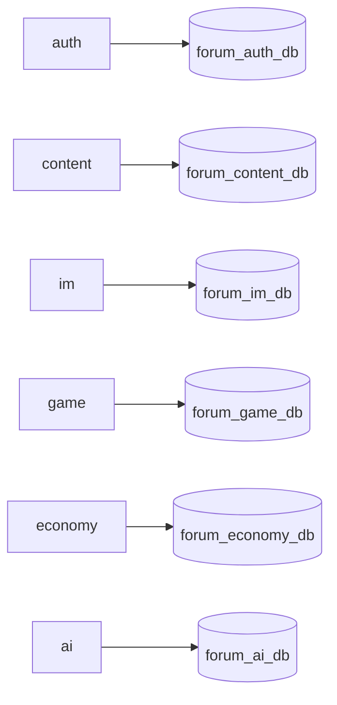

### 共享能力与旁路

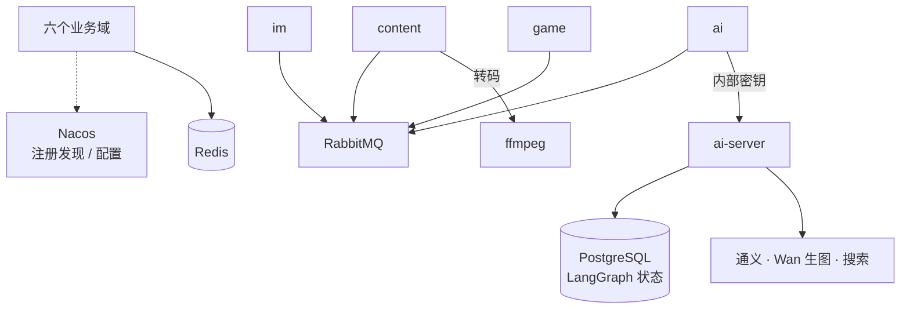

请求单向分层：用户端 → Nginx → Gateway → 对应业务域。六个 Java 域各自持有 `api` 契约和 `server` 实现，靠 Nacos 注册发现；MySQL 按域拆库。AI 生成在 Python，Java `ai` 域管额度、会话和落库。生图走通义 Wan。

### 目录

| 目录 | 负责什么 |
| --- | --- |
| `forum-vue` | 用户端页面、编辑器、互动与看板娘 |
| `java-cloud-standalone` | Gateway + 六域 `api`/`server` + `common` |
| `ai-server` | 审核、摘要、创作、检索、推荐、看板娘 |
| `deploy` | Compose、Nginx、打包与发布脚本 |
| `scripts` | 本地中间件与首次建库 |

### 端到端协作

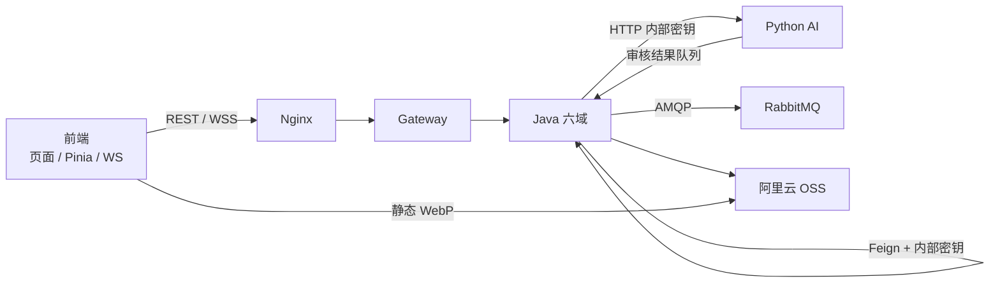

边界一句话：

- **前端**：展示、交互、登录拦截；不直接调模型，不信自己带的用户 ID
- **Java**：权限、状态机、落库、跨域编排；最终业务真相在这里
- **Python**：生成与检查；结论回 Java，自己不写社区业务库；生图只用通义 Wan

## 核心功能展示


## 微服务架构

### 六域职责

| 域 | 进程 | 数据库 | 主要能力 | Gateway 路径 |
| --- | --- | --- | --- | --- |
| auth | `forum-auth` | `forum_auth_db` | 登录注册、资料、权限快照、验证码 | `/user/**` `/captcha/**` `/mail/**` `/sms/**` |
| content | `forum-content` | `forum_content_db` | 帖子、板块、评论、弹幕、收藏、搜索推荐、音乐厅 | `/article/**` `/board/**` `/favorite/**` `/search/**` `/recommend/**` `/file/**` … |
| im | `forum-im` | `forum_im_db` | 私信、群聊、通知、未读 | `/message/**` `/group-chat/**` `/notice/**`；WS `/ws/notify` |
| game | `forum-game` | `forum_game_db` | 大厅、房间、对局、排行、回放 | `/game/**`；WS `/ws/game-center/**` `/ws/games/**` |
| economy | `forum-economy` | `forum_economy_db` | 积分、签到、星辉商城、抽奖、会员订单与支付；会员配额为通用额度 + Wan | `/points/**` `/checkin/**` `/vip/**` `/lottery/**` `/starlight/**` |
| ai | `forum-ai` | `forum_ai_db` | AI 额度、会话、看板娘业务落库、创作工作区；生图额度只计 Wan | `/ai/**` `/mascot/**` |

跨域只依赖对方的 `xxx-api`，消费方本地声明 Feign；不共享 Entity、Mapper、Service 实现。

### 单域内部分层

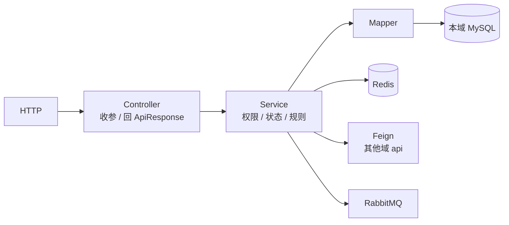

同一条帖子无论从首页、搜索、收藏还是看板娘进来，数据都回 `content`；账号身份由 `auth` 提供快照，其他域按需读取。

### 模块依赖关系

入口到业务域：

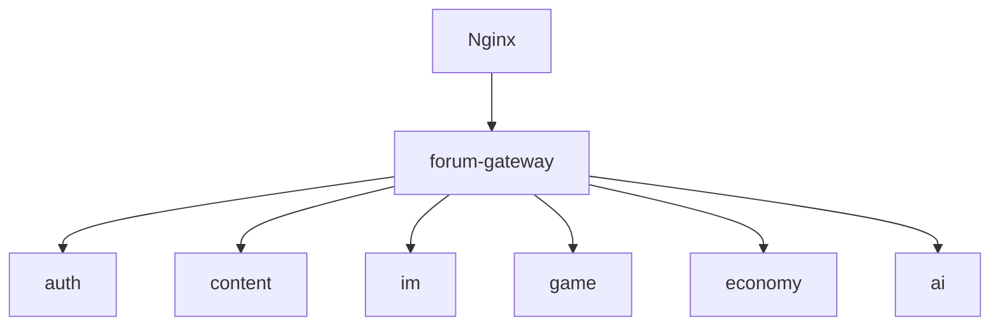

每个域都依赖的公共能力：

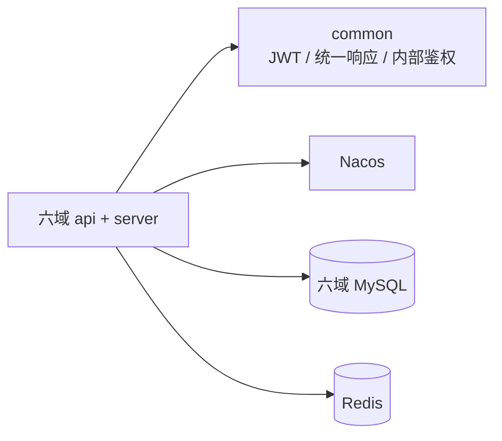

只有部分域才有的旁路：

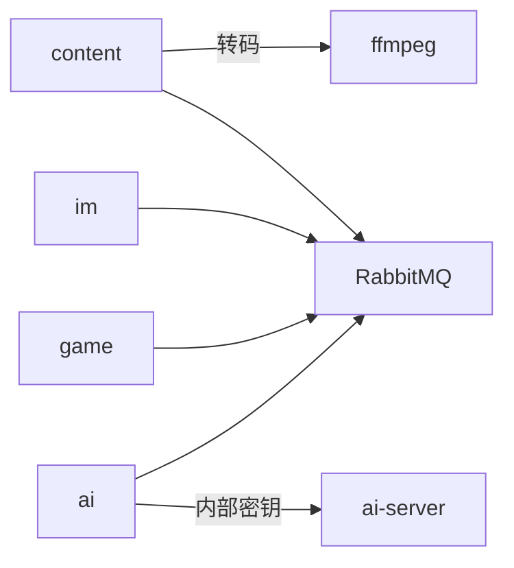

## Java 端

代码在 `java-cloud-standalone`。调用链固定为 Controller → Service → Mapper；写操作带事务；业务状态只允许 Service 推进。

### 技术选型

| 依赖 | 用途 |
| --- | --- |
| Spring Boot 3.5 / Spring Cloud Gateway | Web、AMQP、Mail、WebSocket、路由 |
| MyBatis-Plus | Lambda 查询与分页 |
| JJWT | 登录态签发解析 |
| Nacos | 注册发现与配置 |
| OpenFeign | 跨域调用 |
| RabbitMQ | 审核等异步任务 |
| 阿里云 OSS / 短信 | 媒体与验证码 |
| tianai-captcha / ip2region | 滑块验证码、IP 属地 |

### 帖子发布与审核

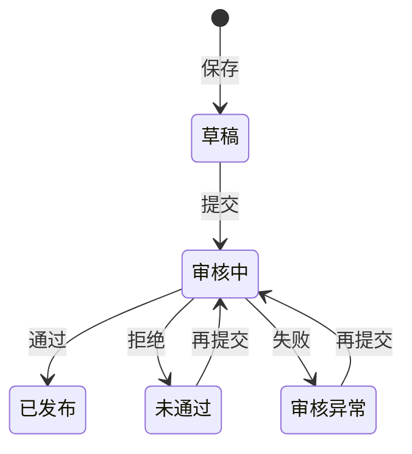

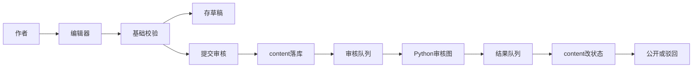

要点：

- 最终是否公开由 Java 决定，AI 只给检查结果与摘要
- 每次提交写入 `audit_task_id`，对应 Python LangGraph `thread_id`
- 审核期间字段锁定，前端没有直接改状态的入口

### 互动与通知

写互动记录：

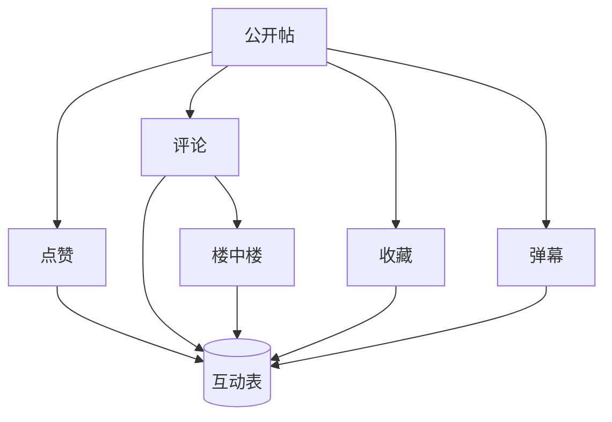

发通知：

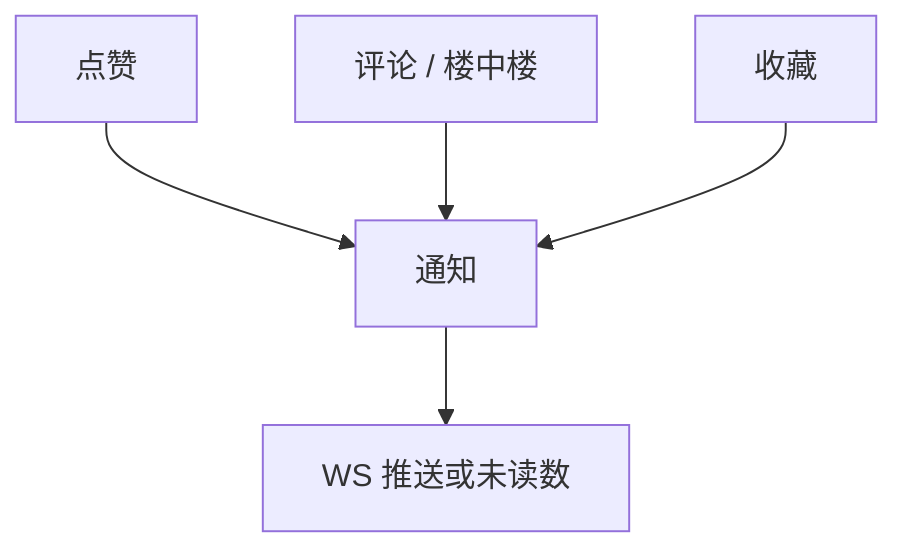

互动记录与帖子正文分表；展示时再组合。通知走 im 域，可实时推，也可断线后补未读。

### 内容治理与举报

发布前的审核之外，还有一条用户驱动的举报管线，帖子、评论、弹幕、私信、歌曲共用它。

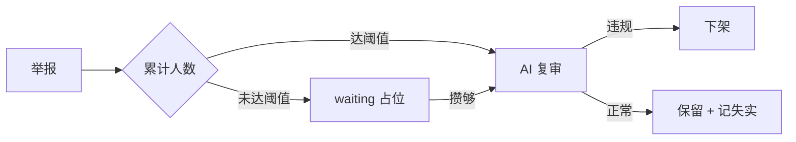

歌曲要累计到若干个不同用户才触发 AI，成本不会被单个用户刷掉；攒着的举报单挂占位任务号，
达到阈值时一次性改写成真 taskId，先举报的人照样收到结论。举报人自身也有每日上限与失实停权。

作者自删和判违规删除的处理不一样：

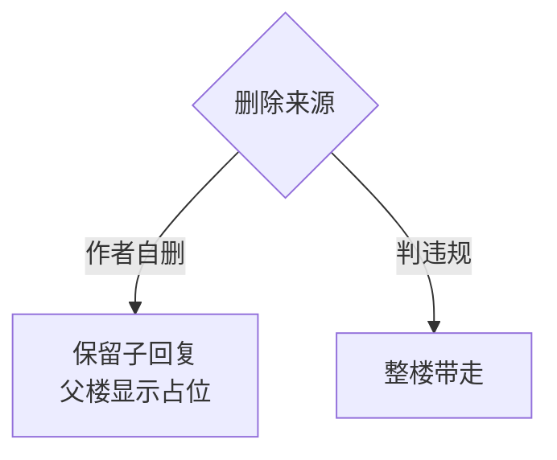

自删保留子回复，是因为楼中楼里往往有别人的对话，一起删掉等于替他人做决定。

### 搜索、热帖与推荐

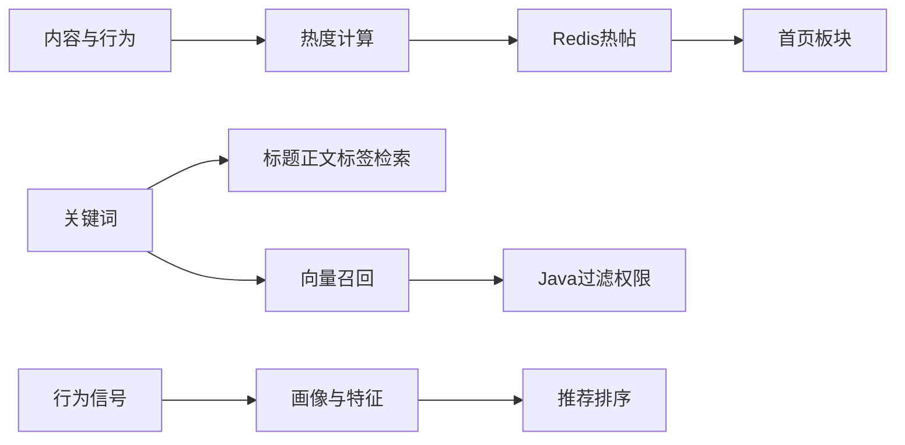

搜索模块返回候选 ID 和分数；可见性、分页、不感兴趣过滤在 Java。推荐 AI 异步提炼特征，排序规则仍在 content。

### 私信、群聊与实时

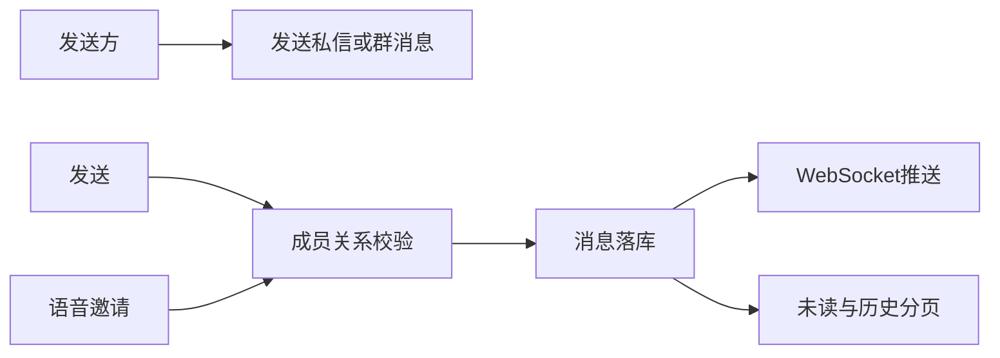

先存后推。重连后从数据库补历史，不依赖当时是否在线。

### 游戏中心

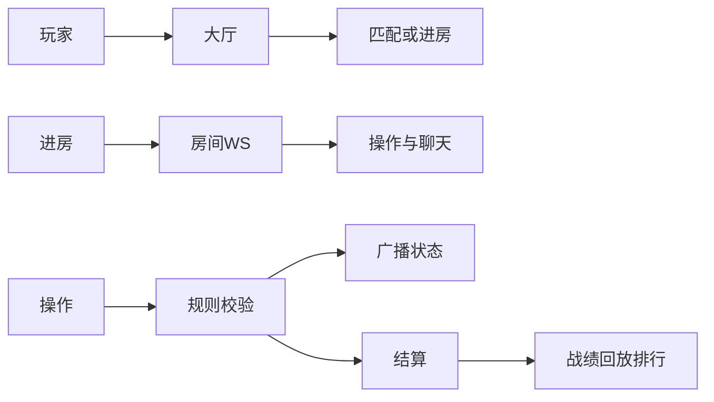

五子棋、井字棋、俄罗斯方块共用大厅 / 房间 / 结算骨架；对局中状态多在内存，结束再写库。

### 积分、签到、商城、抽奖

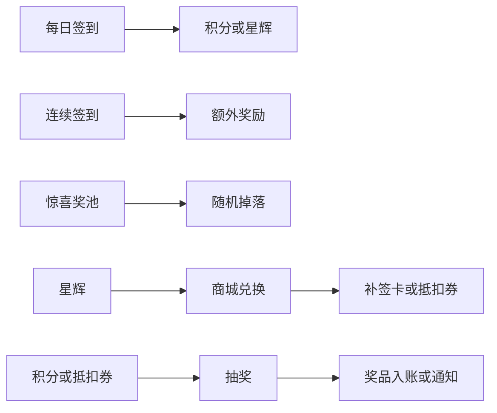

权威钱包与流水在 economy；前端只展示余额与结果。  
会员面板展示通用额度与 Wan 张数；体验卡礼包只发 Qwen / Wan，不再发 GPT 生图额度。

### 会员订单与支付

会员购买走完整的订单流程，而不是「点一下就加权益」。金额一律服务端定价，前端只能提交想买哪一档。

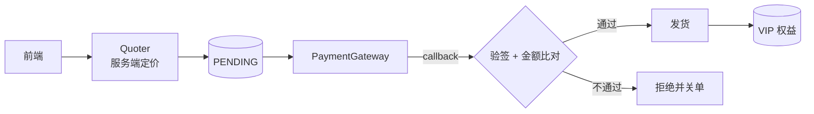

状态单向，没有回头路。发货靠条件更新的影响行数决定，渠道重推同一条回调不会发两次货；收款与发货在同一个事务里。

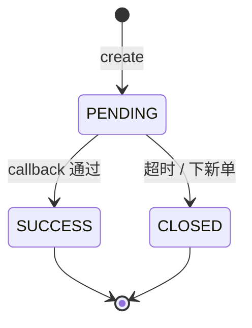

三种订单的发货规则完全不同：

```mermaid
flowchart TB
  T{"当前档位"} -->|无会员| N["new<br/>今天起 30 天"]
  T -->|同档| R["renew<br/>接原到期日"]
  T -->|PRO → MAX| U["upgrade<br/>只补差价"]
  T -->|MAX → PRO| D["拒绝降级"]
```

`renew` 从原到期日往后接，不是从今天算——从今天算会吞掉用户没用完的天数。
`upgrade` 到期日不变，只收按剩余天数折算的档位差价，配额周期重置当作升级奖励。

支付渠道是可替换的：`PaymentGateway` 只有 `createOrder` / `verifyCallback` / `refund` 三个方法。
目前只有本地 `MockPaymentGateway`，但它的**验签是真实的 HMAC-SHA256**——
如果 mock 直接返回「验签通过」，上层永远走不到拒绝分支，换真实渠道那天才会发现失败路径从没跑过。

### 文件生命周期

OSS 用「目录即状态」管理文件，不做定时扫描比对，因此不会产生孤儿文件。

```mermaid
flowchart LR
  UP["上传"] --> P["_pending/"]
  P -->|业务绑定| OK["正式目录"]
  P -->|无人绑定| L1["lifecycle 回收"]
  OK -->|判违规| RM["_removed/"]
  RM --> L2["lifecycle 回收"]
```

上传只落 `_pending/`，业务真正引用时才搬进正式目录；没人认领的由 OSS 生命周期规则按天数收走。
判违规的对象搬进 `_removed/`，播放立刻 404，同时留一个可逆窗口以防误判。

### 主要表分组

| 库 | 代表表 |
| --- | --- |
| auth | `user`、登录日志、关注 |
| content | `article`、评论、弹幕、标签、收藏夹、`user_music*`、推荐设置 |
| im | `message`、群聊、群消息、通知 |
| game | 游戏定义、对局记录、用户战绩 |
| economy | 积分钱包、签到、星辉、抽奖、会员订阅、会员订单流水与 Wan/通用额度礼包 |
| ai | 任务会话、用量、创作工作区、看板娘会话与记忆；周期额度只预占 Qwen 与 Wan |

基线表数量：auth 11 · content 30 · im 14 · game 12 · economy 36 · ai 17。  
建库文件：各域 `server/src/main/resources/db/create.sql`。

## Python 端

代码在 `ai-server`。对外是统一 Gateway：按 `taskType + intent + version` 路由到模块。Java 不直连某个模型。

### 模块地图

| 模块目录 | 能力 |
| --- | --- |
| `moderation` | 帖子文本 / 图片 / 视频审核 |
| `summary` | 帖子摘要 |
| `creation` | 润色、封面提示、Wan 生图、音乐审核解析 |
| `creator_insight` | 创作数据洞察 |
| `rag` | 帖子 / 用户索引写入与删除 |
| `search` | 站内向量 / 关键词召回 |
| `recommendation` | 帖子特征、用户画像 |
| `mascot` | 看板娘 Agent：对话、澄清追问、站内找帖邀约、Wan 生图 |
| `game` | 五子棋 AI 建议步 |

### 调用总览

```mermaid
flowchart LR
  FE["前端"] --> J["Java ai / content"]
  J --> 校验额度与密钥
  校验额度与密钥 --> G["AI Gateway"]
  G --> 模块路由
  模块路由 --> 审核
  模块路由 --> 摘要
  模块路由 --> 创作
  模块路由 --> 检索
  模块路由 --> 推荐
  模块路由 --> 看板娘
  模块路由 --> 游戏AI
  审核 & 摘要 & 创作 & 检索 & 推荐 & 看板娘 & 游戏AI --> 标准结果
  标准结果 --> J
  J --> FE
```

### 审核图

```mermaid
flowchart LR
  待审帖 --> Java发任务
  Java发任务 --> 审核队列
  审核队列 --> LangGraph开始
  LangGraph开始 --> 检正文
  检正文 -->|过| 检图片
  检正文 -->|拒| 汇总
  检图片 -->|过| 检视频
  检图片 -->|拒| 汇总
  检视频 -->|过| Flash摘要
  检视频 -->|拒| 汇总
  Flash摘要 --> 通过
  通过 --> 汇总
  汇总 --> 结果队列
  结果队列 --> Java改帖子状态
```

异步走 RabbitMQ，发帖请求不会卡在模型上。

### 看板娘

```mermaid
flowchart LR
  用户消息 --> 读会话与记忆
  读会话与记忆 -->|历史过长| 压缩摘要
  压缩摘要 --> 读会话与记忆
  读会话与记忆 --> 识别技能
  识别技能 --> 督导分流
  督导分流 -->|生图| 生图节点
  督导分流 -->|对话| 是否联网
  是否联网 -->|是| 搜索工具
  搜索工具 --> 回答
  是否联网 -->|否| 回答
  生图节点 & 回答 --> 保存消息
  保存消息 --> 流式推前端
```

会话与长期记忆落在 Java `forum_ai_db`；LangGraph 运行态在 PostgreSQL。

要点：

- 技能分流：找帖 / 推荐帖走写作能力；帮助技能只答站内怎么用，不替代找帖
- 找帖先发「看看 / 不用」邀约，用户同意后由 Java 做可见性过滤的向量检索
- 意图不清时先出澄清追问面板，流式结束后再展示，答完再继续生成
- 生图只走 Wan 普通档；用量条在重新进入会话时仍保留本轮统计

### 创作与生图

```mermaid
flowchart LR
  编辑器 --> Java校验草稿归属
  Java校验草稿归属 --> 润色或封面提示
  润色或封面提示 --> 返回候选
  返回候选 --> 编辑器
  编辑器 --> 生图请求
  生图请求 --> 图片URL
  图片URL --> 用户确认后Java保存
```

AI 只出候选文本 / 提示词 / 图片地址，不直接改帖子状态。  
封面与看板娘委派生图一律 `quality=normal`（Wan）；非 normal 请求直接拒绝。

### 搜索与 RAG

```mermaid
flowchart LR
  搜索词 --> Java准备候选上下文
  Java准备候选上下文 --> SEARCH模块
  SEARCH模块 --> 向量召回
  向量召回 -->|未命中| 关键词兜底
  向量召回 & 关键词兜底 --> 候选ID与分数
  候选ID与分数 --> Java权限过滤分页
```

```mermaid
flowchart LR
  帖子公开 --> Java确认已提交
  Java确认已提交 --> RAG索引
  RAG索引 --> 向量库
  帖子下架 --> Java触发删除
  Java触发删除 --> 从向量库移除
```

### Python 侧数据

```mermaid
flowchart LR
  Java --> MySQL会话额度创作区
  Java --> Redis缓存去重
  Java --> RabbitMQ审核
  AIGateway --> PostgreSQL检查点
  AIGateway --> 向量检索
  AIGateway --> 通义与搜索工具
```

## 前端

代码在 `forum-vue/front`。Vue 3 + Vite；页面拆 `.vue` / `.js` / `.scss`；接口统一走 `src/api/`，状态经 Pinia Action。

### 技术选型

| 依赖 | 用途 |
| --- | --- |
| Vue 3 + Vite | SPA 与构建 |
| Pinia | 登录态、钱包、板块等 |
| Vue Router | 路由与登录守卫 |
| Element Plus | 组件库 |
| 自研播放器 / 游戏画布 | 音乐厅、对局画面 |

### 页面与接口分层

```mermaid
flowchart LR
  视图Vue --> 脚本js
  脚本js --> api封装
  api封装 --> Axios请求
  Axios请求 --> NginxGateway
  脚本js --> Pinia
  静态大图 --> OSS_WebP
  错误空态图 --> 本地assets
```

### 主要页面能力

| 区域 | 页面方向 | 调哪些域 |
| --- | --- | --- |
| 门户 / 首页 | 未登录展示、信息流、推荐 | content、auth |
| 创作 | 发帖、草稿、创作中心 | content、ai |
| 社交 | 私信、群聊、通知 | im |
| 成长 | 签到、积分、星辉、抽奖、会员 | economy |
| 游戏 | 大厅与房间 | game |
| 音乐厅 | 发现、上传、播放统计 | content、ai |
| 看板娘 | 桌宠对话、澄清追问、找帖邀约、Wan 生图 | ai |

### 登录与受保护操作

```mermaid
flowchart LR
  点击受保护操作 --> 前端登录校验
  前端登录校验 -->|未登录| 引导登录
  前端登录校验 -->|已登录| 发请求
  发请求 --> Gateway
  Gateway --> 业务域
  业务域 -->|401| 前端兜底登出提示
```

登录拦截放在 UI 入口；后端 401 只是兜底。

### 静态资源策略

- 装饰大图、游戏封面、营销图：OSS `forum_images/client/webp/`
- 错误图、空态图、登录壳兜底：留在 `src/assets/images`
- 用户上传内容：业务 OSS 桶，走后端签名 / 服务端上传链路

## 几条跨端主链路

### 发帖审核

```mermaid
sequenceDiagram
  participant FE as 前端
  participant CT as content
  participant MQ as RabbitMQ
  participant PY as ai-server
  FE->>CT: 提交审核
  CT->>CT: 写待审状态与 taskId
  CT->>MQ: 审核任务
  MQ->>PY: 消费并跑审核图
  PY->>MQ: 审核结果
  MQ->>CT: 更新公开或驳回
  CT->>FE: 状态可见
```

### 看板娘对话

```mermaid
sequenceDiagram
  participant FE as 前端
  participant AI as forum-ai
  participant PY as ai-server
  FE->>AI: 发消息
  AI->>AI: 鉴权与扣额度
  AI->>PY: 内部调用
  PY-->>FE: 流式文本或图集
  PY->>AI: 落库会话与记忆
```

前端在流结束后可展示澄清追问或「看看帖子」邀约；用量统计与本地消息合并后，重进会话仍能看到。

### 游戏一局

```mermaid
sequenceDiagram
  participant FE as 前端
  participant GM as forum-game
  FE->>GM: 匹配或进房
  GM-->>FE: 房间状态 WS
  FE->>GM: 操作
  GM->>GM: 规则校验
  GM-->>FE: 广播棋盘或盘面
  GM->>GM: 结束写战绩
```

## 可观测与容错

### 链路追踪

全链路一个 `X-Trace-Id`，同步和异步都覆盖，日志里直接 grep 就能把一次请求的所有落点串起来。

```mermaid
flowchart LR
  GW["Gateway<br/>生成 trace id"] --> SVC["六域<br/>MDC"]
  SVC -->|Feign header| SVC2["下游域"]
  SVC -->|MQ header| WK["worker"]
  SVC -->|header + body| PY["ai-server"]
  SVC2 --> LOG["日志同一 trace id"]
  WK --> LOG
  PY --> LOG
```

这是关联式追踪，不是 span 式：能回答「这个请求去过哪些服务」，不能直接给出每一跳的耗时瀑布图。
对这个规模的项目够用，而且零额外容器、零内存开销。将来要接 OpenTelemetry，
透传点已经全部就位，属于加依赖而不是重做。

### 限流与熔断

只在**已经证明会拖累上游**的跨服务同步调用上加 Sentinel——也就是三个域打向 AI 的边界，
业务 Service 完全不感知规则。没有全局默认规则，没有 dashboard，没有网关限流。

```mermaid
flowchart LR
  SVC["content / game / ai"] --> E["SphU.entry"]
  E -->|正常| CALL["远程调用"]
  E -->|限流| RL["明确错误码"]
  E -->|熔断| DG["明确错误码"]
  CALL -->|异常| TR["traceEntry<br/>计入统计"]
```

降级一定返回明确语义（限流 / 不可用 / 超时），绝不吞掉异常伪装成功。
五子棋是个好例子：远程 AI 熔断后直接退回本地引擎，用户感觉不到。

阈值都放在 Nacos，不硬编码。限流是**每实例**的 QPS，多实例部署时实际压力等于阈值乘以实例数。

## 基础设施

| 服务 | 版本 | 用途 |
| --- | --- | --- |
| Nginx | 1.30.1 | HTTPS、静态资源、反代 |
| Nacos | 3.1.1 | 注册发现与配置 |
| MySQL | 9.7.0 | 六域库 |
| Redis | 8.0 | 缓存与排行，约 256MB |
| RabbitMQ | 4.3 | 审核等异步消息 |
| PostgreSQL | 17 | LangGraph checkpoint |

生产对外只开 Nginx 的 80 / 443；Nacos 与数据库不暴露公网。

## 本地启动

准备：Java 17、Python 3.11、Node.js、Docker Desktop。  
密钥放 Windows 用户环境变量，键名参考 `deploy/.env.example`。

```powershell
# 1) 中间件
.\deploy\scripts\dev-compose.ps1 up -d

# 2) 空库首次建表
.\scripts\init-db.ps1

# 3) 推送 Nacos 配置（首次或配置变更后）
.\deploy\scripts\sync-nacos.ps1

# 4) 前端
cd forum-vue\front
npm install
npm run dev

# 5) Java：IDEA 启动 gateway、auth、content、im、game、economy、ai

# 6) AI
cd ai-server
python main.py
```

Nacos 控制台：http://127.0.0.1:8080/index.html  
本地 Java 连 `127.0.0.1:8848`。

### Windows 下的端口保留问题

Docker Desktop 在 Windows 上走 Hyper-V / WinNAT，系统会**动态保留**若干段高位端口。
本地中间件用的 `33306` / `16530` / `56720` / `54320` 正好落在这个区间，
一旦撞上，`docker compose up` 会报这样一句，看起来像权限问题，其实是端口被系统占了：

```
bind: An attempt was made to access a socket in a way forbidden by its access permissions
```

先确认是不是它：

```powershell
netsh interface ipv4 show excludedportrange protocol=tcp
```

输出里如果包含你要用的端口，有两条路：

```powershell
# 1) 换端口（推荐）——所有宿主端口都可以用环境变量覆盖
$env:MYSQL_HOST_PORT = "33307"; .\deploy\scripts\dev-compose.ps1 up -d

# 2) 让 WinNAT 重新分配保留段（需要管理员，会短暂断开容器网络）
net stop winnat
net start winnat
```

可覆盖的变量：`NACOS_HTTP_HOST_PORT` `NACOS_GRPC_HOST_PORT` `NACOS_CONSOLE_HOST_PORT`
`MYSQL_HOST_PORT` `REDIS_HOST_PORT` `RABBITMQ_AMQP_PORT` `RABBITMQ_MGMT_PORT`
`POSTGRES_HOST_PORT` `FFMPEG_HOST_PORT`。
改了宿主端口记得同步改 Java 的数据源地址，那几个也是环境变量。

## 打包发布

```mermaid
flowchart LR
  源码 --> make-package
  make-package --> 前端dist
  make-package --> 离线镜像
  make-package --> sql基线
  前端dist & 离线镜像 & sql基线 --> 发布包
  发布包 --> 上传服务器
  上传服务器 --> start或up
```

```powershell
cd deploy
.\scripts\make-package.ps1
```

包默认在 `C:\forum-build\luntan-package`。服务器：

```bash
# 首次空库
FORUM_ENV_FILE=/opt/forum-config/prod.env bash start.sh

# 日常更新
FORUM_ENV_FILE=/opt/forum-config/prod.env bash up.sh

# 只建库
FORUM_ENV_FILE=/opt/forum-config/prod.env bash init-db.sh
```

生产密钥在 `/opt/forum-config/prod.env`，发布包不带真实 `.env`。  
有数据的库禁止跑 `init-db` / `reset-db`，改表只用审核过的前向迁移。

### 脚本

部署只有三个入口，其余文件都是被它们调用的内部步骤，不要单独运行。

| 入口 | 在哪跑 | 作用 |
| --- | --- | --- |
| `deploy/scripts/make-package.ps1` | 本地 PowerShell 7 | 构建并校验发布包 |
| `start.sh` | 服务器（包内） | 首次部署：空库建表 + 起服务 |
| `up.sh` | 服务器（包内） | 重新打包后上线：换镜像 + 重启 |

`make-package.ps1` 内部依次调用 `build-all.ps1`（编前端与后端、构镜像）、`export-images.ps1`（组包并生成包内 `start.sh`/`reset-db.sh`/`collect-logs.sh`/`DEPLOY.txt`）、`verify-package.ps1` 与 `test-production-tls.ps1`（校验包与证书域名）。
包内 `start.sh` 与 `up.sh` 会调用同包的 `init-db.sh`、`sync-nacos.sh`、`verify-frontend-dist.sh`。

本地开发另有三个脚本，与部署无关：

| 脚本 | 作用 |
| --- | --- |
| `deploy/scripts/dev-compose.ps1` | 起/停本地中间件，参数直接透传给 docker compose |
| `scripts/init-db.ps1` | 本地空库建表并校正六域账号 |
| `deploy/scripts/sync-nacos.ps1` | 把 `deploy/nacos-config` 推到本地 Nacos 并回读校验 |