<div align="center">

# 萌部落社区

<strong>内容交流 · 同好互动 · AI 陪伴</strong>

[](https://www.nuonuoya.cn)


[访问社区](https://www.nuonuoya.cn) · [项目结构](#项目结构) · [Java 业务](#java-业务模块) · [AI 模块](#ai-模块) · [本地启动](#本地启动)

</div>

萌部落是一个前后端分离的兴趣社区。它把发帖、评论、收藏、聊天、成长、游戏和 AI 陪伴放在一套社区体系中：用户只需围绕喜欢的内容交流，系统负责把内容保存、检查、分发和推荐出去。

## 项目总览

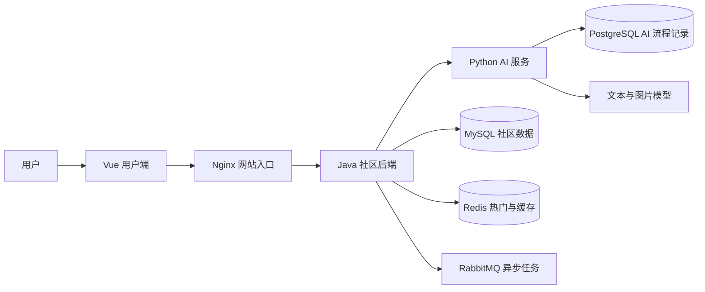

整体思路很简单：用户端负责操作和展示；Java 后端负责社区规则、账号和数据；AI 服务负责理解、检索和生成。普通社区功能不依赖某个具体模型，因此 AI 能力以后单独调整时，不会影响发帖、聊天等基础体验。

## 项目结构

| 目录 | 负责什么 |
| --- | --- |
| `forum-vue` | 用户端页面、编辑器、社区互动与看板娘界面 |
| `backend` | 账号、帖子、互动、推荐、游戏、权限与数据保存 |
| `ai-server` | 发帖检查、摘要、写作、生图、站内检索与看板娘 |
| `nginx` | 网站入口、容器配置、打包和发布脚本 |
| `live2d` | 看板娘模型资源 |

## Java 业务模块

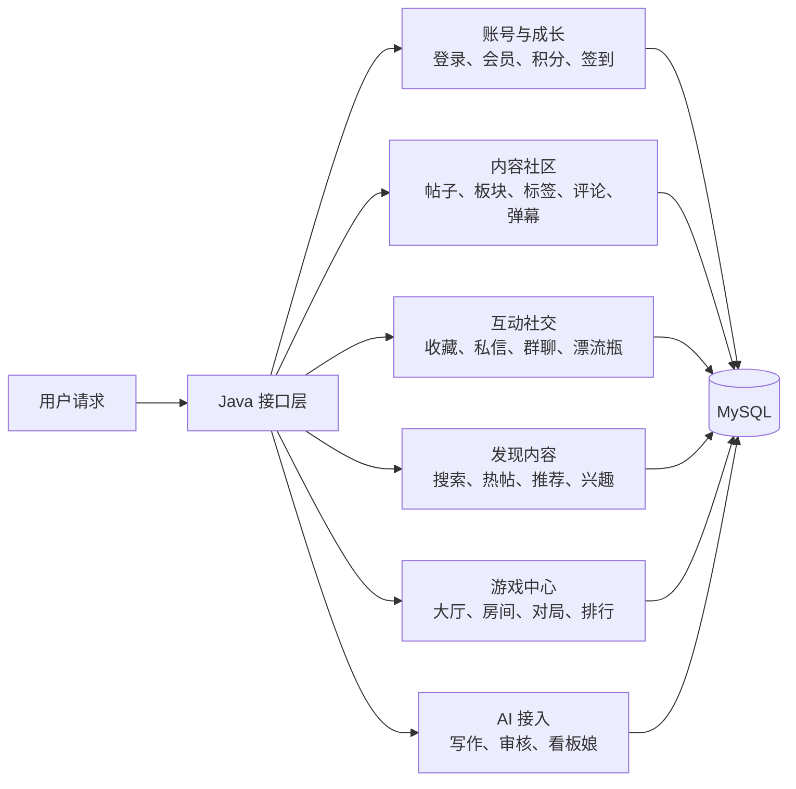

Java 模块按社区中的真实业务划分，而不是按页面拆分。同一条帖子无论从首页、搜索、收藏夹、个人主页还是看板娘对话进入，最终都回到同一份帖子和互动数据。

### 帖子发布与审核

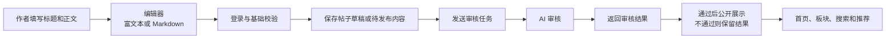

帖子、问答、视频和弹幕都建立在内容社区模块上。发布时先保存必要内容，再进行检查；最终是否公开由 Java 后端决定，AI 只给出内容检查结果。

### 帖子互动与通知

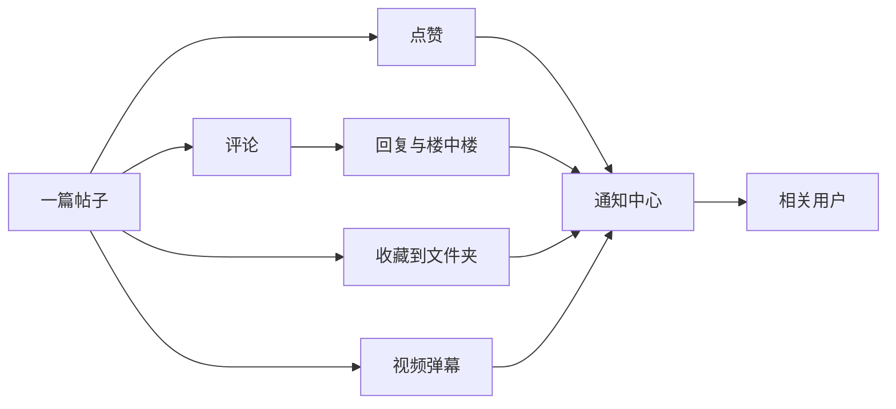

互动数据和帖子数据分开保存，但展示时会组合在一起。这样既能显示每个人的点赞、收藏和回复状态，也能让通知中心准确告诉用户发生了什么。

### 搜索、热帖与推荐

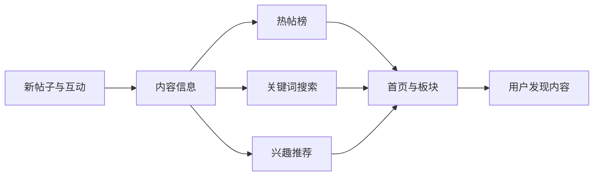

发现模块不是另外复制一份帖子，而是根据已有内容、互动和兴趣帮助用户更快找到想看的内容。搜索优先找帖子本身；需要时也能找到与关键词高度相关的作者。

### 私信、群聊与实时互动

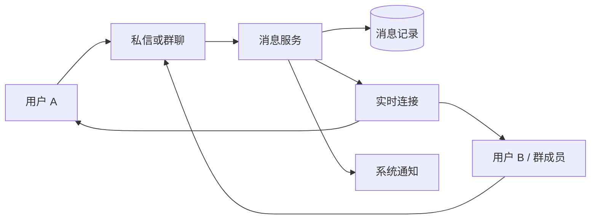

私信、群聊和语音功能共用“消息先保存，再实时送达”的思路。用户重新进入页面后仍能看到历史消息；多人同时在线时也能及时收到新消息。

### 游戏中心

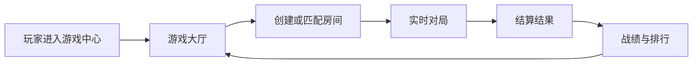

五子棋、井字棋和俄罗斯方块复用大厅、房间、实时连接和结算这套基本流程；每种游戏只保留各自的规则和画面，不重复建立一整套社交和排行系统。

## AI 模块

AI 模块采用“统一入口、模块化处理”的方式。Java 后端不直接调用某一张图或某个模型，而是把请求交给 AI 服务入口；AI 服务再根据用途进入对应模块。这样现在可以共用一个服务，未来某项能力需要独立扩展时也容易拆开。

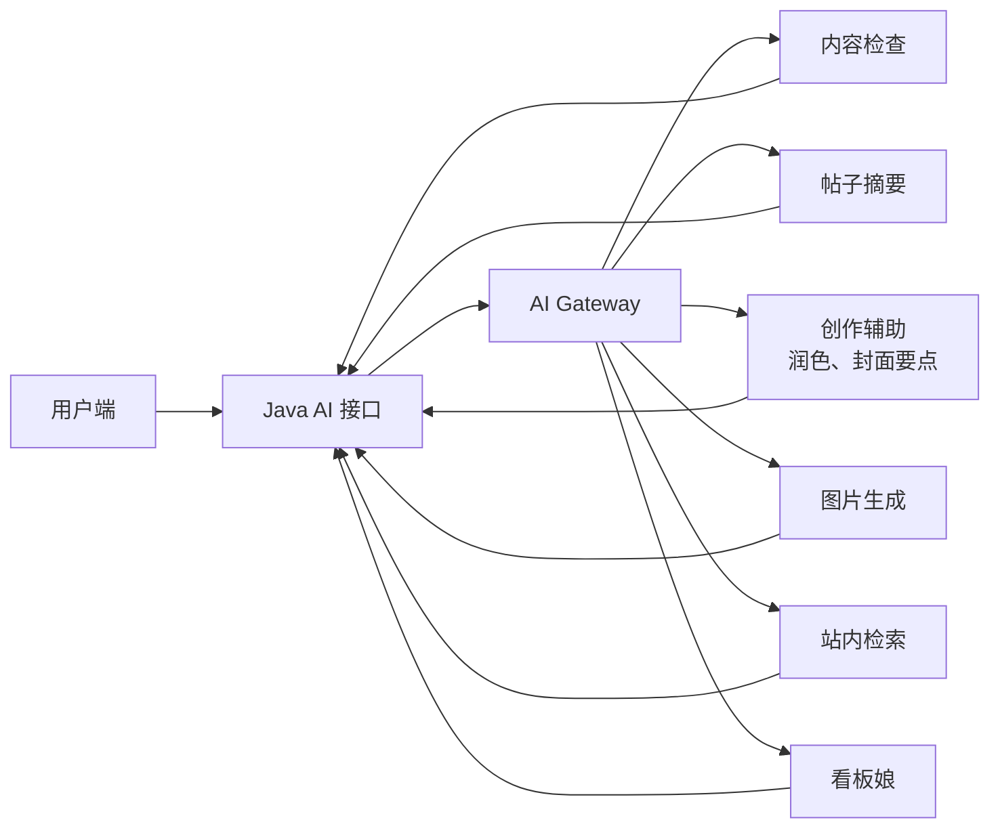

### 内容检查与帖子摘要

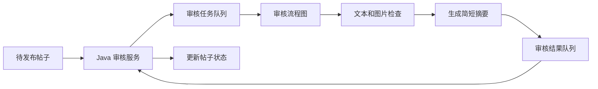

内容检查走异步流程，避免用户发帖时一直等待。摘要固定使用快速模型，作为展示和理解内容的辅助，不改变帖子原文。

### 看板娘助手

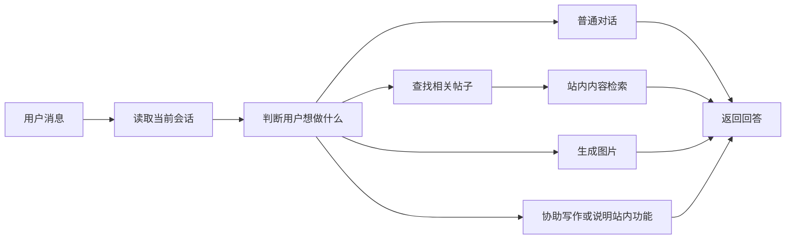

看板娘会参考正在进行的对话。多数问题优先快速回答；只有需要复杂推理、规划或多步骤处理时才使用更强模型。检索到的帖子结果会保存到当前会话中，用户关闭再打开仍可以继续查看。

### 站内检索与工具使用

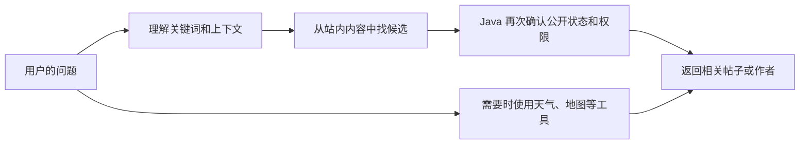

AI 可以帮助查找站内内容，也可以在需要时使用外部工具。但是否向用户展示内容、是否消耗额度、是否保存结果，仍然由社区后端统一决定。

### AI 使用的数据与记录

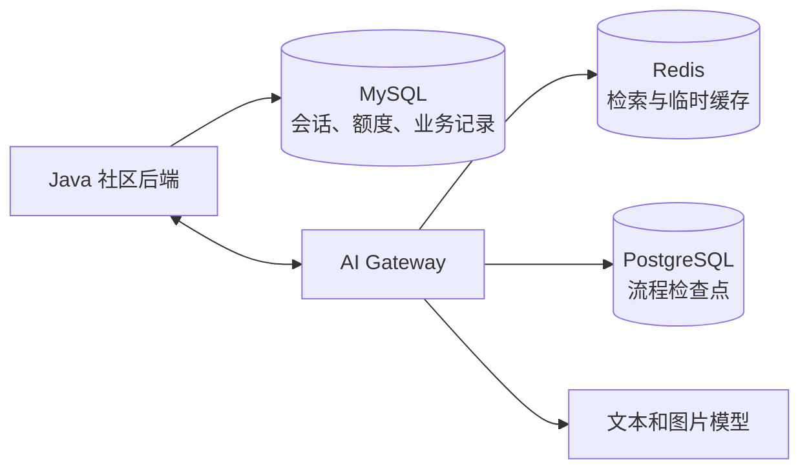

会话、额度和业务结果留在社区数据中；AI 流程本身保留必要的过程记录。这样既能让用户回到上次的对话，也能避免模型调用越过社区已有的账号和权限规则。

## 本地启动

准备 Java 17、Python 3.11、Node.js、Docker Desktop，以及 MySQL、Redis、RabbitMQ、PostgreSQL。

```powershell
# 用户端
cd forum-vue\front
npm install
npm run dev

# 社区后端
cd ..\..\backend
mvn spring-boot:run

# AI 服务
cd ..\ai-server
python main.py
```

本地构建和 Docker 构建会通过本机 `7897` 代理访问外部依赖。密钥和环境差异只放在环境变量或被忽略的本地配置中，不放入仓库。

## 打包发布

在 `nginx` 目录执行：

```powershell
.\scripts\make-package.ps1
```

默认只显示简洁的构建结果。需要查看镜像构建详情时，再使用：

```powershell
.\scripts\make-package.ps1 -ShowBuildDetails
```

完整发布包会生成在 `nginx\package\`。上传前可校验：

```powershell
.\scripts\verify-package.ps1
```

本轮 AI 模块的线上增量脚本是 [`incremental_ai_module_release.sql`](backend/src/main/resources/static/incremental_ai_module_release.sql)。旧会话清理默认关闭，只有明确把脚本中的开关改为 `1` 才会执行清理。

## 开发约定

- 内容、权限和数据由社区后端统一决定，页面只负责展示和提交操作。
- AI 只通过统一入口接入，不让页面直接调用具体模型。
- 新的数据库变更只追加新脚本，不修改已经执行过的历史脚本。
- 不把密码、密钥、验证码或本地环境配置提交到仓库。
