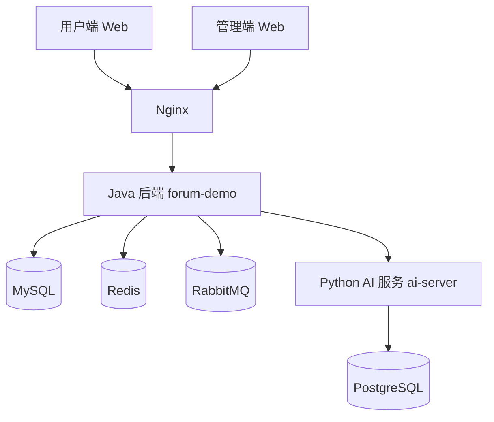
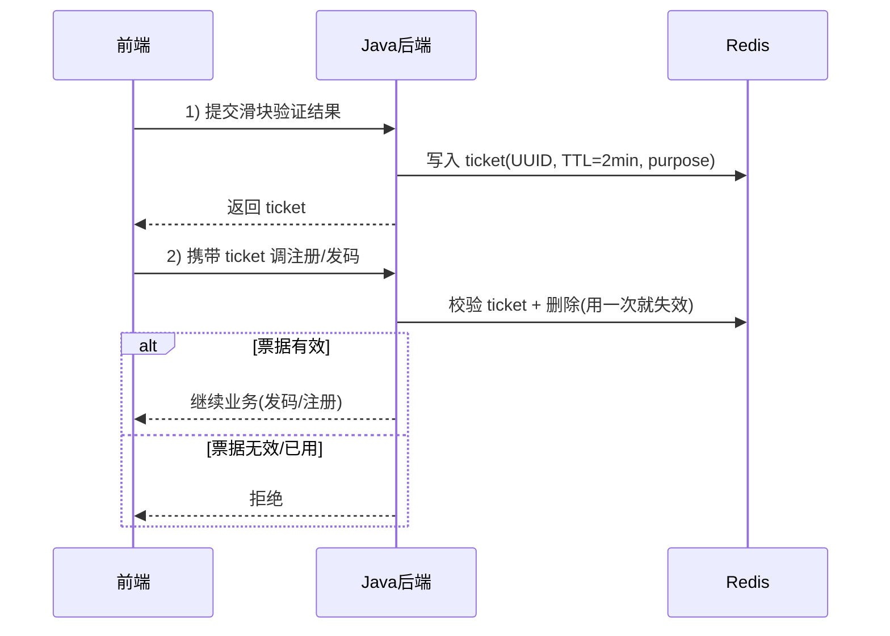
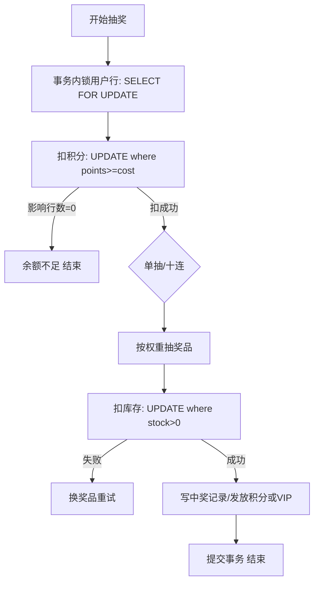
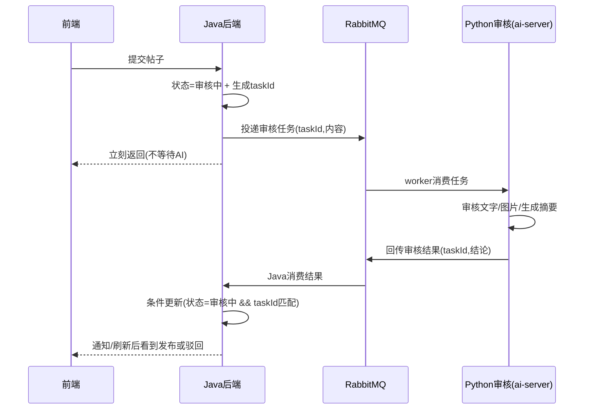
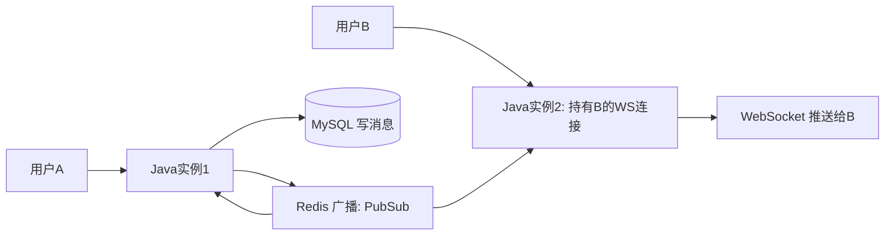
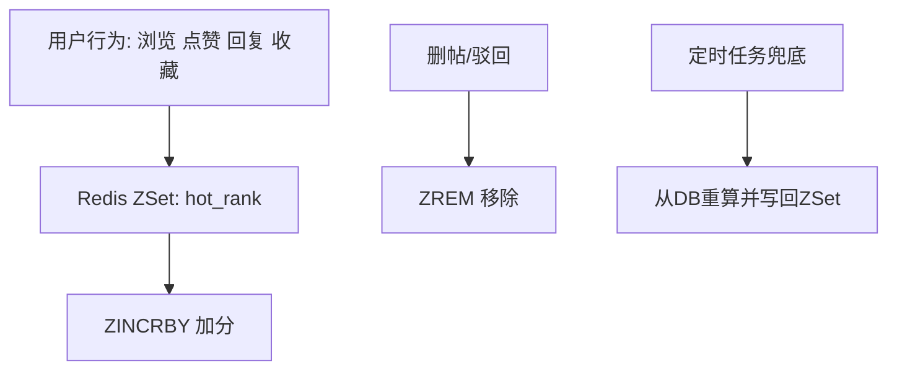
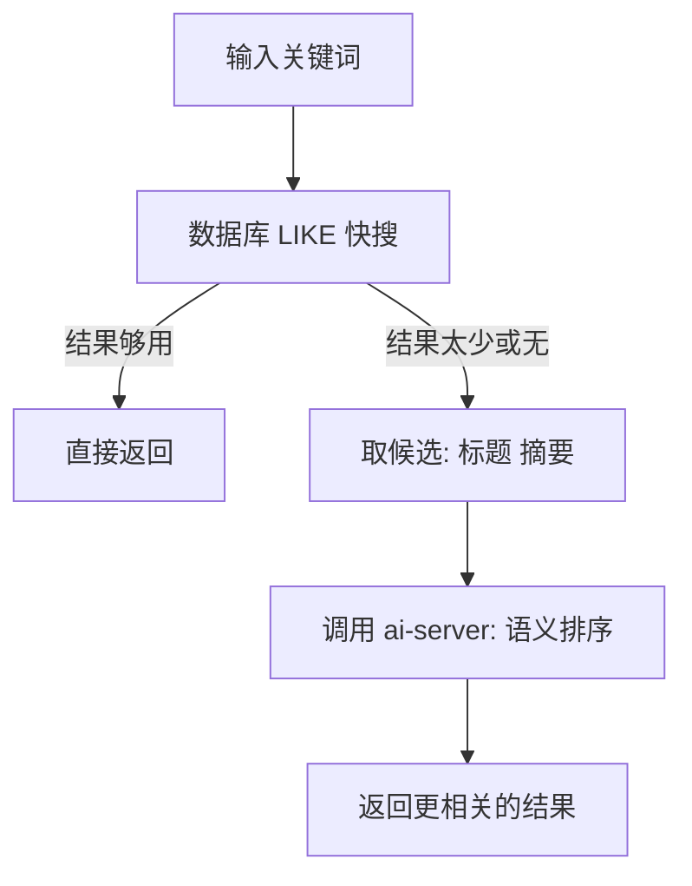
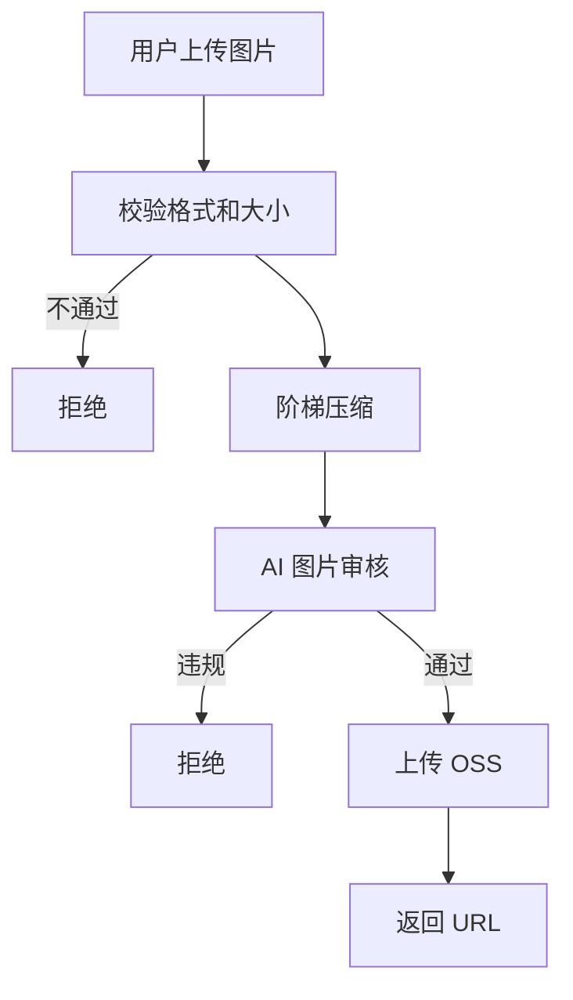

***

[toc]

***

## 说明

> 本项目只是纯粹出于个人兴趣爱好做的，实际生产环境这项目就是垃圾桶里的

## 部分界面演示


***

线上真实地址：
- 用户端：`https://www.nuonuoya.cn`
- 管理端：`https://admin.nuonuoya.cn`

> 这是一个前后端分离技术社区项目：发帖、评论、私信、抽奖、搜索都具备；帖子和图片在发布前会经过 AI 审核；多实例部署时私信支持跨实例实时推送。

---

## 目录

- 项目概览
- 整体架构
- 功能一览
- 核心流程（重点讲得清）
- 本地开发（可选）
- 生产部署（Docker Compose）
- 配置说明（环境变量）
- 常见问题
- 仓库结构

---

## 项目概览

这个仓库包含 4 个主要部分：

- **`forum-demo`**：Java 后端（Spring Boot），提供业务 API、鉴权、消息消费、WebSocket、审核状态流转等
- **`ai-server`**：Python 服务，负责 AI 审核 / AI 写作 / 看板娘聊天 / 智能搜索（语义排序、RAG 相关能力）
- **`forum-vue`**：用户端前端（Vue 3）
- **`forum-vue-admin`**：管理端前端（Vue 3 + Arco）
- **`nginx`**：打包与部署（Nginx 配置、compose、脚本）

---

## 整体架构

系统的主链路大致是这样：

- 用户端 / 管理端 → **Nginx**（静态资源 + 反向代理）
- Nginx → **Java 后端**（业务 API、WebSocket）
- Java 后端 → **MySQL**（主业务数据）
- Java 后端 → **Redis**（缓存、排行榜、发布订阅）
- Java 后端 → **RabbitMQ**（发帖审核、异步任务解耦）
- Java 后端 → **Python AI 服务**（审核、写作、搜索、聊天）
- Python AI 服务 → **PostgreSQL**（LangGraph 会话/状态持久化）



---

## 功能一览

### 用户端

- **发帖 / 评论 / 楼中楼**：支持富文本 / Markdown（按项目实现）
- **发帖审核**：提交后先进入“审核中”，通过才发布，失败会给出原因
- **图片上传**：服务端压缩 + AI 图片审核，通过后才上传 OSS
- **私信聊天**：WebSocket 实时消息，支持跨实例推送
- **积分体系**：签到、商城、抽奖等带来积分增减（以你的业务为准）
- **抽奖活动**：扣积分、扣库存、防超卖，支持软/硬保底
- **热帖榜**：实时加分的排行榜
- **智能搜索**：先走数据库快搜，必要时再走 AI 语义增强

### 管理端

- **内容管理**：帖子、评论、公告、抽奖活动/奖品等（以你的页面为准）
- **系统管理**：字典、菜单、部门、角色（RBAC 表结构已预置）

---

## 核心流程

### 1) 行为验证码 + 一次性票据（防刷）

目的很简单：短信/邮件是要花钱的，注册/找回密码也不能让脚本随便刷。

做法分两层：

- **先过行为验证码**：通过后签发一张“一次性票据”
- **再做频率限制**：按手机号/邮箱做冷却与窗口限额

一次性票据的核心是两点：

- 票据写入 Redis，**短过期**
- 使用时校验通过后立刻删除，**同一张票用一次就失效**



---

### 2) 积分抽奖防超卖（扣积分 + 扣库存都要稳）

抽奖里最怕两件事：

- **积分扣成负数**
- **限量奖品发超了**

这里的处理思路是：关键扣减都交给数据库做“带条件的更新”，让它天然原子。

- 扣积分：`points >= cost` 才能扣，影响行数为 0 就直接失败
- 扣库存：`stock > 0` 才能扣，失败就换个奖品重新抽（有限次数）
- 同一用户并发抽奖：在事务内锁定用户行，避免同时扣两次

硬保底 / 软保底：

- **硬保底**：连续 N 次没中头奖，下一次直接走保底池（保证命中）
- **软保底**：十连在最后一抽做兜底（保证至少出一个稀有）



---

### 3) 发帖审核工作流（异步 + 幂等）

AI 审核慢，不能让用户提交发帖接口卡住。

所以发帖审核采用“异步工作流”：

1. 用户提交后，Java 先把帖子状态改为“审核中”，生成任务 ID
2. Java 把任务投递到 MQ，接口立刻返回（用户体验不卡）
3. Python worker 消费消息，跑审核流程（文字→图片→摘要）
4. 审核结果再回到 MQ，Java 消费后更新帖子状态、通知用户

关键点：

- **不怕重复回调**：用“状态 + 任务 ID”做条件更新，结果只会成功一次
- **不怕短暂失败**：消费者手动 ACK、失败重试；超时可以做补偿扫描



---

### 4) 私信跨实例推送（Redis 广播）

单机推送很简单：用户 A 发给 B，服务端拿到 B 的 WebSocket 连接就推。

但多实例部署时，B 的连接在哪台机器上是不确定的。解决办法是：

- 写库后发布一条“推送事件”到 Redis（广播）
- 所有实例都能收到
- **真正持有 B 连接的那台**负责推送，其它实例忽略

这样做的好处是：无论用户连到哪台机器，都能实时收到消息。



---

### 5) 热帖榜（ZSet）

热帖榜用 Redis 的 ZSet 存：

- member：帖子 ID
- score：热度分

点赞/浏览/回复/收藏等行为发生时，直接 `ZINCRBY` 加分。

删帖/驳回/下线时从榜单移除（并且可以定时全量重算做兜底）。



---

### 6) 智能搜索（先快搜，后增强）

搜索不是上来就 AI：

1. **先走数据库**：标题模糊匹配，快、稳定、成本低
2. **必要时走 AI**：当结果太少/不准确，才用语义增强做排序或召回

一句话解释：**普通搜索用“快的”，找不到再用“聪明的”。**



---

### 7) 图片压缩 + AI 审核 + OSS 上传（同一条流水线）

图片上传做三件事：

- **压缩**：体积太大就逐级压缩，压到合适为止（不写临时文件）
- **AI 审核**：违规图不允许进入 OSS
- **上传 OSS**：统一目录、统一命名策略

这套流水线的目标就是：图片更省、更快、更安全。



---

## 生产部署（Docker Compose）

部署相关都在 `nginx/` 目录下，推荐按文档走。

### 打包（Windows）

```powershell
cd nginx
.\scripts\make-package.ps1
```

生成的部署包在 `nginx/package/`，把这个目录整体上传到服务器 `~/package/`。

### 服务器启动

```bash
cd ~/package
cp .env.example .env && nano .env
chmod +x start.sh
./start.sh
```

Nginx 使用 volume 挂载方式加载前端构建产物：

- `./dist/user` → `/usr/share/nginx/user`
- `./dist/admin` → `/usr/share/nginx/admin`

### 生产中间件端口映射（只绑 127.0.0.1）

生产 overlay 在 `nginx/docker-compose.prod.yml`，中间件端口默认只对本机开放，方便配 SSH 隧道：

- MySQL：`127.0.0.1:33061`
- Redis：`127.0.0.1:63790`
- PostgreSQL：`127.0.0.1:54320`
- RabbitMQ：AMQP `127.0.0.1:56720`，管理台 `127.0.0.1:15672`

更详细的部署说明见：`nginx/DEPLOY-SERVER.md`

---

## 配置说明（环境变量）

下面这些通常是上线时最需要改的（以 `nginx/.env` 为准）：

- **安全相关**
  - `JWT_SECRET`
  - `PII_CRYPTO_SECRET`
  - `FORUM_MASCOT_INTERNAL_KEY` / `FORUM_AI_INTERNAL_KEY`
- **数据库 / 缓存 / MQ**
  - `MYSQL_*`、`REDIS_PASSWORD`
  - `RABBITMQ_*`
  - `POSTGRES_*`
- **AI 能力**
  - `DASHSCOPE_API_KEY`（通义）
  - `DEEPSEEK_API_KEY`
  - `HUANAPI_*`（Gemini / Image / Claude 等）
  - `TAVILY_API_KEY`
- **对象存储 / 短信 / 邮件**
  - `ALIYUN_ACCESS_KEY_ID` / `ALIYUN_ACCESS_KEY_SECRET`
  - `OSS_*`
  - `MAIL_USERNAME` / `MAIL_PASSWORD`

---

## 常见问题

### 1) 刚启动访问 502 / WebSocket 失败

后端 Spring Boot 启动需要 20~30 秒，Nginx 可能先起来，刷新即可。

（部署包里已经做了健康检查，尽量减少首次 502）

### 2) Navicat 连不上 MySQL

生产端口只绑 `127.0.0.1`，需要配 SSH 隧道；并且必须用 `docker-compose.prod.yml` 启动。

### 3) 管理端登录提示“需要管理员权限”

管理端硬门槛是 `user.is_admin = 1`。普通注册用户默认是 0，需要在数据库里提升为管理员，并绑定 `role_admin`（如你提供的迁移脚本）。

---

## 仓库结构

```text
luntan/
  forum-demo/            # Java 后端（Spring Boot）
  ai-server/             # Python AI 服务（审核/写作/搜索/聊天）
  forum-vue/             # 用户端前端（Vue）
  forum-vue-admin/       # 管理端前端（Vue + Arco）
  nginx/                 # 打包与部署（compose、Nginx 配置、脚本）
```
