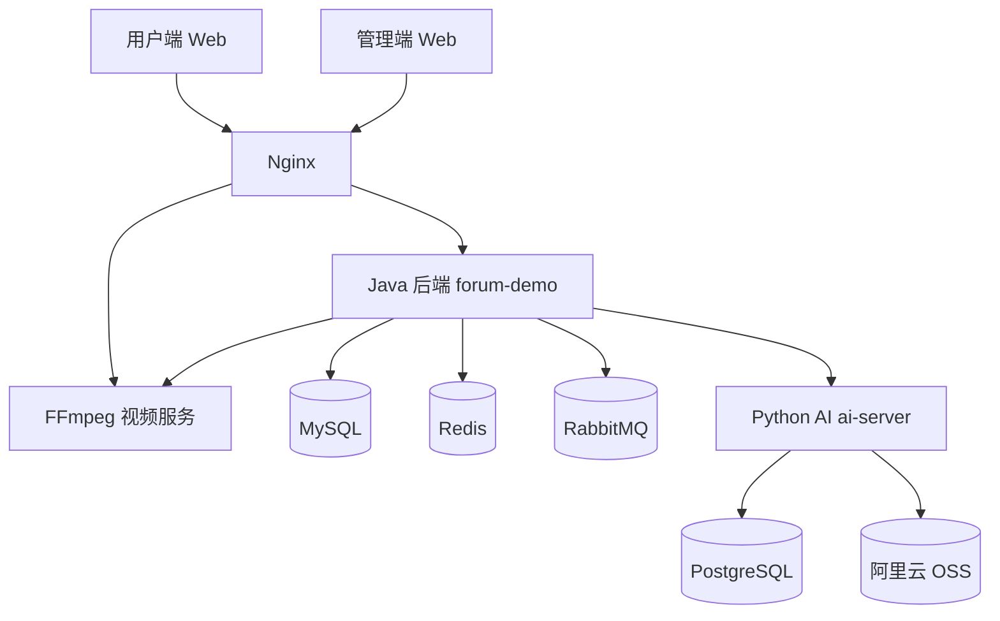
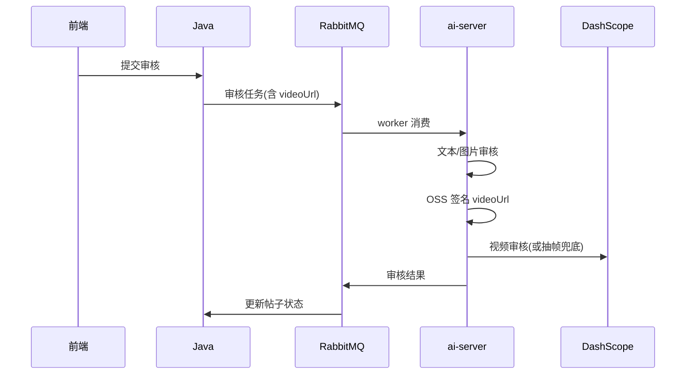

## 萌部落社区 v1.2

> 本项目出于个人兴趣爱好搭建；线上地址仅供学习交流。

## 部分界面演示


***

线上地址：

- 用户端：`https://www.nuonuoya.cn`
- 管理端：`https://admin.nuonuoya.cn`

> 前后端分离技术社区：发帖（图文 / 视频）、评论、私信、抽奖、搜索、帖子标签；发布前 AI 审核；多实例部署时私信支持跨实例实时推送；看板娘支持 RAG 推荐帖子、MCP 联网与出行工具。

---

## 目录

- [v1.2 更新摘要](#v12-更新摘要)
- [项目概览](#项目概览)
- [整体架构](#整体架构)
- [功能一览](#功能一览)
- [核心流程](#核心流程)
- [本地开发](#本地开发)
- [生产部署](#生产部署)
- [配置说明](#配置说明)
- [常见问题](#常见问题)
- [仓库结构](#仓库结构)

---

## v1.2 更新摘要

- **视频帖**：发帖支持视频模式；大文件（>200MB）走 FFmpeg 服务压缩/重封装后上传 OSS
- **帖子标签**：按版块绑定标签，搜索与详情展示标签
- **审核增强**：文本 → 图片 → **视频** 三阶段；私有 OSS 视频自动签名 URL；超大视频抽帧兜底审核
- **看板娘**：登录用户会话落库；RAG 推荐站内帖子；Tavily 搜索 + 百度地图 MCP
- **部署脚本**：`package/up.sh` 日常更新（权限修复、`docker load`、强制重建）；`start.sh` 首次部署 / 初始化库

---

## 项目概览

| 目录 | 说明 |
|------|------|
| `forum-demo` | Java 后端（Spring Boot）：业务 API、鉴权、MQ、WebSocket、审核状态 |
| `ai-server` | Python：AI 审核 / 写作 / 看板娘 / 语义搜索 / RAG |
| `forum-vue` | 用户端（Vue 3 + Vite 6） |
| `forum-vue-admin` | 管理端（Vue 3 + Arco） |
| `nginx` | Nginx 配置、Docker Compose、打包脚本、`ffmpeg` 视频服务 |

---

## 整体架构



- 用户端 / 管理端 → **Nginx**（静态 `dist/` + 反代 API）
- Java → MySQL / Redis / RabbitMQ / FFmpeg / ai-server
- ai-server → PostgreSQL（LangGraph checkpoint）、DashScope、OSS 签名读私有媒体

---

## 功能一览

### 用户端

- 发帖 / 评论 / 楼中楼（富文本 / Markdown）
- **图文帖 / 视频帖**、封面、相册（最多 15 张）
- **帖子标签**（版块内申请 / 绑定）
- 发帖 **AI 异步审核**（通过才发布）
- 图片压缩 + AI 审核 + OSS；视频 FFmpeg 处理后上传 OSS
- 私信 WebSocket、积分 / 签到 / 商城 / 抽奖、热帖榜
- 智能搜索（DB 快搜 + AI 语义增强）
- 看板娘：多模型、会话历史、站内帖子 RAG、联网与地图工具

### 管理端

- 帖子 / 评论 / 公告 / 抽奖等内容管理
- 系统字典、菜单、部门、角色（RBAC 预置表）

---

## 核心流程

### 1) 发帖审核（异步 + 幂等）

1. 用户提交 → Java 状态改为「审核中」，生成 `taskId`，投递 `q-audit-article`
2. Python worker 消费：`validate_text` → `validate_images` → **`validate_video`**（有视频时）→ `summarize`
3. 结果回 MQ → Java 条件更新状态并通知用户

**视频审核要点（v1.2）**

- DashScope 需能访问视频 URL；**私有 OSS** 由 ai-server 用 `ALIYUN_*` / `OSS_*` 生成**签名 URL**
- 视频 >100MB 或 DashScope 拉取失败时：FFmpeg **抽帧** → 走图片审核兜底
- ai-server 容器须配置与 Java 相同的 OSS 环境变量（见 `docker-compose.yaml`）



### 2) 视频上传

- ≤200MB：直传 OSS
- \>200MB：Java → FFmpeg（优先 remux，否则 ultrafast 重编码）→ OSS
- Nginx `/file/` 代理超时 3600s

### 3) 行为验证码 + 一次性票据

滑块通过后签发 Redis 短 TTL 票据；注册 / 发码须带票据且**用一次即删**。

### 4) 积分抽奖防超卖

事务内 `SELECT FOR UPDATE`；扣积分 `points >= cost`、扣库存 `stock > 0` 条件更新；硬 / 软保底。

### 5) 私信跨实例推送

写库后 Redis PubSub 广播；持有目标 WebSocket 的实例负责推送。

### 6) 热帖榜

Redis ZSet；行为 `ZINCRBY`；删帖 / 驳回 `ZREM`。

### 7) 智能搜索

先 DB `LIKE`，不足时 ai-server 语义排序 / RAG。

---

## 本地开发

### 中间件（Docker）

```powershell
cd nginx
docker compose -f docker-compose.dev.yaml up -d --build
```

| 服务 | 宿主机端口 |
|------|------------|
| MySQL | 33061 |
| Redis | 63790 |
| RabbitMQ AMQP | **56690**（Windows Hyper-V 保留 56720，勿改回） |
| RabbitMQ 管理台 | 25672 |
| PostgreSQL | 54320 |
| FFmpeg | 8099 |

### 应用（宿主机）

| 模块 | 目录 | 默认地址 |
|------|------|----------|
| 用户端 | `forum-vue/front` | `npm run dev` → 5173 |
| 管理端 | `forum-vue-admin/admin` | 各自 dev 端口 |
| 后端 | `forum-demo` | `http://localhost:10086` |
| AI | `ai-server` | `http://localhost:5000` |

**IDEA 打开后端**：File → Open → 选 **`forum-demo`** 文件夹（或 `pom.xml`），Maven Reload，开启 Lombok Annotation Processors。

**本地密钥（勿提交仓库）**

```powershell
copy scripts\dev-secrets.ps1.example scripts\dev-secrets.ps1
# 编辑 dev-secrets.ps1 填入 Key
. .\scripts\load-dev-env.ps1
```

**数据库**：结构变更后整库重跑 `forum-demo/src/main/resources/sql/create.sql`（会清空数据）。PostgreSQL 会话表：`postgres_ai_session.sql`；开发清空 checkpoint：`postgres_reset_dev.sql`。

**RAG 向量**：`model_embedding_rag` 默认 `qwen3-vl-embedding`；`qwen3-vl-rerank` 仅用于重排，不能当 embedding。

---

## 生产部署

栈：**本机 `make-package.ps1` → 上传 `nginx/package/` → 服务器 `up.sh` / `start.sh`**。  
**勿**只上传部分 `assets/*.js`；**勿**单独 `docker compose up --build`（不会 `docker load` 离线镜像，易 403 白屏）。

### 本机打包

```powershell
cd nginx
# 确认 nginx\.env 为生产配置（会复制进 package\.env，该文件已 gitignore）
.\scripts\make-package.ps1
```

产物：`nginx\package\`（`dist/`、`images/*.tar`、`conf.d/`、`ssl/` 模板、`.env.example`、`start.sh`、`up.sh`、`collect-logs.sh`）。

仅更新前端（已有镜像）：

```powershell
.\scripts\build-all.ps1 -SkipDocker -SkipBackend
.\scripts\export-images.ps1
```

### 上传

整目录传到服务器 `~/package/`。替换前可备份 `.env` 与 `ssl/`。

### 服务器启动

```bash
cd ~/package
sed -i 's/\r$//' .env start.sh up.sh verify-frontend-dist.sh reset-db.sh collect-logs.sh
chmod +x start.sh up.sh verify-frontend-dist.sh reset-db.sh collect-logs.sh

# 日常更新（推荐）
bash up.sh

# 首次部署 / 需要初始化库
cp .env.example .env && nano .env
# HTTPS：证书放入 ssl/（*.pem *.key 已 gitignore）
bash start.sh
```

`up.sh`：`chmod dist` → 校验前端 → `docker load` 三个 tar → `compose up --force-recreate`。  
`start.sh`：含首次 `create.sql` 初始化（可用 `SKIP_DB_INIT=1` 跳过）。

**排错**：`bash collect-logs.sh` 生成 `logs-collect-*.txt`。

### 数据与 Navicat

| 操作 | 数据卷 |
|------|--------|
| `up.sh` / `up --force-recreate` | 保留 |
| `docker compose down` | 保留 |
| `docker compose down -v` | **删除** |

SSH 隧道后连接（须加载 `docker-compose.yaml` + `docker-compose.prod.yml`）：

| 服务 | 127.0.0.1 端口 |
|------|----------------|
| MySQL | 33061 |
| Redis | 63790 |
| PostgreSQL | 54320 |
| RabbitMQ 管理台 | 15672 |

### 验证

```bash
docker compose -f docker-compose.yaml -f docker-compose.prod.yml ps
curl -s http://127.0.0.1/healthz
./verify-frontend-dist.sh .
```

---

## 配置说明

以 `nginx/.env`（及服务器 `package/.env`）为准，**切勿提交真实 `.env`**。

| 类别 | 变量 |
|------|------|
| 安全 | `JWT_SECRET`、`PII_CRYPTO_SECRET`、`FORUM_MASCOT_INTERNAL_KEY`、`FORUM_AI_INTERNAL_KEY` |
| 数据 | `MYSQL_*`、`REDIS_PASSWORD`、`RABBITMQ_*`、`POSTGRES_*` |
| AI | `DASHSCOPE_API_KEY`、`DEEPSEEK_API_KEY`（须来自 [platform.deepseek.com](https://platform.deepseek.com)，**勿与 DashScope 混用**）、`HUANAPI_*`、`TAVILY_API_KEY`、`BAIDU_MAP_API_KEY` |
| OSS | `ALIYUN_ACCESS_KEY_ID`、`ALIYUN_ACCESS_KEY_SECRET`、`OSS_BUCKET_NAME`、`OSS_URL_PREFIX`、`OSS_ROOT_PREFIX` |
| OSS → ai-server | 同上 OSS 变量须注入 **forum-ai-server**（视频审核签名读私有桶） |
| 邮件 | `MAIL_USERNAME`、`MAIL_PASSWORD` |

看板娘 MCP（ai-server 内置）：`tavily_search`、`get_current_datetime`、`map_*`（需对应 API Key）。

---

## 常见问题

### 1) 502 / WebSocket 失败

后端启动约 20～90s，刷新即可；compose 已配置 backend healthy 后再起 Nginx。

### 2) 前端 403 / 白屏

- 未执行 `bash up.sh`：缺 `chmod dist` 或 `docker load`
- `index.html` 与 `assets/*.js` 版本不一致：整包重传 `dist/`，跑 `./verify-frontend-dist.sh .`

### 3) 审核一直「审核异常」

- 文本超时：已加长 `text_audit_timeout`；长文会截断
- **视频帖**：日志若 `Failed to download multimodal content` → OSS 私有桶；确认 ai-server 有 OSS 环境变量并重新部署
- 队列 `NOT_FOUND q-audit-article`：启动竞态，Java 起来后自动恢复

### 4) 视频帖保存报「不支持相册图」

v1.2 已修复：视频模式只调 `setArticleVideo`，勿对视频帖调 `replaceArticleImages`。需部署最新前后端。

### 5) Navicat 连不上

生产端口绑 `127.0.0.1`，须 SSH 隧道 + `docker-compose.prod.yml`。

### 6) 管理端「需要管理员权限」

库中 `user.is_admin = 1` 并绑定 `role_admin`。

---

## 仓库结构

```text
luntan/
  forum-demo/              # Java 后端
  ai-server/               # Python AI（审核 / 看板娘 / RAG）
  forum-vue/               # 用户端前端
  forum-vue-admin/         # 管理端前端
  nginx/                   # Compose、Nginx、FFmpeg、打包脚本
    scripts/
      make-package.ps1     # 一键打包
      build-all.ps1        # 构建前后端与镜像
      export-images.ps1    # 组装 package/
      verify-package.ps1   # 打包自检
      server-up.sh         # → package/up.sh
    ffmpeg/                # 视频压缩 / 审核抽帧
  scripts/
    dev-secrets.ps1.example
    load-dev-env.ps1       # 本地加载密钥到当前 PowerShell 会话
  luntan.code-workspace    # 多根工作区（可选）
```

**Git 忽略要点**：`.env`、`nginx/package/`、`nginx/dist/`、`target/`、`node_modules/`、`ssl/*.pem`、`scripts/dev-secrets.ps1`、本地 `ai-server/config.local.yaml` 等，见根目录 `.gitignore`。
