## 萌部落社区 v1.7

> 本项目出于个人兴趣爱好搭建；线上地址仅供学习交流。

## 部分界面演示


> 管理界面还没完全做好，目前比较糙


***

线上地址：

- 用户端：`https://www.nuonuoya.cn`

> 前后端分离技术社区：发帖（图文 / 视频）、评论楼中楼、视频弹幕、私信、关注、收藏夹、抽奖、搜索、帖子标签；发布前 AI 审核；多实例部署时私信支持跨实例实时推送；看板娘支持 RAG 推荐帖子、MCP 联网与出行工具；游戏中心已接入 WebSocket 五子棋、井字棋与俄罗斯方块（单人 + PK）。

---

## v1.7 更新摘要

相对 **v1.6**，本版重点完成 **并发安全与幂等整改**（Phase 01~05），并补齐线上**增量发布**流程说明。详细设计与实现记录见仓库内 `.codex/concurrency-update/`（本地文档，不提交 Git）。

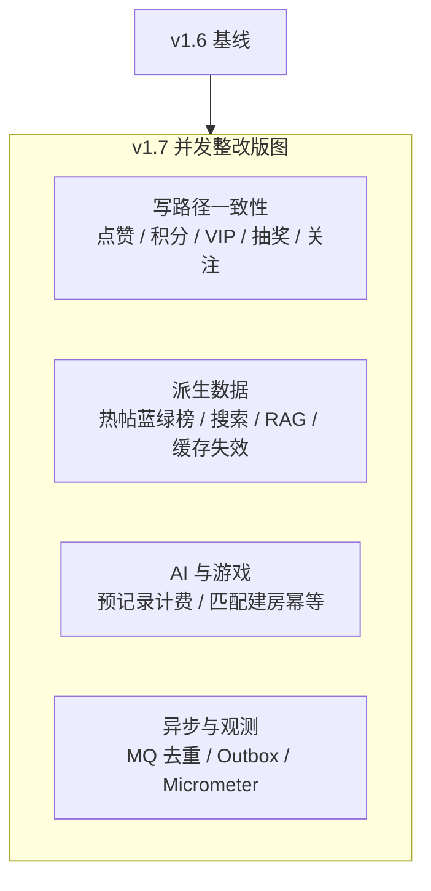

| 维度 | v1.6 | v1.7（本版） |
|------|------|----------------|
| 写一致性 | 部分接口有竞态风险 | 点赞/评论/积分/抽奖/VIP/关注等幂等 + 条件更新 |
| 热帖榜 | 单 ZSet，重算可能空榜 | **蓝绿双槽**切换 + 7 天窗口衰减 + DB 兜底 |
| 帖子下线 | 副作用分散 | `TransactionHooks.afterCommit` 统一热榜/搜索/RAG |
| AI 计费 | 事后写 usage_log | **`forum_ai_call_record` 预记录** + 流式断网规则 |
| 游戏匹配 | 仅部分幂等 | **gobang / jinzi / tetris** 匹配建房 Redis 幂等键 |
| MQ 私信 | 直接发 RabbitMQ | 事务后 **本地消息表** + 定时投递；消费 **Redis 去重** |
| 分页 | offset + pageSize 上限 | 签到/积分流水新增 **游标分页** API |
| 数据库 | 仅 `create.sql` | 新增 **`incremental_concurrency.sql`** 等增量脚本 |

**后端核心（P0 / P1）**

- **事务外副作用**：`TransactionHooks.afterCommit` — Redis、MQ、热帖、搜索/RAG 索引仅在 DB 提交成功后执行。
- **票据与验证码**：`RedisAtomicValueConsumer` Lua 原子消费，防并发重复用码。
- **热帖榜**：`HotArticleRedisOps` 蓝绿 key（`hot:articles:a|b` + active 指针），重算期间旧榜可读。
- **AI 调用**：调用前 `PENDING` 预记录；成功/失败/停止/断网分状态结算；前端可传 `clientRequestId` 防重试重复扣费。
- **收藏移动**：`folder_id` 条件更新，并发移动幂等。
- **签到**：`GET /checkin/trend` 按月萌币趋势；`GET /checkin/log/cursor` 游标分页。

**工程与发布**

- **SQL**：全新环境用 `create.sql`；**已有线上库**用 `incremental_concurrency.sql` + `incremental_postgres_ai_session.sql`（可重复执行）。
- **打包发布**：仍为本机 `make-package.ps1` → 上传整包 → 服务器 **`bash up.sh`**；增量发布**禁止** `reset-db.sh` / `down -v`。
- **待办 backlog**：`.codex/todo/concurrency-backend-pending.md`、`concurrency-frontend-pending.md`。

---

## v1.6 更新摘要

相对 **v1.3（上一版 README）**，本版在保留游戏中心三套玩法的基础上，重点补齐社区互动、视频体验、登录引导与前端工程化。相对 **上一 Git 提交（`422802d`）**，本版另含大规模代码整理与仓库瘦身（约 566 个文件变更，移除独立管理端目录等）。

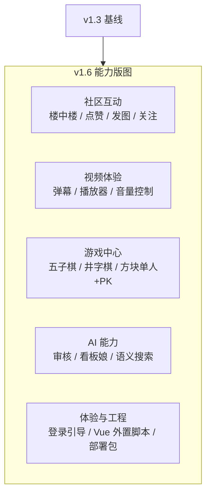

| 维度 | v1.3 | v1.6（本版） |
|------|------|----------------|
| 游戏 | 五子棋、井字棋 | + 俄罗斯方块单人 / PK；匹配与观战规则修复 |
| 视频帖 | 播放、上传 | + 弹幕（样式 / 密度 / 区域）；播放器控件优化 |
| 评论 | 楼中楼 | + 回复刷新、发图进度、回复点赞、表情卡片统一 |
| 私信 | 文本 / 表情 | + 上传分页、左侧列表跳主页、表情 UI 统一 |
| 个人中心 | 资料 / 收藏 | + 收藏夹分页与重命名、详情页返回定位钩子 |
| 社交 | — | + 用户关注 / 粉丝列表 |
| 登录 | 路由守卫 | + 未登录统一弹窗引导；验证码交互优化 |
| 仓库 | 含 `forum-vue-admin` | 精简为用户端 + 后端 + AI + Nginx 四件套 |

**社区与内容**

- **楼中楼回复**：主评 / 子评回复后局部刷新，不再整页重载。
- **评论互动**：回复点赞（空心 / 实心红心）；评论发图保留上传提示直至全部完成；表情包封面与标题同行展示。
- **视频弹幕**：视频帖支持滚动 / 顶部 / 底部弹幕，可配置颜色、字号、模式、密度、显示区域与彩色过滤；发送与播放器控件分层布局。
- **视频播放器**：音量改为喇叭图标（静音显示带斜线喇叭）；弹幕层底部高于控制栏，避免遮挡。
- **用户关注**：关注 / 取关、粉丝与关注列表；个人主页展示关注关系。
- **收藏夹与个人主页**：收藏夹分页（每页 10 条）、名称编辑（≤25 字）；从帖子详情返回时恢复收藏夹 / 个人主页原滚动位置；笔记与点赞列表分页（每页 12 条）。

**私信与表情**

- **私信**：左侧会话列表点击头像 / 昵称可跳转对方主页；我的上传表情支持分页，上传按钮与表情格同尺寸并排。
- **表情卡片**：评论、私信、游戏房间复用统一「封面 + 标题」布局；移除表情后不再自动关闭弹层。

**游戏中心（在 v1.3 基础上加固）**

- **五子棋 / 井字棋**：修复双人在线匹配不到的问题；观战席禁止聊天与表情；终局卡片仅展示胜负与倒计时。
- **俄罗斯方块**：单人 `canvas` 循环 + 后端成绩中心；PK 后端权威棋盘、垃圾行、观战只读；结算卡星空蓝主题；PK 观战禁输入。
- **房间聊天**：表情包入口在输入框内侧，发送按钮统一星空蓝色调。

**AI 与搜索**

- **语义搜索**：AI 向量搜索时过滤无关用户结果。
- **看板娘**：关闭对话面板不中断进行中的回复或生图；GPT 生图请求参数与帖子封面图生成对齐。
- **Python 服务**：补齐 `oss2` 等依赖；内部鉴权与客户端模块拆分。

**登录与安全体验**

- **未登录引导**：首页搜索、创作中心、私信、设置、积分、签到、抽奖、看板娘等操作统一 `弹窗确认 → 去登录`，不直接硬跳转。
- **会员中心**：未登录访问 `/vip` 弹窗引导，而非静默跳转登录页。
- **行为验证码**：滑块 / 点击验证失败自动关闭弹窗；发码按钮展示 loading；验证码错误码静默避免重复 toast。

**工程与仓库**

- **Vue 规范**：持续推进「`.vue` 仅模板 + 外置 `.js` / `.scss`」；抽取 `VideoVolumeIcon`、`PurchasedEmojiPackPopover` 等公共组件。
- **仓库精简**：移除独立 `forum-vue-admin` 目录，聚焦用户端交付；管理端能力保留在后端 API，界面待完善。
- **部署**：仍遵循「本机 `make-package.ps1` 打整包 → 服务器 `bash up.sh`」，避免 `index.html` 与 `assets` 版本错位。

---

## v1.3 历史摘要（保留）

- **游戏中心 / 五子棋**：新增独立游戏大厅、五子棋匹配页和蓝黑主题对局页，支持真人匹配、观战、房间聊天 / 表情、棋谱回放、天梯榜和战绩统计。
- **游戏中心 / 井字棋**：复用游戏中心通用表与结算链路，新增 3×3 井字棋匹配页与对局页；支持快速匹配、AI 对手、房间聊天 / 表情、棋谱回放、天梯榜和战绩统计（不开放观战）。
- **游戏中心 / 俄罗斯方块**：新增 `canvas` 单人模式与双人 PK 模式；单人模式支持成绩结算、历史记录、排行榜与回放，PK 模式支持双人匹配、后端权威房间状态、垃圾行攻击、观战与终局结算。
- **三层 WebSocket**：大厅在线、游戏在线、房间对局拆成独立连接，服务端主动推送在线状态、匹配结果、落子、终局胜线和观战席变化。
- **论坛积分联动**：五子棋 / 井字棋胜负直接进入论坛积分流水，玩家段位、胜率、总局数和排行榜复用论坛账号体系。
- **单人成绩型游戏接入**：俄罗斯方块单人模式采用“前端本地权威游戏循环 + 后端成绩中心”的方案，避免把单人玩法硬套成棋类房间模型。
- **局时 / 步时**：五子棋支持 10 分钟局时、60 秒步时；井字棋支持 2 分钟局时、20 秒步时；超时、认输、成线 / 五连均走统一结算链路。
- **AI 对手**：长时间无人匹配时自动进入 AI 房间；低水平玩家使用 `deepseek-v4-flash`，高水平玩家使用 `deepseek-v4-pro`，DeepSeek 不可用时展示本地策略兜底（井字棋 AI 局积分变化更小）。
- **局部责任链**：五子棋动作 / 匹配、私信发送、发帖提交审核、抽奖准入已抽成 Guard Chain；结算、扣分、库存、MQ、WebSocket 广播仍保留在 Service 主流程。
- **多实例准备**：在线状态、匹配队列、房间快照、房间事件广播和对局结束事件已按 Redis / RabbitMQ 拆出扩展点。

---

## 项目概览

| 目录 | 说明 |
|------|------|
| `backend` | Java 后端（Spring Boot）：业务 API、鉴权、MQ、WebSocket、审核状态、五子棋 / 井字棋 / 俄罗斯方块 |
| `ai-server` | Python：AI 审核 / 写作 / 看板娘 / 语义搜索 / RAG |
| `forum-vue` | 用户端（Vue 3 + Vite 6） |
| `nginx` | Nginx 配置、Docker Compose、打包脚本、`ffmpeg` 视频服务 |

---

## 整体架构

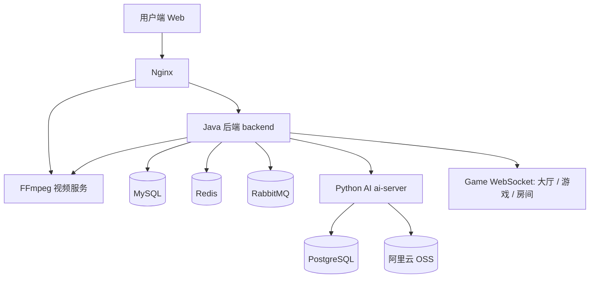

- 用户端 → **Nginx**（静态 `dist/` + 反代 API）
- Java → MySQL / Redis / RabbitMQ / FFmpeg / ai-server
- 五子棋 / 井字棋 / 俄罗斯方块 PK 实时链路 → Java WebSocket（大厅在线、游戏在线、房间对局三类连接）
- 局部责任链 → Java 后端 Guard Chain，只拦截前置准入规则，不接管事务核心流程
- ai-server → PostgreSQL（LangGraph checkpoint）、DashScope、OSS 签名读私有媒体

---

## 功能一览

### 用户端

- 发帖 / 评论 / 楼中楼（富文本 / Markdown）
- **图文帖 / 视频帖**、封面、相册（最多 15 张）
- **视频弹幕**（滚动 / 顶 / 底、颜色 / 字号 / 密度 / 区域可配）
- **帖子标签**（版块内申请 / 绑定）
- 发帖 **AI 异步审核**（通过才发布）
- 图片压缩 + AI 审核 + OSS；视频 FFmpeg 处理后上传 OSS
- 评论 / 楼中楼回复点赞、评论发图与表情包
- 私信 WebSocket、积分 / 签到 / 商城 / 抽奖、热帖榜
- **用户关注**、个人主页、收藏夹（分页 / 重命名 / 返回定位）
- 智能搜索（DB 快搜 + AI 语义增强）
- 看板娘：多模型、会话历史、站内帖子 RAG、联网与地图工具、GPT 生图
- 未登录操作统一弹窗引导登录；会员中心 / 关键功能需登录
- 游戏中心：五子棋实时匹配、观战、房间聊天 / 表情、棋谱回放、战绩统计、天梯榜、AI 对手
- 游戏中心：井字棋快速匹配、房间聊天 / 表情、棋谱回放、战绩统计、天梯榜、AI 对手（平局不扣积分）
- 游戏中心：俄罗斯方块单人模式（`canvas` 棋盘、成绩结算、历史记录、排行榜、回放）
- 游戏中心：俄罗斯方块 PK 模式（双人匹配、后端权威状态、垃圾行攻击、观战、胜负结算）

---

## 核心流程

### 1) 游戏中心 / 五子棋（WebSocket 实时对战）

游戏中心目前先接入 **五子棋**，实时链路分成三层 WebSocket：大厅连接用于展示大厅在线与玩家状态；游戏连接用于匹配页在线人数、房间总数和最近对局；房间连接用于落子、计时、观战、聊天和终局同步。HTTP 只负责历史记录、统计、天梯榜、回放等非实时数据查询。

**五子棋能力**

- 快速匹配：真人优先，长时间无人时自动创建 AI 房间
- AI 对手：Java 调 Python AI Hub；低水平玩家使用 `deepseek-v4-flash`，高水平玩家使用 `deepseek-v4-pro`；DeepSeek 不可用或返回非法坐标时才走本地规则兜底
- 实时对局：服务端维护权威棋盘，校验回合、坐标、棋色和观战身份；落子结果通过房间 WebSocket 主动推送
- 计时规则：支持 10 分钟局时、60 秒步时，任一玩家超时直接结算
- 观战与聊天：观众只读棋局，不能落子 / 认输；房间内支持文本和已购表情包，终局后禁止继续发送消息或表情
- 棋谱与回放：每手落子写入 MySQL，前端支持历史对局回放和自动播放
- 积分结算：胜负同步论坛积分流水，战绩统计、胜率、天梯榜与论坛用户体系共享
- 多实例准备：在线状态、匹配队列、房间快照与房间事件可走 Redis；对局结束事件可投递 RabbitMQ 做补偿与异步处理

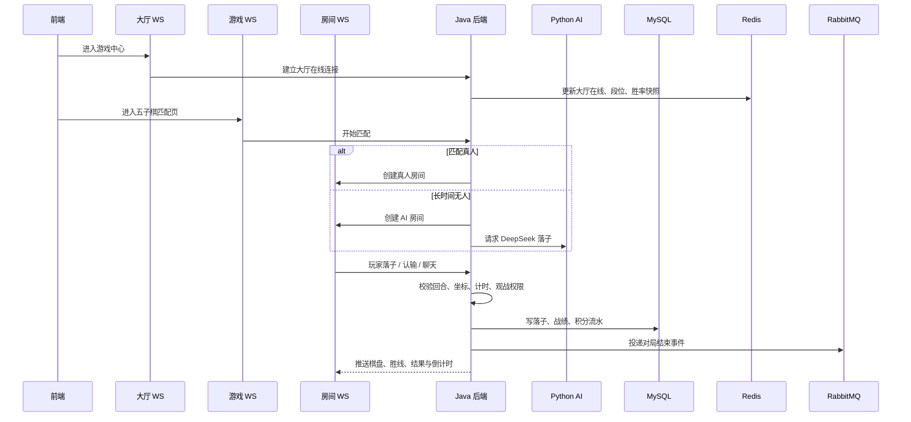

### 1b) 游戏中心 / 井字棋（WebSocket 轻量对战）

井字棋作为游戏中心第二款对战游戏，**复用** `game_definition` / `game_user_profile` / `game_match_record` / `game_room_move` 等通用表，以 `game_code = jinzi` 区分数据。实时链路同样拆成三层 WebSocket：大厅连接展示游戏中心在线；游戏连接负责井字棋匹配页在线人数与匹配队列；房间连接负责 3×3 落子、计时、聊天和终局同步。HTTP 负责个人资料、历史战绩、天梯榜与棋谱回放查询。

**井字棋能力**

- 快速匹配：按论坛积分分桶（青铜 / 白银 / 黄金 / 大师），同桶内真人优先配对
- 入场门槛：开始匹配前须至少有 **3** 论坛积分；真人胜局 ±3 分，AI 胜局 ±1 分，**平局不结算积分**
- AI 对手：队列等待约 **15 秒**无人匹配时自动创建 AI 房间；积分低于 1600 走 `deepseek-v4-flash`，达到 1600 及以上走 `deepseek-v4-pro`；DeepSeek 不可用或返回非法坐标时走本地 Minimax 兜底
- 实时对局：服务端维护权威 3×3 棋盘，校验回合、坐标、棋色；三连成线推送 `winningLine`，平局走 `END_DRAW`
- 计时规则：支持 **2 分钟**局时、**20 秒**步时；断线保留 **30 秒**重连窗口，超时判负
- 房间聊天：对局双方支持文本和已购表情包；**不开放观战席**，终局后禁止继续落子 / 认输 / 聊天
- 棋谱与回放：每手落子写入 `game_room_move`，匹配页支持历史对局回放
- 积分结算：胜负同步论坛积分流水；战绩、胜率、天梯榜与论坛用户体系共享
- 多实例准备：在线状态、匹配队列、房间快照与结算事件复用 Redis / RabbitMQ 扩展点

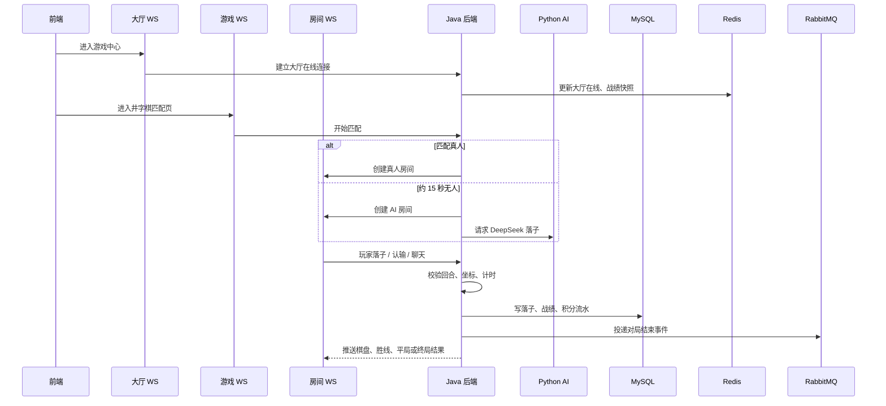

### 1c) 游戏中心 / 俄罗斯方块（单人 + PK）

俄罗斯方块分成两套玩法。单人模式采用 `canvas` 主棋盘，前端本地运行游戏循环，后端只负责资料、结算、排行榜与回放；双人 PK 模式则回到后端权威房间状态，双方输入通过 WebSocket 上送，服务端推进棋盘、处理垃圾行并广播最新状态。这样既保留了单人模式的流畅度，也保证了 PK 模式的公平性。

**俄罗斯方块能力**

- 单人模式：10x20 经典玩法，支持移动、旋转、软降 / 硬降、消行、成绩结算、历史记录、排行榜与回放
- PK 模式：双人匹配、双棋盘实时同步、基础垃圾行攻击、终局胜负结算
- 观战：第三名及以上用户可以进入 PK 房间实时观看双方棋盘，但不能发送输入控制
- 数据分层：单人模式不硬套棋类房间语义；PK 模式保留游戏级 / 房间级连接与观战列表
- 积分联动：单人模式按成绩档位发放论坛积分，PK 模式按胜负发放论坛积分

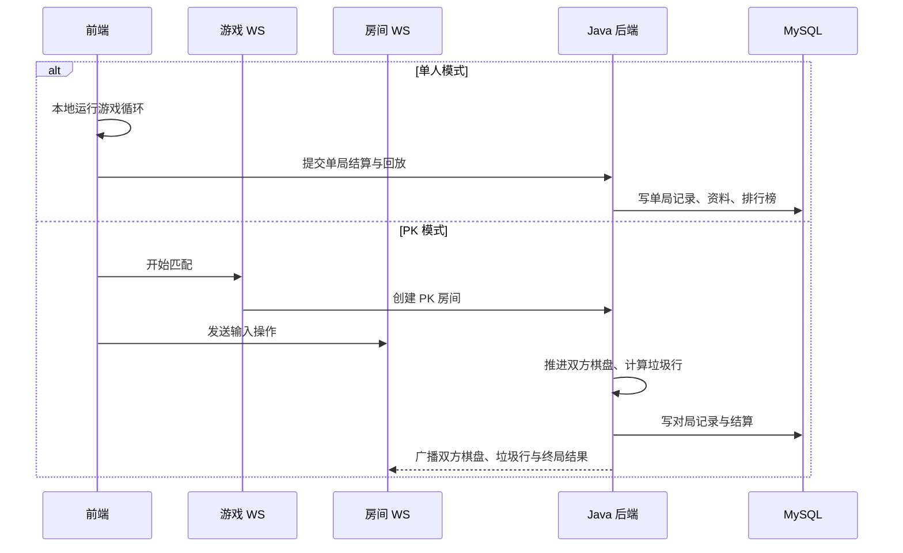

### 1d) 视频帖弹幕

视频帖在播放器层叠加弹幕引擎：前端按视频时间轴渲染滚动 / 顶部 / 底部弹幕；用户可在播放条旁设置颜色、字号、模式与显示区域，发送时写入 `article_video_danmaku` 表。弹幕层高度受控，底部不低于播放器控制栏。

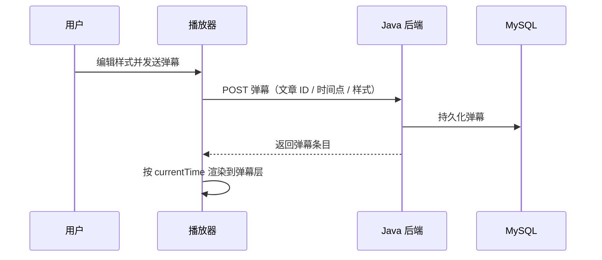

### 2) 发帖审核（异步 + 幂等）

1. 用户提交 → Java 状态改为「审核中」，生成 `taskId`，投递 `q-audit-article`
2. Python worker 消费：`validate_text` → `validate_images` → **`validate_video`**（有视频时）→ `summarize`
3. 结果回 MQ → Java 条件更新状态并通知用户

**视频审核要点**

- DashScope 需能访问视频 URL；**私有 OSS** 由 ai-server 用 `ALIYUN_*` / `OSS_*` 生成**签名 URL**
- 视频 >100MB 或 DashScope 拉取失败时：FFmpeg **抽帧** → 走图片审核兜底
- ai-server 容器须配置与 Java 相同的 OSS 环境变量（见 `docker-compose.yaml`）

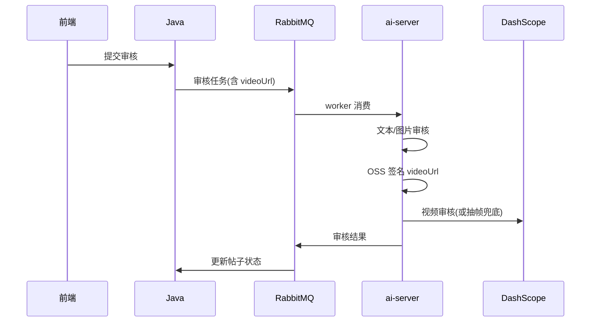

### 3) 视频上传

用户选择视频后，前端可**后台上传**并展示进度；后端按体积分流，大文件经 FFmpeg 再写入 OSS。Nginx `/file/` 代理超时 **3600s**，避免长视频压缩卡住。

- **≤200MB**：Java 直传 OSS
- **>200MB**：Java → FFmpeg（H.264+AAC 则 **remux** 不重编码，否则 **ultrafast** 重编码）→ 回传字节流 → OSS
- 绑定帖子：保存草稿 / 提交时调用 `setArticleVideo`（视频帖不调相册接口）

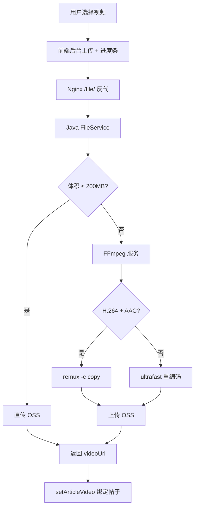

### 4) 行为验证码 + 一次性票据

短信 / 邮件有成本，注册与找回密码不能裸奔。滑块验证通过后签发 **Redis 短 TTL 票据**；后续发码 / 注册须携带票据，校验成功即 **删除**（一次性）。

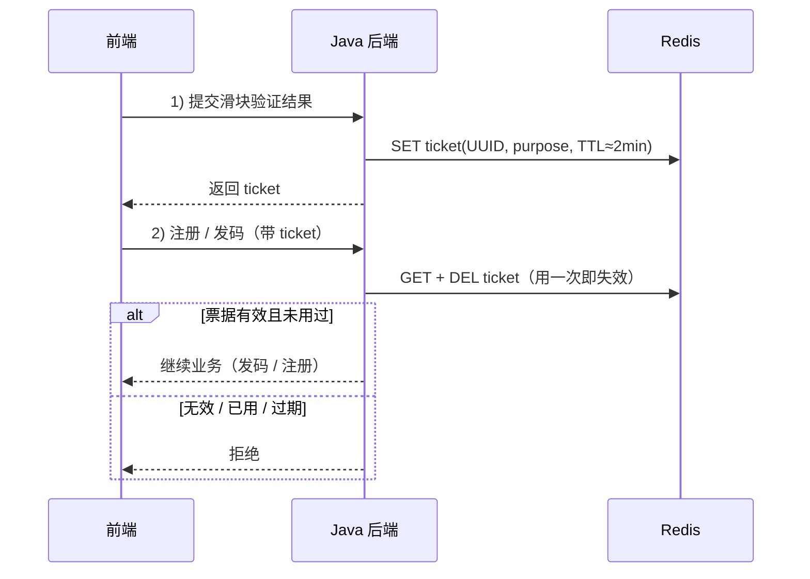

### 5) 积分抽奖防超卖

抽奖最怕 **积分扣成负数** 和 **限量奖品发超**。关键扣减在事务内用 **带条件的 UPDATE** 保证原子性；并发抽奖对用户行 `SELECT FOR UPDATE` 串行化。

- 扣积分：`WHERE points >= cost`，影响行数为 0 则失败
- 扣库存：`WHERE stock > 0`，失败则换奖品重抽（有上限）
- **硬保底**：连续 N 次未中头奖 → 下次走保底池
- **软保底**：十连最后一抽兜底，保证至少一个稀有

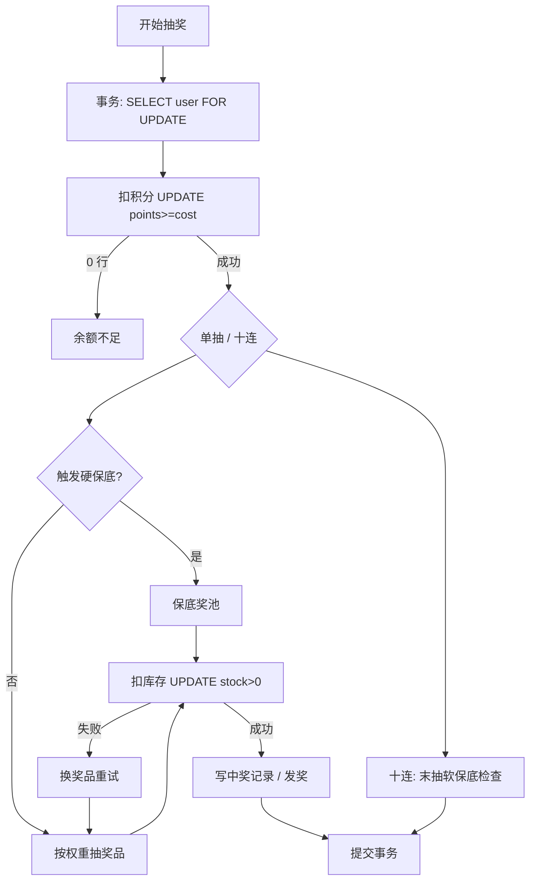

### 6) 私信跨实例推送

多实例时，接收方的 WebSocket 连接落在哪台机器不确定。写库后向 Redis **PubSub 广播**推送事件；**只有持有目标连接的那台实例**真正下发，其余实例忽略。

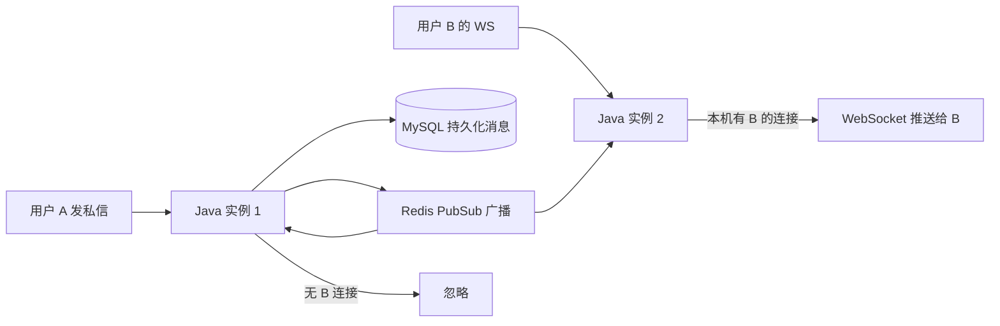

### 7) 热帖榜（Redis ZSet 蓝绿切换）

热帖榜用 Redis **ZSet**：member 为帖子 ID，score 为热度。点赞 / 浏览 / 回复 / 收藏等行为通过 `ArticleHotRankingService.incrementScore` 更新；删帖、驳回、下线时在 **事务提交后** `ZREM` 并清理搜索/RAG。定时任务在**非活跃槽**重建完整榜单，再原子切换 `hot:articles:active` 指针，重算期间读侧始终命中旧槽，避免空榜。

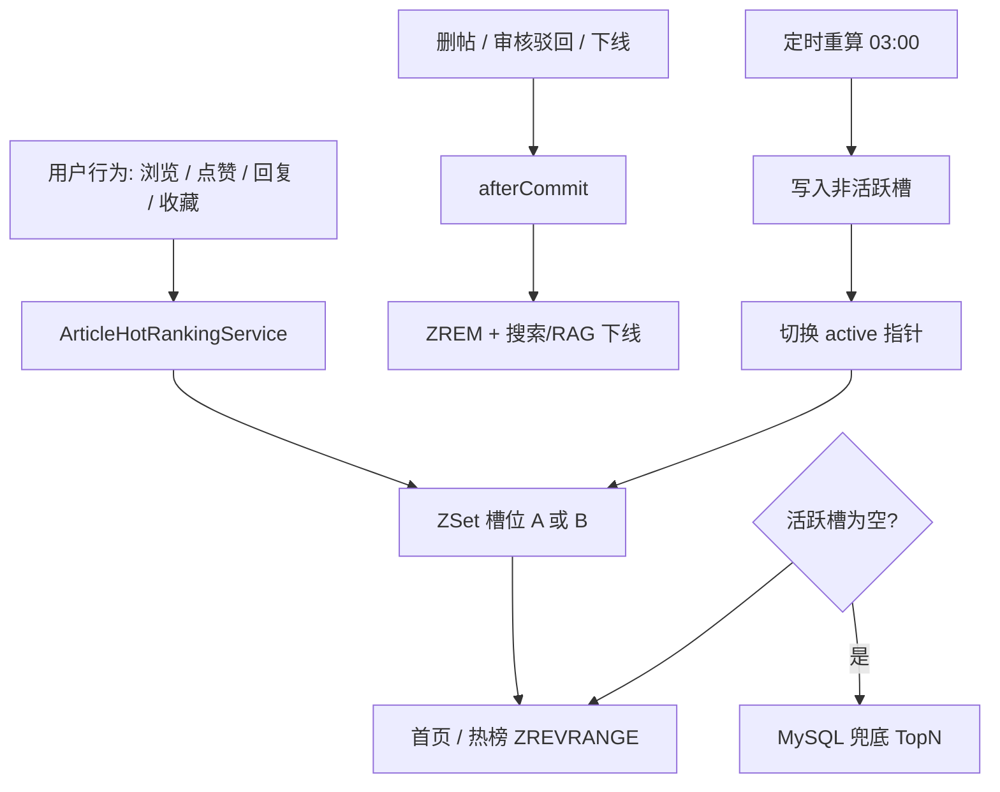

### 8) 智能搜索（快搜 + 语义增强）

搜索分层：**先数据库** `LIKE` 快搜（低成本、稳定）；结果过少或相关性不足时，再调 **ai-server** 做语义排序 / RAG 召回，把更相关的帖子排到前面。

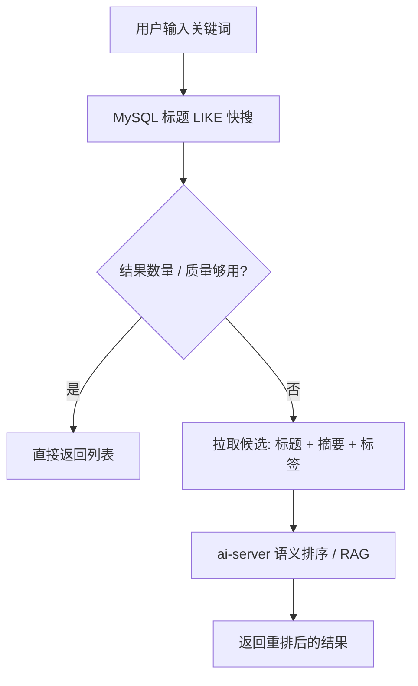

### 9) 局部责任链（Guard Chain）

后端只在**前置准入校验**上使用局部责任链，避免业务入口继续堆叠大量重复 `if`。责任链只回答“能不能继续”，失败时返回统一错误；真正的落库、扣积分、库存扣减、MQ 投递、WebSocket 广播和状态流转仍由原 Service 主流程负责。

已接入的 Guard Chain：

- 五子棋房间动作：`MOVE / CHAT / SURRENDER`，校验房间存在、进行中、玩家身份、回合、坐标、空位和聊天内容
- 五子棋匹配入口：校验用户存在、积分足够、未在对局中、未重复入队
- 井字棋房间动作：在 `JinziRoomService` 内校验房间存在、进行中、玩家身份、回合、坐标、空位和聊天内容（不开放观战）
- 井字棋匹配入口：校验用户存在、积分 ≥ 3、未在对局中、未重复入队
- 私信发送：校验文本 / 图片 / GIF / 回复消息的内容、发送者状态、接收者、不能给自己发、媒体 URL 来源
- 发帖提交审核：校验作者、禁言、帖子可见、状态允许、审核重试次数
- 抽奖准入：校验用户 ID、抽数、活动可用、用户可用

明确不放进责任链的核心流程：

- 五子棋终局结算：对局记录、胜负统计、积分流水、玩家状态、结算事件和广播
- 井字棋终局结算：对局记录、胜负统计、积分流水（平局 scoreDelta=0）、玩家状态、结算事件和广播
- 发帖审核结果应用：`PENDING_AUDIT + taskId` 的 DB CAS、Redis dedup、通过 / 拒绝 / 异常状态落库
- 抽奖执行：积分扣减、库存扣减、中奖记录、软保底 / 硬保底计数
- 文件上传：当前私有方法校验已足够集中，拆链收益不明显

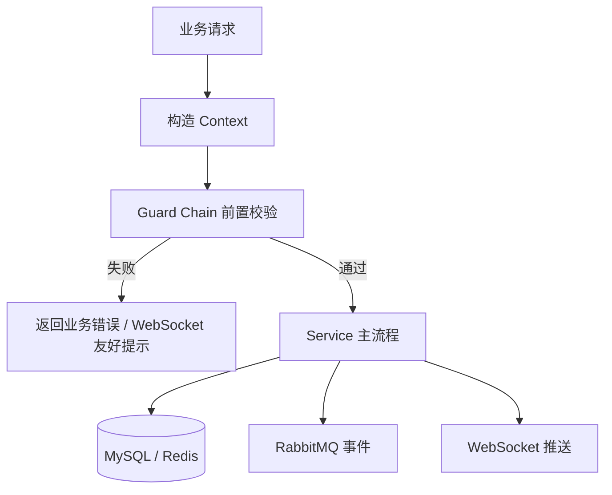

### 10) 并发写一致性与幂等（v1.7）

核心原则：**MySQL 是唯一事实来源**；Redis、热帖榜、搜索/RAG、MQ 推送均为派生数据，且尽量在 **事务提交后** 更新。

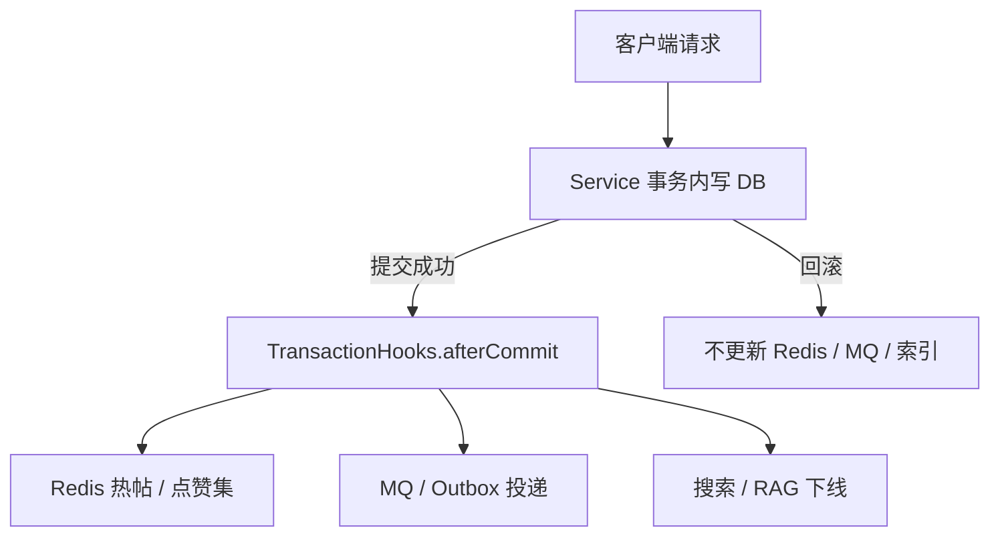

**典型幂等模式**

| 场景 | 手段 |
|------|------|
| 点赞 / 关注 | 唯一索引 + `DuplicateKeyException` |
| 积分 / VIP / 抽奖 | `idempotency_key` 或 `requestId` + `FOR UPDATE` |
| AI 计费 | `forum_ai_call_record` 预记录 + `clientRequestId` |
| MQ 消费 | `MqEventDedupHelper` Redis `SET NX` |
| 游戏匹配建房 | `GameMatchRoomHelper` 用户对 Redis 键 |
| 验证码 / 票据 | `RedisAtomicValueConsumer` Lua 原子删 |

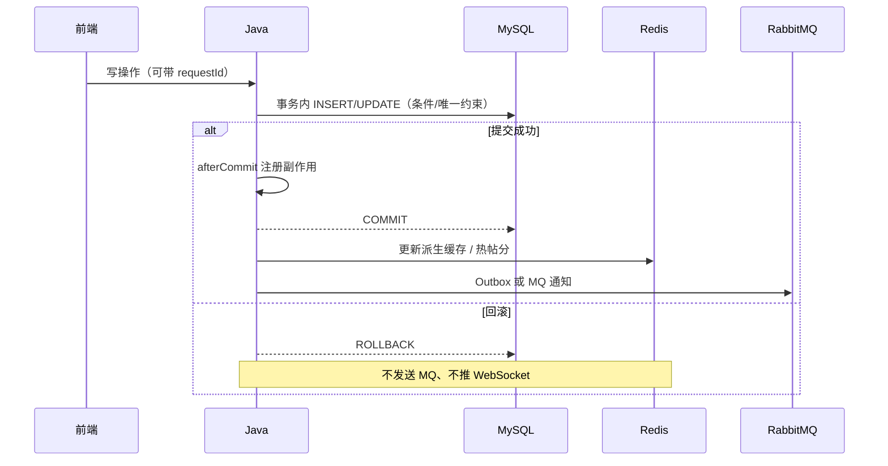

**SQL 迁移文件**（`backend/src/main/resources/sql/`，打包时复制到 `package/sql/`）

| 文件 | 使用场景 |
|------|----------|
| `create.sql` | 全新 MySQL 删库重建（**线上增量禁用**） |
| `incremental_concurrency.sql` | 已有 `forum_db` 增量（幂等键、AI 预记录、Outbox 等） |
| `postgres_ai_session.sql` | Postgres 会话表全量（可重复执行） |
| `incremental_postgres_ai_session.sql` | 已有 Postgres 库补字段/触发器 |

---

## 本地开发

### 启动顺序

```powershell
# 1. 中间件
cd nginx
docker compose -f docker-compose.dev.yaml up -d --build

# 2. 用户端
cd ..\forum-vue\front
npm install
npm run dev

# 3. 后端
cd ..\..\backend
mvn spring-boot:run

# 4. Python AI
cd ..\ai-server
python main.py
```

| 模块 | 默认地址 / 端口 |
|------|----------------|
| 用户端 | `http://localhost:5173` |
| 后端 | `http://localhost:10086` |
| AI 服务 | `http://localhost:5000` |
| MySQL | `localhost:33061` |
| Redis | `localhost:63790` |
| RabbitMQ AMQP | `localhost:56690` |
| RabbitMQ 管理台 | `localhost:25672` |
| PostgreSQL | `localhost:54320` |
| FFmpeg | `localhost:8099` |

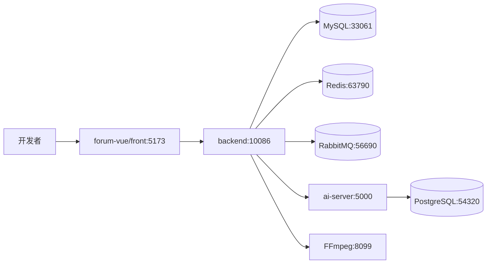

**IDEA 打开后端**：File → Open → 选 `backend` 文件夹或 `pom.xml`，Maven Reload，开启 Lombok Annotation Processors。

**五子棋本地调试**

- 游戏入口：用户端登录后访问 `/games`，再进入 `/games/gobang`
- WebSocket 入口：`/ws/game-center/lobby`、`/ws/games/gobang`、`/ws/games/gobang/rooms/{roomId}`
- 对局结果依赖 MySQL；在线、匹配与多实例房间事件依赖 Redis；异步结算事件依赖 RabbitMQ
- AI 对手依赖 `ai-server` 与 `DEEPSEEK_API_KEY`；Python 服务不可用时 Java 会使用本地规则兜底，但界面会展示兜底标识

**井字棋本地调试**

- 游戏入口：用户端登录后访问 `/games`，再进入 `/games/jinzi`
- WebSocket 入口：`/ws/game-center/lobby`、`/ws/games/jinzi`、`/ws/games/jinzi/rooms/{roomId}`
- 匹配门槛：论坛积分至少 3 分；真人胜局 ±3 分，AI 胜局 ±1 分，平局不结算
- 计时：2 分钟局时、20 秒步时；断线 30 秒内可重连，否则判负
- AI 对手约 15 秒无人匹配后触发；同样依赖 `ai-server` 与 `DEEPSEEK_API_KEY`，不可用时走本地 Minimax 兜底

### 本地密钥

```powershell
copy scripts\dev-secrets.ps1.example scripts\dev-secrets.ps1
. .\scripts\load-dev-env.ps1
```

真实 `.env`、`scripts/dev-secrets.ps1`、`ai-server/config.local.yaml` 不提交。

**数据库脚本**

| 场景 | 命令 / 文件 |
|------|-------------|
| 本地空库初始化 | `docker compose.dev` 启动后执行 `create.sql` |
| 已有库升级（对齐 v1.7） | `incremental_concurrency.sql`、`incremental_postgres_ai_session.sql` |
| 切勿在线上 | `reset-db.sh` / `create.sql`（会 DROP 库） |

### 快速验收

```powershell
cd backend
mvn clean test
# 并发相关（需本地 MySQL + Redis）
mvn test -Dtest=Phase01RedisAtomicConsumeTest,Phase02ConcurrencyAcceptanceTest

cd ..\forum-vue\front
npm run build
```

---

## 生产部署

生产部署遵循「**本机构建完整包，服务器只加载完整包**」的原则，避免前端 `index.html` 与 `assets` 版本不一致。

### 发布模式对比

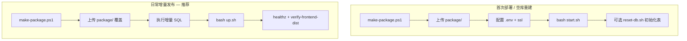

| 步骤 | 首次部署 | 增量发布（已有数据） |
|------|----------|----------------------|
| 打包 | `.\scripts\make-package.ps1` | 同左 |
| 上传 | 整包 `nginx/package/` → `~/package/` | 同左 |
| 数据库 | `bash start.sh` 或 `reset-db.sh` + `create.sql` | **`incremental_*.sql`  only** |
| 启停 | `bash start.sh` | **`bash up.sh`** |
| 数据卷 | 新建 | **保留**（禁止 `down -v`） |

### 增量发布流程（线上常规）

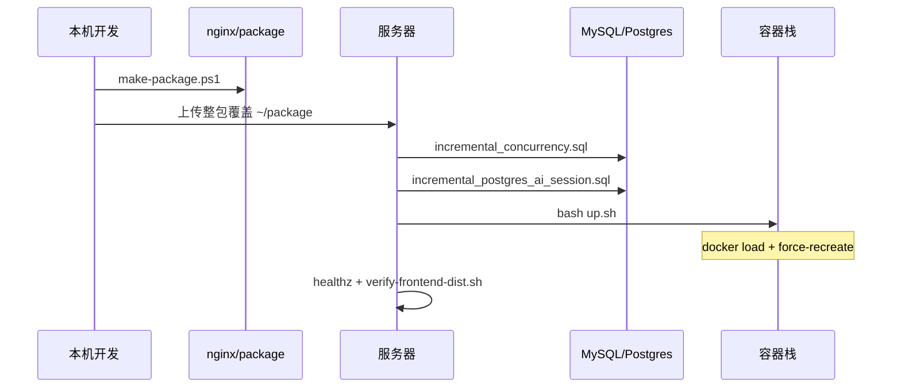

**本机**

```powershell
cd nginx
.\scripts\make-package.ps1
```

**服务器**（在 `~/package` 执行）

```bash
# 1. 增量 SQL（v1.7 并发整改；可重复执行）
docker exec -i forum-mysql mysql -uroot -p'<MYSQL_ROOT_PASSWORD>' forum_db \
  < sql/incremental_concurrency.sql

docker exec -i forum-postgres psql -U langgraph -d langgraph_db \
  < sql/incremental_postgres_ai_session.sql

# 2. 重建容器（保留数据卷）
bash up.sh

# 3. 验证
curl -s http://127.0.0.1/healthz
./verify-frontend-dist.sh .
docker compose -f docker-compose.yaml -f docker-compose.prod.yml ps
```

```mermaid
flowchart LR
  Local[本地 make-package.ps1] --> Pack[nginx/package]
  Pack --> Upload[上传整包]
  Upload --> SQL[增量 SQL]
  SQL --> Up[bash up.sh]
  Up --> Load[docker load 镜像]
  Load --> Recreate[compose up --force-recreate]
  Recreate --> Check[healthz / 前端资源校验]
```

### 日常更新（无 schema 变更时）

若本次发布**仅改代码、不改表**，可跳过 SQL 步骤，直接：

```bash
cd ~/package && bash up.sh
```

### 首次部署

```bash
cd ~/package
cp .env.example .env
nano .env
bash start.sh
# 需要重建表结构时（会清空数据）：
# bash reset-db.sh
```

### 增量发布禁止事项

```mermaid
flowchart TD
  OK[bash up.sh] --> Safe[保留 MySQL/Redis 数据卷]
  BAD1[bash reset-db.sh] --> X1[DROP + CREATE 全库]
  BAD2[docker compose down -v] --> X2[删除数据卷]
  BAD3[仅上传 dist 不传 images] --> X3[index.html 与 assets 错位]
  BAD4[线上执行 create.sql] --> X4[删库重建]
```

| 禁止操作 | 后果 |
|----------|------|
| `docker compose down -v` | 删除 MySQL / Redis 等持久化数据 |
| `bash reset-db.sh` / 线上 `create.sql` | 全库 DROP 重建 |
| 服务器 `docker compose up --build` | 不 load 离线镜像，易 403 / 镜像不一致 |
| 只替换单个 `assets/*.js` | `index.html` 引用版本错位 |

`up.sh` 保留数据卷；需要排查时执行 `bash collect-logs.sh`。更多说明见打包内 `DEPLOY.txt`。

---

## 配置说明

以 `nginx/.env` 和服务器 `package/.env` 为准，真实值只来自环境变量或本地忽略文件。

| 类别 | 变量 |
|------|------|
| 安全 | `JWT_SECRET`、`PII_CRYPTO_SECRET`、`FORUM_MASCOT_INTERNAL_KEY`、`FORUM_AI_INTERNAL_KEY` |
| 数据 | `MYSQL_*`、`REDIS_PASSWORD`、`RABBITMQ_*`、`POSTGRES_*` |
| AI | `DASHSCOPE_API_KEY`、`DEEPSEEK_API_KEY`（须来自 [platform.deepseek.com](https://platform.deepseek.com)，**勿与 DashScope 混用**）、`HUANAPI_*`、`TAVILY_API_KEY`、`BAIDU_MAP_API_KEY` |
| OSS | `ALIYUN_ACCESS_KEY_ID`、`ALIYUN_ACCESS_KEY_SECRET`、`OSS_BUCKET_NAME`、`OSS_URL_PREFIX`、`OSS_ROOT_PREFIX` |
| OSS → ai-server | 同上 OSS 变量须注入 **forum-ai-server**（视频审核签名读私有桶） |
| 邮件 | `MAIL_USERNAME`、`MAIL_PASSWORD` |

五子棋 / 井字棋 AI 使用 DeepSeek：低水平对手走 `deepseek-v4-flash`，高水平对手走 `deepseek-v4-pro`；模型名称配置在 `ai-server/config.yaml` / `config.docker.yaml` 的 `deepseek.model_flash`、`deepseek.model_pro`。看板娘 MCP 内置 `tavily_search`、`get_current_datetime`、`map_*`，需要对应 API Key。

---

## 常见问题

### 1) 五子棋对局结束后还能发消息导致异常

结束后房间会清理内存状态，但前端还会停留 60 秒展示胜负和胜线。后端必须把这段窗口里的聊天、表情、落子、认输都拦截成友好提示：`当前对战已经结束，不能发送消息或表情包`。如果又出现堆栈，优先看 `GobangGuardChain` 中的房间存在、进行中和玩家动作准入校验。

### 2) 五子棋 WebSocket 已连接但棋盘不刷新

检查三层连接是否连对：大厅 `/ws/games/lobby`，游戏 `/ws/games/gobang`，房间 `/ws/games/gobang/rooms/{roomId}`。落子后不应该依赖 HTTP 刷新，前端应直接应用 `move_accepted` / `game_finished` 的 payload。

```mermaid
flowchart TD
  A[棋盘没刷新] --> B{房间 WS 有消息?}
  B -->|没有| C[检查 token、roomId、Nginx WS 代理]
  B -->|有| D{消息类型正确?}
  D -->|move_accepted| E[检查前端 applyMove]
  D -->|game_finished| F[检查胜线和结束态渲染]
  D -->|room_error| G[按后端提示修权限 / 状态]
```

### 3) 井字棋 WebSocket 已连接但棋盘不刷新

检查游戏连接与房间连接是否连对：大厅 `/ws/game-center/lobby`，游戏 `/ws/games/jinzi`，房间 `/ws/games/jinzi/rooms/{roomId}`。落子后应直接应用 `move_accepted` / `game_finished` 的 payload，不要依赖 HTTP 轮询刷新。

### 4) AI 对手一直显示本地策略兜底

说明 Java 没拿到 Python / DeepSeek 的合法坐标。依次检查：`ai-server` 是否在 `5000` 端口；`FORUM_AI_INTERNAL_KEY` 是否一致；`DEEPSEEK_API_KEY` 是否有效；Python 返回坐标是否为空位。兜底不是错误，但如果 Python 已启动仍长期兜底，优先查 Python 日志里的 DeepSeek 调用失败原因。

### 5) 前端 403 / 白屏

通常是生产包没整体更新，导致 `index.html` 指向的 `assets` 不存在。不要只传单个 JS 文件；重新上传完整 `nginx/package`，服务器执行 `bash up.sh`，再跑 `./verify-frontend-dist.sh .`。

### 6) 审核一直显示异常

视频审核最常见是私有 OSS 导致 DashScope 无法拉取媒体，确认 ai-server 注入 OSS 变量并生成签名 URL。RabbitMQ 队列短暂 `NOT_FOUND` 多数是启动竞态，Java / Python 都起来后会恢复；持续存在时检查交换机和队列声明。

### 7) Redis / RabbitMQ 在游戏里分别负责什么

Redis 更适合短生命周期实时状态：大厅在线、游戏在线、匹配队列、房间快照、跨实例房间事件广播。RabbitMQ 更适合“必须最终处理”的事件：对局结束后异步结算、补偿任务、统计刷新和通知扩展。不要把实时棋盘权威状态只放进 MQ，棋盘最终裁决仍由 Java 房间服务完成。

### 8) 本地 RabbitMQ 端口对不上

开发 Compose 默认把 RabbitMQ AMQP 映射到 `56690`，而后端配置如果没有加载本地环境变量，可能仍按 `56720` 连接。启动后端前确认 `SPRING_RABBITMQ_PORT=56690`，或在本机显式启动与 `application.yml` 一致的 RabbitMQ 端口。

### 9) 未登录点击功能直接跳转登录页

v1.6 起首页搜索、创作中心、私信、看板娘等交互应弹出「需要登录」确认框。若仍直接跳转，检查 `loginPrompt.js` 与路由 `meta.requiresAuth` 是否被绕过。

### 10) 行为验证码失败后弹窗不关闭

验证失败（业务码 `1168`）须自动关闭弹窗，由用户下次手动触发。检查 `BehaviorCaptchaDialog.failAndClose` 与 `checkCaptcha` 的 `silentBizCodes` 配置。

### 11) 增量发布后接口 500 / 缺表

v1.7 起若后端报 `forum_ai_call_record`、`forum_outbox_message` 等表不存在，说明**未执行增量 SQL**。在 `~/package` 执行 `sql/incremental_concurrency.sql` 后 `docker compose restart backend-1`。切勿用 `reset-db.sh` 修表。

### 12) AI 重试重复扣费

看板娘 / 写作 / 生图请求应携带 **`clientRequestId`**（同一轮重试复用同一 UUID）。未传时预记录表不生效，极端重试仍可能重复计费。详见 `.codex/todo/concurrency-frontend-pending.md`。

---

## 仓库结构

```text
luntan/
  backend/                 # Java 后端：API、WebSocket、积分、弹幕、关注、五子棋 / 井字棋 / 俄罗斯方块
    src/main/resources/sql/
      create.sql           # 全量建库（仅新环境）
      incremental_concurrency.sql      # MySQL 增量（线上常规）
      incremental_postgres_ai_session.sql
  ai-server/               # Python AI（审核 / 看板娘 / RAG）
  forum-vue/               # 用户端前端
  nginx/                   # Compose、Nginx、FFmpeg、打包脚本
    scripts/
      make-package.ps1     # 一键打包
      build-all.ps1        # 构建前后端与镜像
      export-images.ps1    # 组装 package/（含 sql/）
      verify-package.ps1   # 打包自检
      server-up.sh         # → package/up.sh
    package/               # 上传服务器的完整部署包（gitignore）
    ffmpeg/                # 视频压缩 / 审核抽帧
  .codex/                  # 本地设计 / 待办文档（gitignore）
    concurrency-update/    # 并发整改阶段说明与 IMPLEMENTATION.md
    todo/                  # 前后端 backlog
  scripts/
    dev-secrets.ps1.example
    load-dev-env.ps1       # 本地加载密钥到当前 PowerShell 会话
  luntan.code-workspace    # 多根工作区（可选）
```

**Git 忽略要点**：`.env`、`.codex/`、`nginx/package/`、`nginx/dist/`、`target/`、`node_modules/`、`ssl/*.pem`、`scripts/dev-secrets.ps1`、本地 `ai-server/config.local.yaml` 等，见根目录 `.gitignore`。
