<div align="center">
# 萌部落社区

<strong>内容交流 · 同好互动 · AI 陪伴</strong>

[](https://www.nuonuoya.cn)


[访问社区](https://www.nuonuoya.cn) · [项目结构](#项目结构) · [Java 业务](#java-业务模块) · [AI 模块](#ai-模块) · [本地启动](#本地启动)

</div>

萌部落是一个前后端分离的兴趣社区，把发帖、评论、收藏、聊天、成长、游戏和 AI 陪伴放在一套体系里。

## 核心功能展示


## 项目总览

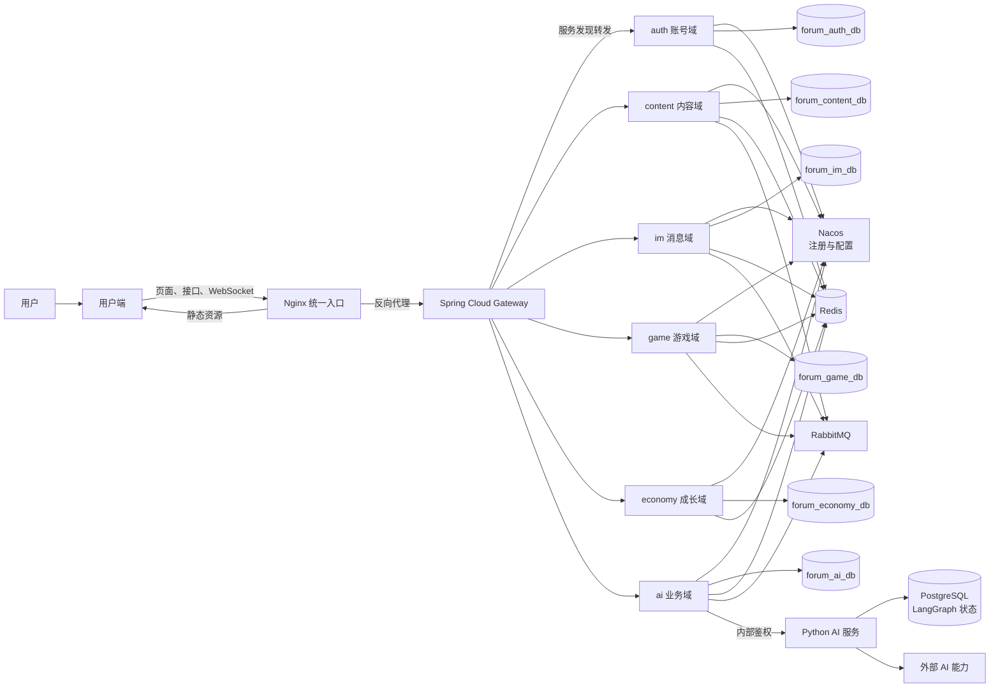

整体思路：用户端负责操作和展示；Nginx 只暴露入口；Gateway 按路径把请求转发到六个业务域；每个域各自持有契约（`api`）与实现（`server`），并通过 Nacos 完成注册发现。AI 能力集中在 Python 服务，Java 的 `ai` 域负责额度、会话与业务落库，普通社区功能不依赖某一具体模型。

## 项目结构

| 目录 | 负责什么 |
| --- | --- |
| `forum-vue` | 用户端页面、编辑器、社区互动与看板娘界面 |
| `java-cloud-standalone` | 单机微服务：Gateway + 六域 `api`/`server` + 公共 `common` |
| `ai-server` | 发帖检查、摘要、写作、生图、站内检索与看板娘 |
| `nginx` | 网站入口、Compose、打包和发布脚本 |
| `live2d` | 看板娘模型资源 |
| `migrate-online-db.sh` | 线上/本地 MySQL 从旧单库拆到六域库的迁移脚本 |

### 微服务模块边界

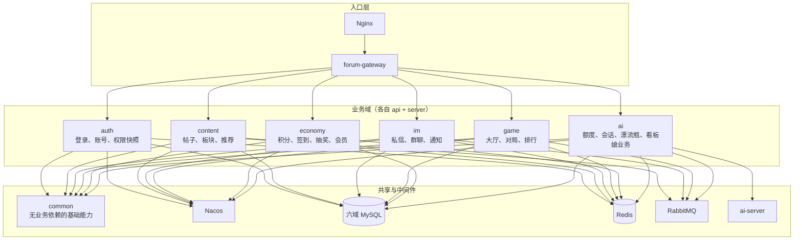

域与域之间只依赖对方的 `xxx-api` 契约，通过本地 Feign 客户端调用；不再使用跨域共享的 Entity / Mapper / Service 实现。

## Java 业务模块

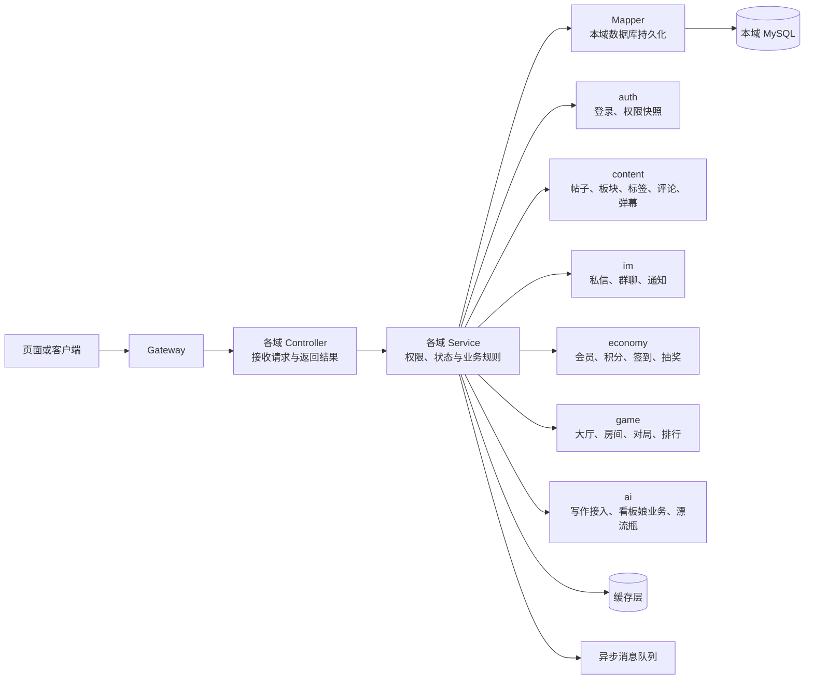

Java 模块按社区中的真实业务域划分，每个域是独立进程。同一条帖子无论从首页、搜索、收藏夹、个人主页还是看板娘对话进入，最终都回到 `content` 域同一份帖子与互动数据；账号身份由 `auth` 域提供快照，其他域按需调用。

### 帖子发布与审核

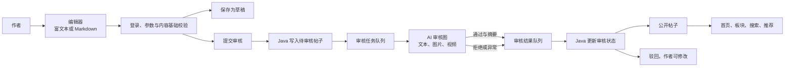

帖子、问答、视频和弹幕都建立在内容社区模块上。发布时先保存必要内容，再进行检查；最终是否公开由 Java 后端决定，AI 只给出内容检查结果。

### 帖子互动与通知

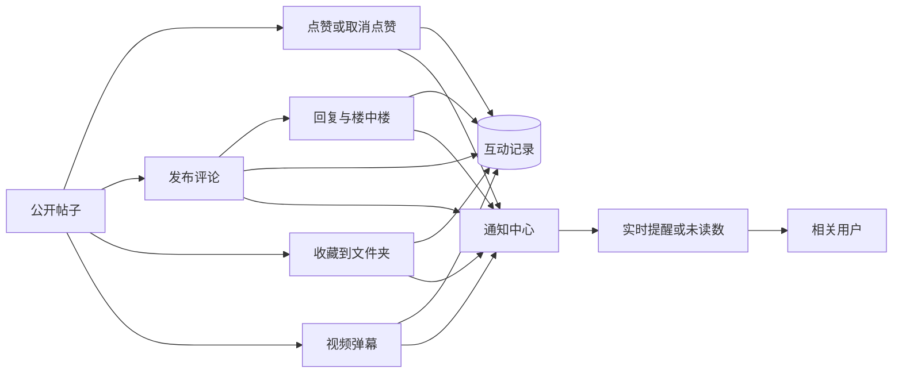

互动数据和帖子数据分开保存，但展示时会组合在一起。这样既能显示每个人的点赞、收藏和回复状态，也能让通知中心准确告诉用户发生了什么。

### 搜索、热帖与推荐

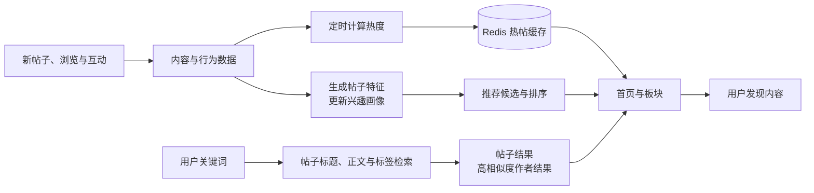

发现模块不是另外复制一份帖子，而是根据已有内容、互动和兴趣帮助用户更快找到想看的内容。搜索优先找帖子本身；需要时也能找到与关键词高度相关的作者。

### 私信、群聊与实时互动

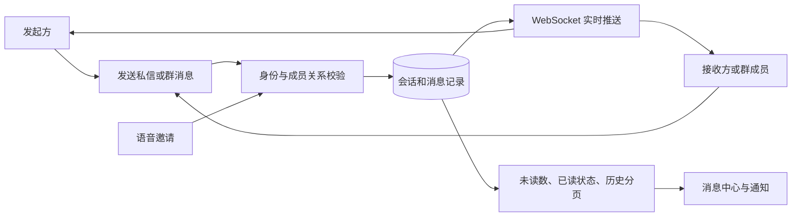

私信、群聊和语音功能共用“消息先保存，再实时送达”的思路。用户重新进入页面后仍能看到历史消息；多人同时在线时也能及时收到新消息。

### 游戏中心

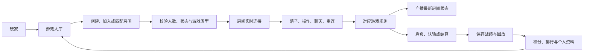

五子棋、井字棋和俄罗斯方块复用大厅、房间、实时连接和结算这套基本流程；每种游戏只保留各自的规则和画面，不重复建立一整套社交和排行系统。

## AI 模块

AI 模块采用“统一入口、模块化处理”的方式。Java 后端不直接调用某一张图或某个模型，而是把请求交给 AI 服务入口；AI 服务按 `taskType + intent + version` 路由到已注册模块。当前的八个 Python 模块目录承载内容审核、摘要、创作、生图、游戏、搜索、RAG、推荐和看板娘九类 Gateway 能力；Java 始终负责权限、额度、持久化与最终业务状态。

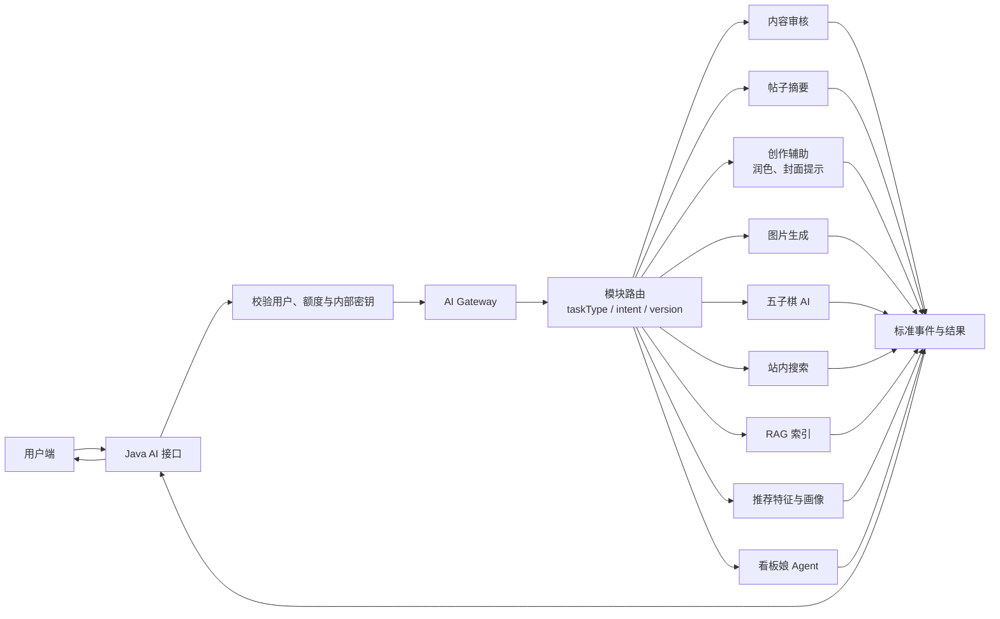

### 内容审核模块

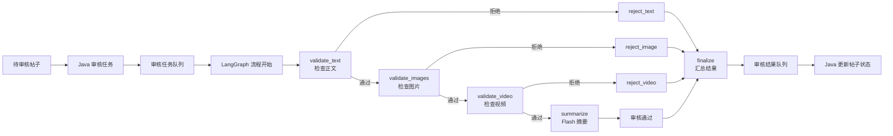

内容审核走 RabbitMQ 异步链路，避免用户发帖时一直等待。审核模块也提供单独的文本、图片检查入口：文本优先命中语义缓存；图片先校验 Base64、体积与格式，再由视觉模型描述、文本模型判定。无论 AI 给出什么结论，Java 才能变更帖子审核状态。

### 帖子摘要模块

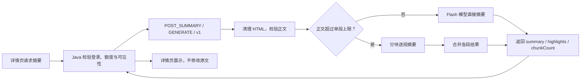

摘要模块使用 `AiRuntime` 调用快速文本模型；它仅输出内容理解结果，不修改帖子原文或审核状态。

### 创作与图片生成模块

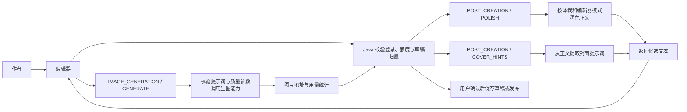

创作模块只生成候选内容、提示词或图片 URL。草稿保存、发布、积分扣除与权限校验都留在 Java，AI 不会直接写入帖子状态。

### 游戏 AI 模块

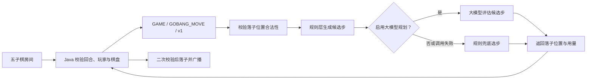

游戏模块只建议一步棋；房间状态、胜负结算与 WebSocket 广播由 Java 游戏服务控制，模型不可绕过游戏规则。

### 推荐画像模块

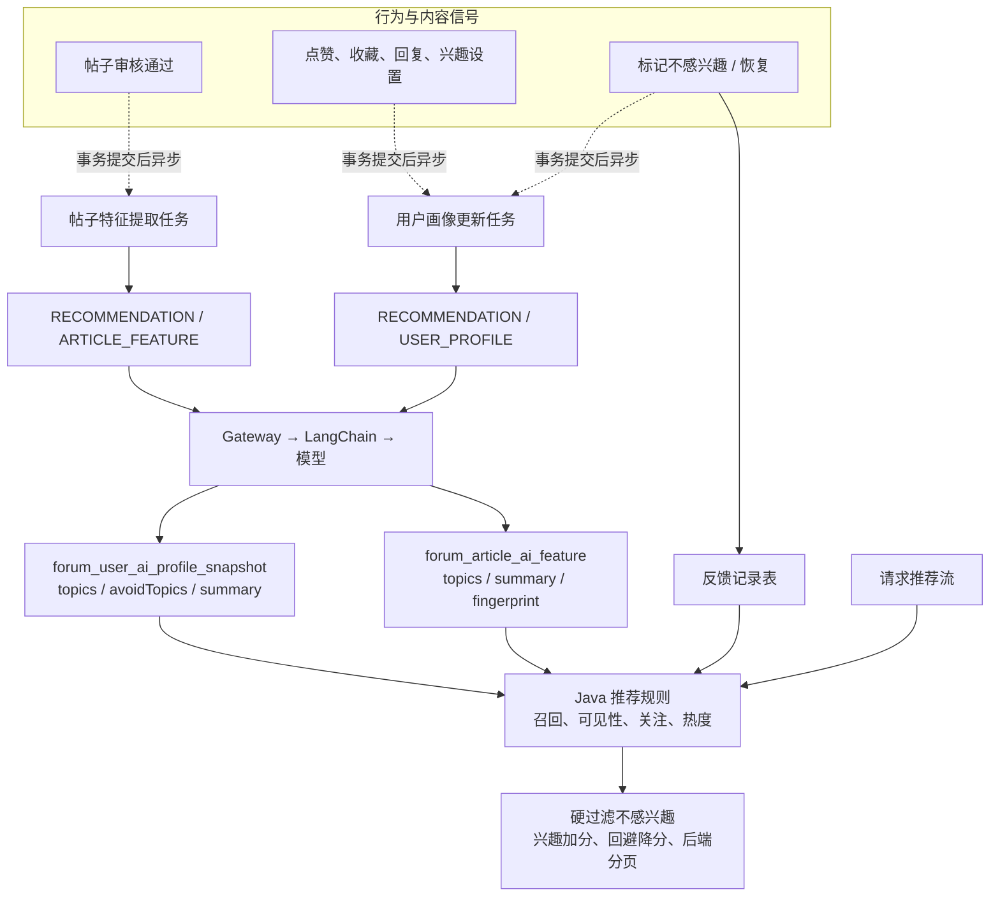

推荐 AI 只异步提炼公开帖主题与用户的聚合兴趣/回避主题，模型失败时使用规则兜底。推荐候选、帖子可见性、不感兴趣硬过滤和最终排序始终由 Java 完成；该模块不经过 RabbitMQ，也不需要 LangGraph。

### 看板娘助手模块

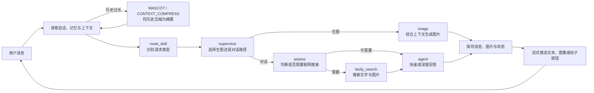

看板娘会参考正在进行的对话。多数问题优先快速回答；只有需要复杂推理、规划或多步骤处理时才使用更强模型。长会话先压缩为摘要，检索到的帖子结果会保存到当前会话中，用户关闭再打开仍可以继续查看。

### 站内搜索模块

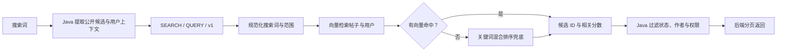

搜索模块只返回候选 ID 与分数，响应中明确标注仍需 Java 权限过滤。看板娘需要外部网页或地图信息时，才在自身 Agent 图中按需调用对应 MCP 工具。

### RAG 索引模块

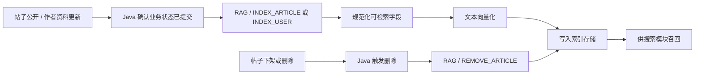

RAG 模块将文章与用户资料的索引写入、删除统一收敛到 Gateway；它不拥有帖子公开状态，索引命中后仍由 Java 过滤。

### AI 使用的数据与记录

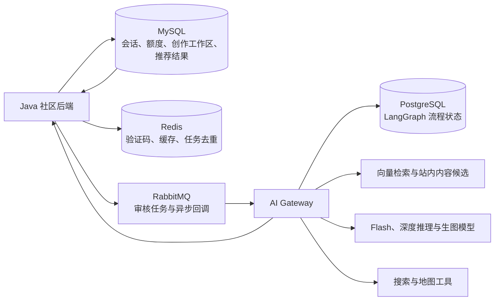

会话、额度和业务结果留在社区数据中；AI 流程本身保留必要的过程记录。这样既能让用户回到上次的对话，也能避免模型调用越过社区已有的账号和权限规则。

## 技术栈

### Java 后端

| 依赖 | 版本 | 用途 |
| --- | --- | --- |
| Spring Boot | 3.5.x | Web、AMQP、Mail、Validation、WebSocket |
| MyBatis-Plus | 3.5.15 | Lambda API 查询，自带分页插件 |
| JJWT | 0.11.5 | JWT 签发与解析 |
| springdoc-openapi | 2.8.0 | 开发期 Swagger UI |
| spring-security-crypto | 随 Spring Boot | BCrypt 密码加密，未引入完整 Security 框架 |
| tianai-captcha | 1.5.5 | 滑块拼图验证码 |
| ip2region | 2.7.0 | 离线 IP 归属地解析 |
| Apache POI / PDFBox | 5.2.5 / 3.0.5 | Word、PDF 题库文档解析 |
| 阿里云 OSS SDK | 3.17.4 | 图片、视频文件存储 |
| 阿里云短信 SDK | 1.2.2 | 手机号验证码 |
| thumbnailator | 0.4.20 | 上传图片压缩与缩略图 |
| Hutool | 5.8.x | 通用工具集 |

### Python AI 服务

| 依赖 | 版本 | 用途 |
| --- | --- | --- |
| Flask | 3.x | HTTP Gateway 入口 |
| LangChain Core | 0.3.x | 模型调用与链路封装 |
| LangGraph | 0.2.x | 审核、看板娘等有状态 Agent 图 |
| langgraph-checkpoint-postgres | 2.x | LangGraph 线程状态持久化到 PostgreSQL |
| dashscope | ≥1.20 | 通义系列模型，含文本、视觉和生图 |
| Pillow | ≥10 | 图片格式校验与处理 |
| pika | 1.3.2 | RabbitMQ 消费者，负责审核异步链路 |
| psycopg3 | ≥3.1 | PostgreSQL 驱动 |
| redis-py | ≥5.0 | 语义缓存与状态去重 |
| oss2 | ≥2.18 | 阿里云 OSS 写入 |

### 前端

| 依赖 | 用途 |
| --- | --- |
| Vue 3 + Vite | SPA 框架与构建工具 |
| Pinia + pinia-plugin-persistedstate | 状态管理，支持本地持久化 |
| Vue Router | 客户端路由 |
| Element Plus | UI 组件库，配置中文语言包 |

### 基础设施

| 服务 | 镜像版本 | 用途 |
| --- | --- | --- |
| Nginx | 1.30.1 | 反向代理、HTTPS 终止、静态资源分发 |
| Nacos | 3.1.1 | 服务注册发现与配置中心 |
| MySQL | 9.7.0 | 六个业务域独立库 |
| Redis | 8.0 | 缓存与排行榜，allkeys-lru 策略，限 256 MB |
| RabbitMQ | 4.3-management | 审核任务的异步消息队列 |
| PostgreSQL | 17 | LangGraph checkpoint 持久化存储 |

## 本地启动

准备 Java 17、Python 3.11、Node.js、Docker Desktop，以及 MySQL、Redis、RabbitMQ、PostgreSQL、Nacos。

```powershell
# 中间件（开发 Compose）
cd nginx
docker compose -f docker-compose.dev.yaml up -d

# 用户端
cd ..\forum-vue\front
npm install
npm run dev

# Java 微服务（IDEA 推荐按模块启动，或根目录 reactor 打包后分别启动）
cd ..\..\java-cloud-standalone
mvn -DskipTests package
# 依次启动：gateway、auth、content、im、game、economy、ai

# AI 服务
cd ..\ai-server
python main.py
```

若本地仍是旧的单库 `forum_db`，可先执行：

```bash
bash migrate-online-db.sh migrate-data
```

本地构建和 Docker 构建会通过本机 `7897` 代理访问外部依赖。密钥和环境差异只放在环境变量或本地配置中，不放入仓库。

### 环境变量说明

参考 `nginx/.env.example`，主要配置项：

| 变量 | 说明 |
| --- | --- |
| `JWT_SECRET` | JWT 签名密钥，生产必须替换 |
| `PII_CRYPTO_SECRET` | 手机号等敏感字段对称加密密钥 |
| `MYSQL_ROOT_PASSWORD` | MySQL root 密码 |
| `FORUM_*_DB_USERNAME` / `FORUM_*_DB_PASSWORD` | 六个业务域数据库账号 |
| `NACOS_ADDR` | Nacos 地址，生产默认 `nacos:8848` |
| `REDIS_PASSWORD` | Redis 认证密码 |
| `RABBITMQ_USER` / `RABBITMQ_PASSWORD` / `RABBITMQ_VHOST` | MQ 账号与虚拟主机 |
| `DASHSCOPE_API_KEY` | 通义大模型 API Key |
| `TAVILY_API_KEY` | 看板娘联网搜索 Key |
| `HUANAPI_IMAGE_KEY` | 图片生成服务 Key |
| `ALIYUN_ACCESS_KEY_ID/SECRET` | 阿里云 OSS / 短信公共凭据 |
| `FORUM_MASCOT_INTERNAL_KEY` | Java ↔ Python 内部鉴权密钥，两侧须一致 |
| `FORUM_VOICE_TURN_*` | 语音通话用的 TURN 服务器地址和凭据 |

## 打包发布

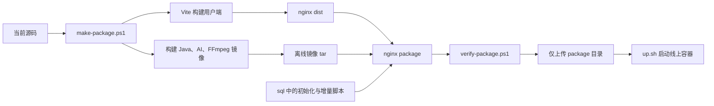

在 `nginx` 目录执行：

```powershell
.\scripts\make-package.ps1
```

默认只显示简洁的构建结果。需要查看镜像构建详情时，再使用：

```powershell
.\scripts\make-package.ps1 -ShowBuildDetails
```

完整发布包会生成在 `nginx\package\`。上传前可校验：

```powershell
.\scripts\verify-package.ps1
```

发布包以六个 server 模块各自的 `src/main/resources/db/create.sql` 作为独立数据库初始化基线。已有旧单库 `forum_db` 的环境，上线前用包内 `migrate-online-db.sh migrate-data` 建六域结构并搬迁数据，默认保留 `forum_db`。旧会话清理默认关闭，只有明确把脚本中的开关改为 `1` 才会执行清理。

## 核心设计思路

权限边界放在各 Java 业务域的 Service 层。前端的登录拦截只是减少无效请求；跨域调用通过 `auth-api` 等契约获取身份快照，AI 服务也只接受附带内部密钥的请求。

帖子有一套严格的状态流转：草稿 → 待审核 → 已发布，每一步只能由 Java Service 推进。审核期间字段锁定，前端拿不到直接改状态的入口。每次提交审核都会生成一个任务 ID 写入 `article.audit_task_id`，和 AI 侧 LangGraph 的 `thread_id` 对应，审核过程可以完整追溯。

AI 服务只管生成，不管写入。审核结论、摘要、推荐特征都由模型给出，但落库的动作始终在 Java 完成。这样换模型或 AI 服务临时挂掉，不会影响发帖、聊天这些核心功能。

消息的逻辑是先存后推。WebSocket 断线重连后，未读内容从数据库补全，不依赖连接状态。私信、群聊、语音邀请和系统通知走同一套流程，差别只在消息类型字段。

游戏的实时状态放在内存里，结束后再写库。对局中的每一步通过 WebSocket 广播给房间成员，游戏结束才把战绩和回放写进数据库，不做高频持久化。

站内搜索优先走向量召回，没命中再退回关键词排序。搜索模块只返回候选 ID 和相关分数，权限过滤和分页由 Java 完成，搜索结果不会泄露无权查看的内容。

## 数据表概览

业务表按六个独立库拆分：`forum_auth_db`、`forum_content_db`、`forum_im_db`、`forum_game_db`、`forum_economy_db`、`forum_ai_db`。每张表都有 `create_time`、`update_time`、`delete_state` 三个基础字段，主键统一用 `BIGINT AUTO_INCREMENT`。

| 分组 | 主要表 |
| --- | --- |
| 用户与账号 | `user`、`user_login_log`、`user_follow`、`user_interest_preference` |
| 帖子内容 | `article`、`article_image`、`article_reply`、`article_sub_reply`、`article_video_danmaku`、`forum_article_tag` |
| 互动行为 | `article_like`、`article_reply_like`、`article_favorite`、`user_favorite_folder` |
| 私信与群聊 | `message`、`group_chat`、`group_chat_member`、`group_chat_message` |
| 漂流瓶 | `drift_bottle`、`drift_bottle_comment`、`drift_bottle_pick_log` |
| 游戏 | `game_definition`、`game_gobang_match_record`、`game_jinzi_match_record`、`game_tetris_pk_match_record`、`game_user_profile` |
| 成长与积分 | `user_growth_profile`、`growth_experience_log`、`growth_challenge`、`points_log` |
| 抽奖 | `lottery_activity`、`lottery_prize`、`lottery_draw_record` |
| AI 相关 | `forum_ai_task_session`、`forum_ai_usage_log`、`forum_ai_creation_workspace`、`forum_user_ai_profile_snapshot`、`forum_article_ai_feature`、`forum_companion_session` |
| 通知 | `forum_notice`、`system_message`、`forum_outbox_message` |

## 容器服务说明

生产栈由 `nginx/docker-compose.yaml` 定义。所有服务在 `forum-net` 网络里用服务名互通，只有 Nginx 的 80 和 443 端口对外开放；Nacos 不对外暴露。

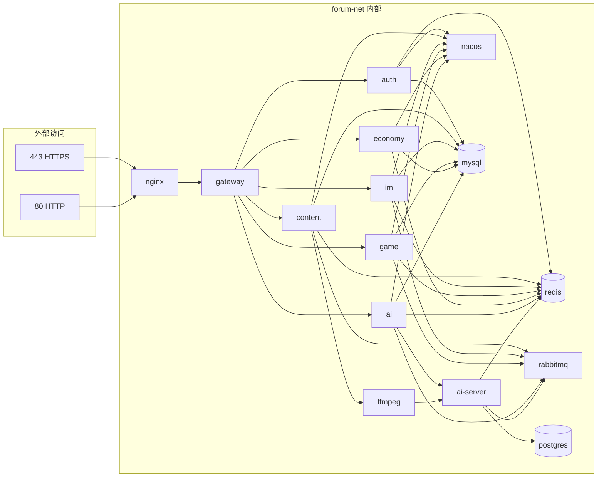

六个 Java 业务容器与 Gateway 共用同一份 `forum-backend` 镜像，启动时通过不同 jar 入口区分进程。`ffmpeg` 处理视频转码，通过内部密钥与 Java / AI 服务通信。

## 开发约定

- 内容、权限和数据由对应业务域的 Java 服务决定，页面只负责展示和提交操作。
- AI 只通过统一入口接入，页面不直接调用具体模型。
- 新的数据库变更只追加新脚本，不修改已经执行过的历史脚本。
- 密码、密钥、验证码或本地环境配置不提交仓库。
