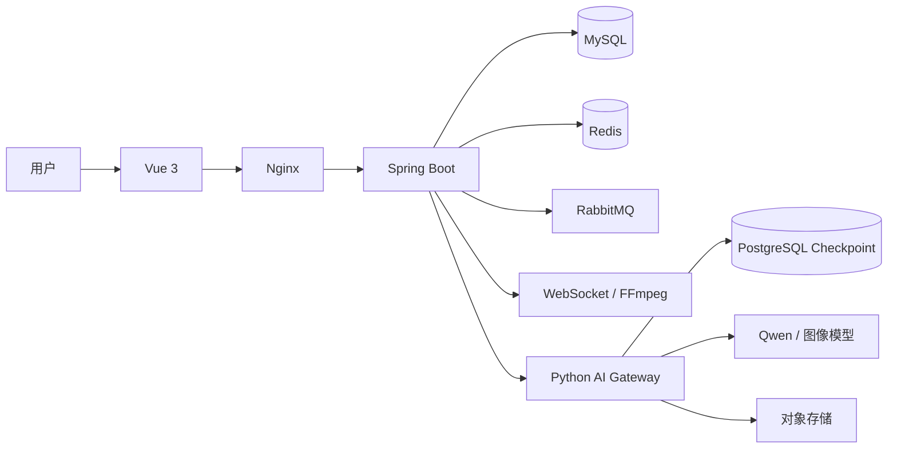
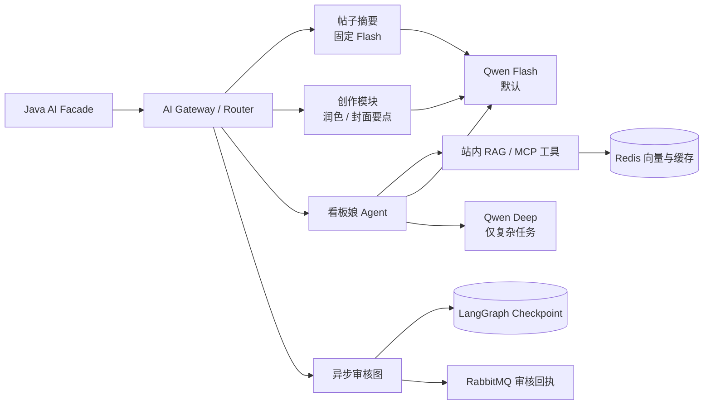

# 萌部落社区

一个面向兴趣交流的前后端分离社区项目。项目提供图文和视频内容、互动社交、成长体系、实时小游戏与模块化 AI 能力。

## 核心能力

| 领域 | 能力 |
| --- | --- |
| 内容社区 | 图文/视频发帖、标签、评论与楼中楼、问答采纳、视频弹幕、热帖与搜索 |
| 社交互动 | 关注、私信、群聊与群语音、收藏夹、表情包、匿名漂流瓶 |
| 成长体验 | 签到、积分、抽奖、会员与成长记录 |
| AI | 发帖审核、正文摘要、写作润色、封面要点、生图、语义检索、看板娘助手 |
| 游戏中心 | 五子棋、井字棋、俄罗斯方块，以及实时对局和统一排位 |

## 技术组成

| 目录 | 职责 |
| --- | --- |
| `forum-vue` | Vue 3 + Vite 用户端 |
| `backend` | Spring Boot 业务 API、权限、WebSocket、MQ 消费与业务状态 |
| `ai-server` | Python AI Gateway、LangGraph、RAG、工具调用与模型适配 |
| `nginx` | Nginx、Compose、镜像构建与发布包脚本 |
| `live2d` | 看板娘模型资源 |

## 总体架构



Java 是业务权威：负责身份、额度、内容状态、持久化与最终发布；Python 只承接稳定的 AI 模块入口及工具编排。两端通过 HTTP 和 RabbitMQ 协作，避免业务模块直接依赖具体模型实现。

## AI 架构



- 帖子摘要固定使用 Flash；看板娘默认走 Flash，只有复杂推理、规划或多步骤任务才由 Java 路由到 Deep。
- 审核使用固定 LangGraph 节点，异步结果回到 Java 决定业务状态；看板娘读取会话上下文后，可自主选择普通回复、站内 RAG、MCP 工具或图片生成。
- RAG 负责召回，Java 在展示或业务落库前继续执行公开状态、权限和额度校验。

## 本地开发

准备 Java 17、Python 3.11、Node.js、Docker Desktop，以及 MySQL、Redis、RabbitMQ、PostgreSQL。

```powershell
# 用户端
cd forum-vue\front
npm install
npm run dev

# Java 后端
cd ..\..\backend
mvn spring-boot:run

# Python AI 服务
cd ..\ai-server
python main.py
```

本地构建和 Docker 构建均通过本机 `7897` 代理访问外部依赖；密钥与环境差异只放在环境变量或被忽略的本地配置中。

## 打包与发布

从 `nginx` 目录执行：

```powershell
.\scripts\make-package.ps1
```

默认输出简洁的构建结果；需要排查镜像构建时再显式打开详情：

```powershell
.\scripts\make-package.ps1 -ShowBuildDetails
```

生成的完整发布包位于 `nginx\package\`，可使用下列命令校验：

```powershell
.\scripts\verify-package.ps1
```

线上增量数据库脚本为 [`incremental_ai_module_release.sql`](backend/src/main/resources/static/incremental_ai_module_release.sql)。它已合并本轮 AI 模块的历史增量；其中旧会话清理默认关闭，只有明确将脚本开关改为 `1` 才会执行清理。

## 贡献约定

- Java 保持 `Controller → Service → Mapper` 分层，业务权限在服务层校验。
- Vue 页面通过 API 层访问后端，异步页面处理加载、错误、空数据与无权限状态。
- Python 路由只做鉴权和参数校验，业务逻辑放在服务或模块层；模型密钥只读取环境变量。
- 数据库迁移只向前新增，不修改已执行的历史迁移。
