## 萌部落社区 v1.3

> 本项目出于个人兴趣爱好搭建；线上地址仅供学习交流。

## 部分界面演示


> 管理界面还没完全做好，目前比较糙


***

线上地址：

- 用户端：`https://www.nuonuoya.cn`

> 前后端分离技术社区：发帖（图文 / 视频）、评论、私信、抽奖、搜索、帖子标签；发布前 AI 审核；多实例部署时私信支持跨实例实时推送；看板娘支持 RAG 推荐帖子、MCP 联网与出行工具；游戏中心已接入 WebSocket 五子棋与井字棋对战。

---

## v1.3 更新摘要

- **游戏中心 / 五子棋**：新增独立游戏大厅、五子棋匹配页和蓝黑主题对局页，支持真人匹配、观战、房间聊天 / 表情、棋谱回放、天梯榜和战绩统计。
- **游戏中心 / 井字棋**：复用游戏中心通用表与结算链路，新增 3×3 井字棋匹配页与对局页；支持快速匹配、AI 对手、房间聊天 / 表情、棋谱回放、天梯榜和战绩统计（不开放观战）。
- **三层 WebSocket**：大厅在线、游戏在线、房间对局拆成独立连接，服务端主动推送在线状态、匹配结果、落子、终局胜线和观战席变化。
- **论坛积分联动**：五子棋 / 井字棋胜负直接进入论坛积分流水，玩家段位、胜率、总局数和排行榜复用论坛账号体系。
- **局时 / 步时**：五子棋支持 10 分钟局时、60 秒步时；井字棋支持 2 分钟局时、20 秒步时；超时、认输、成线 / 五连均走统一结算链路。
- **AI 对手**：长时间无人匹配时自动进入 AI 房间；低水平玩家使用 `deepseek-v4-flash`，高水平玩家使用 `deepseek-v4-pro`，DeepSeek 不可用时展示本地策略兜底（井字棋 AI 局积分变化更小）。
- **局部责任链**：五子棋动作 / 匹配、私信发送、发帖提交审核、抽奖准入已抽成 Guard Chain；结算、扣分、库存、MQ、WebSocket 广播仍保留在 Service 主流程。
- **多实例准备**：在线状态、匹配队列、房间快照、房间事件广播和对局结束事件已按 Redis / RabbitMQ 拆出扩展点。

---

## 项目概览

| 目录 | 说明 |
|------|------|
| `backend` | Java 后端（Spring Boot）：业务 API、鉴权、MQ、WebSocket、审核状态、五子棋 / 井字棋对战 |
| `ai-server` | Python：AI 审核 / 写作 / 看板娘 / 语义搜索 / RAG |
| `forum-vue` | 用户端（Vue 3 + Vite 6） |
| `forum-vue-admin` | 管理端（Vue 3 + Arco） |
| `nginx` | Nginx 配置、Docker Compose、打包脚本、`ffmpeg` 视频服务 |

---

## 整体架构

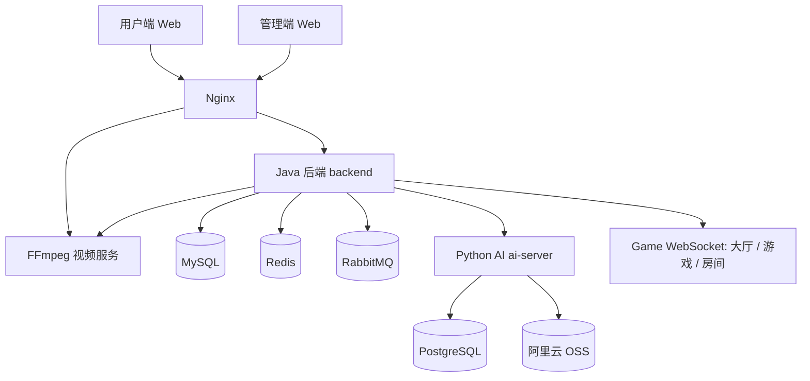

- 用户端 / 管理端 → **Nginx**（静态 `dist/` + 反代 API）
- Java → MySQL / Redis / RabbitMQ / FFmpeg / ai-server
- 五子棋 / 井字棋实时链路 → Java WebSocket（大厅在线、游戏在线、房间对局三类连接）
- 局部责任链 → Java 后端 Guard Chain，只拦截前置准入规则，不接管事务核心流程
- ai-server → PostgreSQL（LangGraph checkpoint）、DashScope、OSS 签名读私有媒体

---

## 功能一览

### 用户端

- 发帖 / 评论 / 楼中楼（富文本 / Markdown）
- **图文帖 / 视频帖**、封面、相册（最多 15 张）
- **帖子标签**（版块内申请 / 绑定）
- 发帖 **AI 异步审核**（通过才发布）
- 图片压缩 + AI 审核 + OSS；视频 FFmpeg 处理后上传 OSS
- 私信 WebSocket、积分 / 签到 / 商城 / 抽奖、热帖榜
- 智能搜索（DB 快搜 + AI 语义增强）
- 看板娘：多模型、会话历史、站内帖子 RAG、联网与地图工具
- 游戏中心：五子棋实时匹配、观战、房间聊天 / 表情、棋谱回放、战绩统计、天梯榜、AI 对手
- 游戏中心：井字棋快速匹配、房间聊天 / 表情、棋谱回放、战绩统计、天梯榜、AI 对手（平局不扣积分）

### 管理端

- 帖子 / 评论 / 公告 / 抽奖等内容管理
- 系统字典、菜单、部门、角色（RBAC 预置表）

---

## 核心流程

### 1) 游戏中心 / 五子棋（WebSocket 实时对战）

游戏中心目前先接入 **五子棋**，实时链路分成三层 WebSocket：大厅连接用于展示大厅在线与玩家状态；游戏连接用于匹配页在线人数、房间总数和最近对局；房间连接用于落子、计时、观战、聊天和终局同步。HTTP 只负责历史记录、统计、天梯榜、回放等非实时数据查询。

**五子棋能力**

- 快速匹配：真人优先，长时间无人时自动创建 AI 房间
- AI 对手：Java 调 Python AI Hub；低水平玩家使用 `deepseek-v4-flash`，高水平玩家使用 `deepseek-v4-pro`；DeepSeek 不可用或返回非法坐标时才走本地规则兜底
- 实时对局：服务端维护权威棋盘，校验回合、坐标、棋色和观战身份；落子结果通过房间 WebSocket 主动推送
- 计时规则：支持 10 分钟局时、60 秒步时，任一玩家超时直接结算
- 观战与聊天：观众只读棋局，不能落子 / 认输；房间内支持文本和已购表情包，终局后禁止继续发送消息或表情
- 棋谱与回放：每手落子写入 MySQL，前端支持历史对局回放和自动播放
- 积分结算：胜负同步论坛积分流水，战绩统计、胜率、天梯榜与论坛用户体系共享
- 多实例准备：在线状态、匹配队列、房间快照与房间事件可走 Redis；对局结束事件可投递 RabbitMQ 做补偿与异步处理

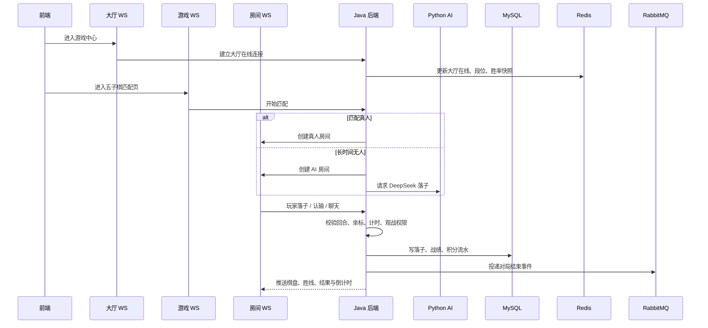

### 1b) 游戏中心 / 井字棋（WebSocket 轻量对战）

井字棋作为游戏中心第二款对战游戏，**复用** `game_definition` / `game_user_profile` / `game_match_record` / `game_room_move` 等通用表，以 `game_code = jinzi` 区分数据。实时链路同样拆成三层 WebSocket：大厅连接展示游戏中心在线；游戏连接负责井字棋匹配页在线人数与匹配队列；房间连接负责 3×3 落子、计时、聊天和终局同步。HTTP 负责个人资料、历史战绩、天梯榜与棋谱回放查询。

**井字棋能力**

- 快速匹配：按论坛积分分桶（青铜 / 白银 / 黄金 / 大师），同桶内真人优先配对
- 入场门槛：开始匹配前须至少有 **3** 论坛积分；真人胜局 ±3 分，AI 胜局 ±1 分，**平局不结算积分**
- AI 对手：队列等待约 **15 秒**无人匹配时自动创建 AI 房间；积分低于 1600 走 `deepseek-v4-flash`，达到 1600 及以上走 `deepseek-v4-pro`；DeepSeek 不可用或返回非法坐标时走本地 Minimax 兜底
- 实时对局：服务端维护权威 3×3 棋盘，校验回合、坐标、棋色；三连成线推送 `winningLine`，平局走 `END_DRAW`
- 计时规则：支持 **2 分钟**局时、**20 秒**步时；断线保留 **30 秒**重连窗口，超时判负
- 房间聊天：对局双方支持文本和已购表情包；**不开放观战席**，终局后禁止继续落子 / 认输 / 聊天
- 棋谱与回放：每手落子写入 `game_room_move`，匹配页支持历史对局回放
- 积分结算：胜负同步论坛积分流水；战绩、胜率、天梯榜与论坛用户体系共享
- 多实例准备：在线状态、匹配队列、房间快照与结算事件复用 Redis / RabbitMQ 扩展点

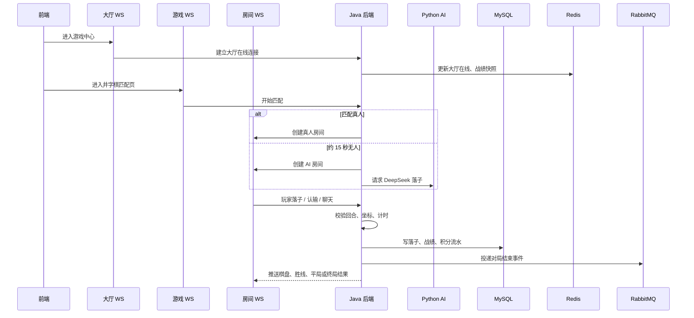

### 2) 发帖审核（异步 + 幂等）

1. 用户提交 → Java 状态改为「审核中」，生成 `taskId`，投递 `q-audit-article`
2. Python worker 消费：`validate_text` → `validate_images` → **`validate_video`**（有视频时）→ `summarize`
3. 结果回 MQ → Java 条件更新状态并通知用户

**视频审核要点**

- DashScope 需能访问视频 URL；**私有 OSS** 由 ai-server 用 `ALIYUN_*` / `OSS_*` 生成**签名 URL**
- 视频 >100MB 或 DashScope 拉取失败时：FFmpeg **抽帧** → 走图片审核兜底
- ai-server 容器须配置与 Java 相同的 OSS 环境变量（见 `docker-compose.yaml`）

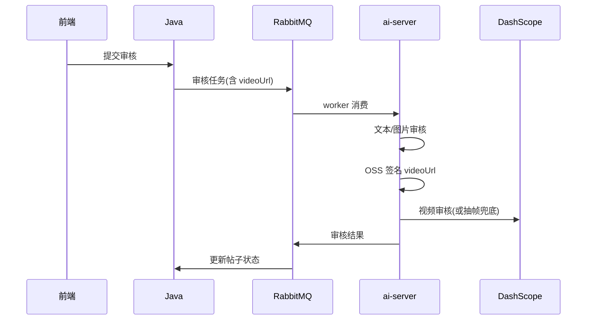

### 3) 视频上传

用户选择视频后，前端可**后台上传**并展示进度；后端按体积分流，大文件经 FFmpeg 再写入 OSS。Nginx `/file/` 代理超时 **3600s**，避免长视频压缩卡住。

- **≤200MB**：Java 直传 OSS
- **>200MB**：Java → FFmpeg（H.264+AAC 则 **remux** 不重编码，否则 **ultrafast** 重编码）→ 回传字节流 → OSS
- 绑定帖子：保存草稿 / 提交时调用 `setArticleVideo`（视频帖不调相册接口）

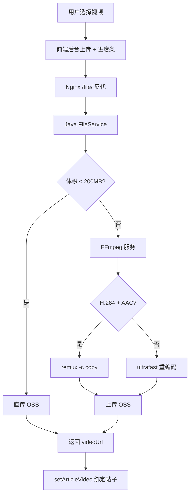

### 4) 行为验证码 + 一次性票据

短信 / 邮件有成本，注册与找回密码不能裸奔。滑块验证通过后签发 **Redis 短 TTL 票据**；后续发码 / 注册须携带票据，校验成功即 **删除**（一次性）。

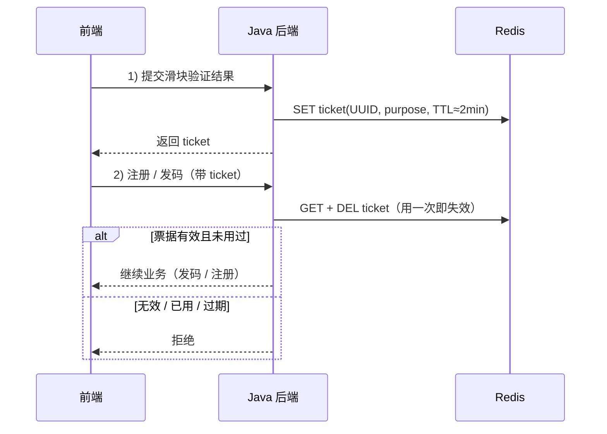

### 5) 积分抽奖防超卖

抽奖最怕 **积分扣成负数** 和 **限量奖品发超**。关键扣减在事务内用 **带条件的 UPDATE** 保证原子性；并发抽奖对用户行 `SELECT FOR UPDATE` 串行化。

- 扣积分：`WHERE points >= cost`，影响行数为 0 则失败
- 扣库存：`WHERE stock > 0`，失败则换奖品重抽（有上限）
- **硬保底**：连续 N 次未中头奖 → 下次走保底池
- **软保底**：十连最后一抽兜底，保证至少一个稀有

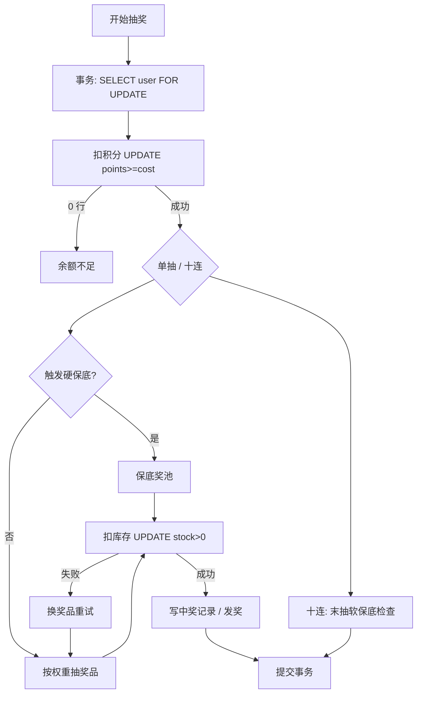

### 6) 私信跨实例推送

多实例时，接收方的 WebSocket 连接落在哪台机器不确定。写库后向 Redis **PubSub 广播**推送事件；**只有持有目标连接的那台实例**真正下发，其余实例忽略。

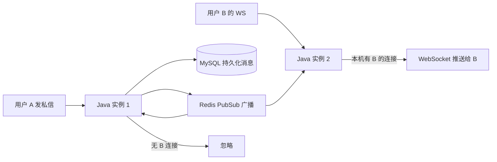

### 7) 热帖榜（Redis ZSet）

热帖榜用 Redis **ZSet**：member 为帖子 ID，score 为热度。点赞 / 浏览 / 回复 / 收藏等行为触发 `ZINCRBY`；删帖、驳回、下线时 `ZREM`。定时任务可从 DB 全量重算做兜底。

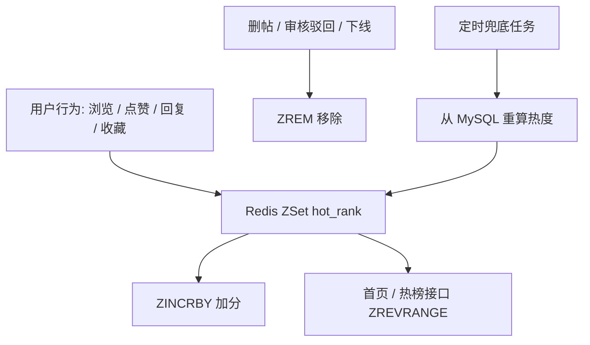

### 8) 智能搜索（快搜 + 语义增强）

搜索分层：**先数据库** `LIKE` 快搜（低成本、稳定）；结果过少或相关性不足时，再调 **ai-server** 做语义排序 / RAG 召回，把更相关的帖子排到前面。

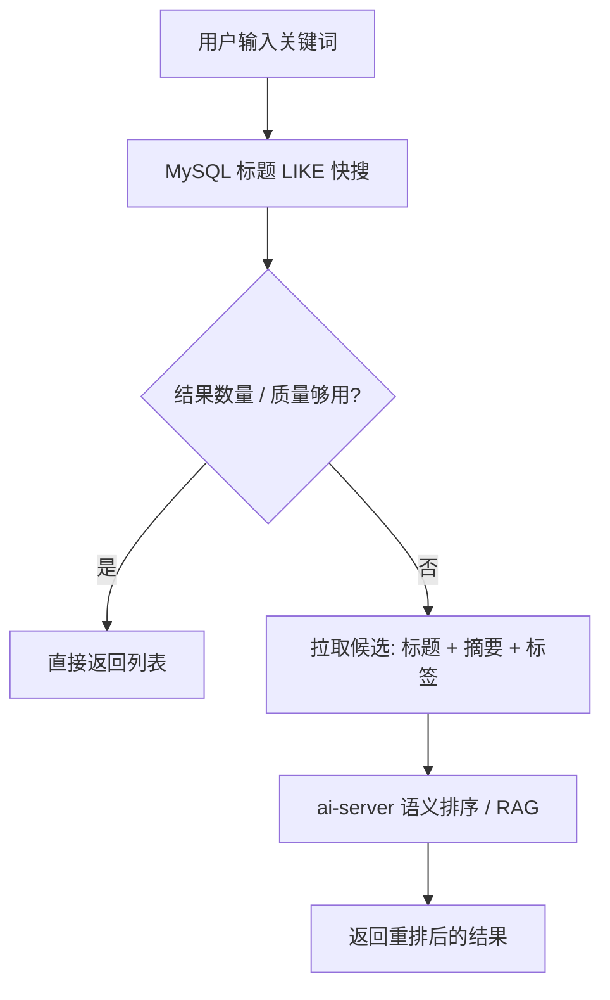

### 9) 局部责任链（Guard Chain）

后端只在**前置准入校验**上使用局部责任链，避免业务入口继续堆叠大量重复 `if`。责任链只回答“能不能继续”，失败时返回统一错误；真正的落库、扣积分、库存扣减、MQ 投递、WebSocket 广播和状态流转仍由原 Service 主流程负责。

已接入的 Guard Chain：

- 五子棋房间动作：`MOVE / CHAT / SURRENDER`，校验房间存在、进行中、玩家身份、回合、坐标、空位和聊天内容
- 五子棋匹配入口：校验用户存在、积分足够、未在对局中、未重复入队
- 井字棋房间动作：在 `JinziRoomService` 内校验房间存在、进行中、玩家身份、回合、坐标、空位和聊天内容（不开放观战）
- 井字棋匹配入口：校验用户存在、积分 ≥ 3、未在对局中、未重复入队
- 私信发送：校验文本 / 图片 / GIF / 回复消息的内容、发送者状态、接收者、不能给自己发、媒体 URL 来源
- 发帖提交审核：校验作者、禁言、帖子可见、状态允许、审核重试次数
- 抽奖准入：校验用户 ID、抽数、活动可用、用户可用

明确不放进责任链的核心流程：

- 五子棋终局结算：对局记录、胜负统计、积分流水、玩家状态、结算事件和广播
- 井字棋终局结算：对局记录、胜负统计、积分流水（平局 scoreDelta=0）、玩家状态、结算事件和广播
- 发帖审核结果应用：`PENDING_AUDIT + taskId` 的 DB CAS、Redis dedup、通过 / 拒绝 / 异常状态落库
- 抽奖执行：积分扣减、库存扣减、中奖记录、软保底 / 硬保底计数
- 文件上传：当前私有方法校验已足够集中，拆链收益不明显

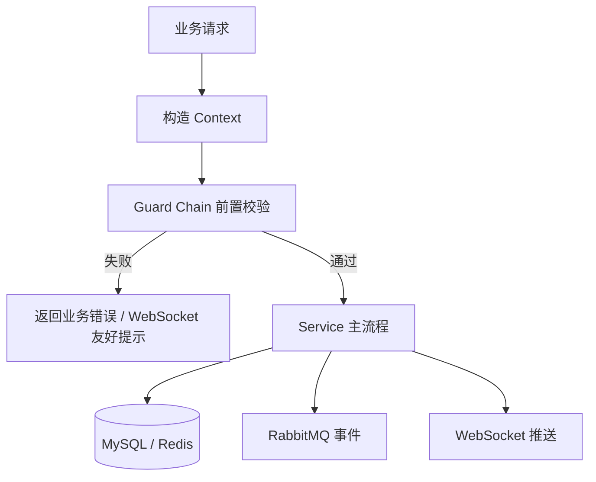

---

## 本地开发

### 启动顺序

```powershell
# 1. 中间件
cd nginx
docker compose -f docker-compose.dev.yaml up -d --build

# 2. 用户端
cd ..\forum-vue\front
npm install
npm run dev

# 3. 后端
cd ..\..\backend
mvn spring-boot:run

# 4. Python AI
cd ..\ai-server
python main.py
```

| 模块 | 默认地址 / 端口 |
|------|----------------|
| 用户端 | `http://localhost:5173` |
| 后端 | `http://localhost:10086` |
| AI 服务 | `http://localhost:5000` |
| MySQL | `localhost:33061` |
| Redis | `localhost:63790` |
| RabbitMQ AMQP | `localhost:56690` |
| RabbitMQ 管理台 | `localhost:25672` |
| PostgreSQL | `localhost:54320` |
| FFmpeg | `localhost:8099` |

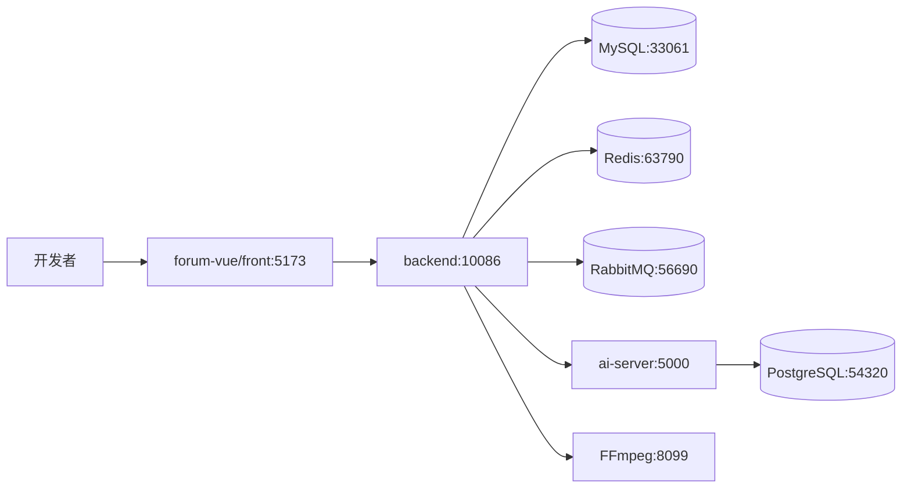

**IDEA 打开后端**：File → Open → 选 `backend` 文件夹或 `pom.xml`，Maven Reload，开启 Lombok Annotation Processors。

**五子棋本地调试**

- 游戏入口：用户端登录后访问 `/games`，再进入 `/games/gobang`
- WebSocket 入口：`/ws/game-center/lobby`、`/ws/games/gobang`、`/ws/games/gobang/rooms/{roomId}`
- 对局结果依赖 MySQL；在线、匹配与多实例房间事件依赖 Redis；异步结算事件依赖 RabbitMQ
- AI 对手依赖 `ai-server` 与 `DEEPSEEK_API_KEY`；Python 服务不可用时 Java 会使用本地规则兜底，但界面会展示兜底标识

**井字棋本地调试**

- 游戏入口：用户端登录后访问 `/games`，再进入 `/games/jinzi`
- WebSocket 入口：`/ws/game-center/lobby`、`/ws/games/jinzi`、`/ws/games/jinzi/rooms/{roomId}`
- 匹配门槛：论坛积分至少 3 分；真人胜局 ±3 分，AI 胜局 ±1 分，平局不结算
- 计时：2 分钟局时、20 秒步时；断线 30 秒内可重连，否则判负
- AI 对手约 15 秒无人匹配后触发；同样依赖 `ai-server` 与 `DEEPSEEK_API_KEY`，不可用时走本地 Minimax 兜底

### 本地密钥

```powershell
copy scripts\dev-secrets.ps1.example scripts\dev-secrets.ps1
. .\scripts\load-dev-env.ps1
```

真实 `.env`、`scripts/dev-secrets.ps1`、`ai-server/config.local.yaml` 不提交。数据库全量结构在 `backend/src/main/resources/sql/create.sql`，增量 SQL 放在 `backend/src/main/resources/sql/`。

### 快速验收

```powershell
cd backend
mvn clean test

cd ..\forum-vue\front
npm run build
```

---

## 生产部署

生产部署遵循“本机构建完整包，服务器只加载完整包”的原则，避免前端 `index.html` 与 `assets` 版本不一致。

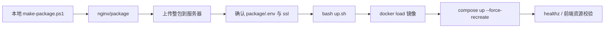

### 日常更新

```powershell
cd nginx
.\scripts\make-package.ps1
```

服务器：

```bash
cd ~/package
bash up.sh
curl -s http://127.0.0.1/healthz
./verify-frontend-dist.sh .
```

### 首次部署

```bash
cd ~/package
cp .env.example .env
nano .env
bash start.sh
```

`up.sh` 保留数据卷；`docker compose down -v` 会删除数据库数据，线上慎用。需要排查时优先执行 `bash collect-logs.sh` 收集日志包。

---

## 配置说明

以 `nginx/.env` 和服务器 `package/.env` 为准，真实值只来自环境变量或本地忽略文件。

| 类别 | 变量 |
|------|------|
| 安全 | `JWT_SECRET`、`PII_CRYPTO_SECRET`、`FORUM_MASCOT_INTERNAL_KEY`、`FORUM_AI_INTERNAL_KEY` |
| 数据 | `MYSQL_*`、`REDIS_PASSWORD`、`RABBITMQ_*`、`POSTGRES_*` |
| AI | `DASHSCOPE_API_KEY`、`DEEPSEEK_API_KEY`（须来自 [platform.deepseek.com](https://platform.deepseek.com)，**勿与 DashScope 混用**）、`HUANAPI_*`、`TAVILY_API_KEY`、`BAIDU_MAP_API_KEY` |
| OSS | `ALIYUN_ACCESS_KEY_ID`、`ALIYUN_ACCESS_KEY_SECRET`、`OSS_BUCKET_NAME`、`OSS_URL_PREFIX`、`OSS_ROOT_PREFIX` |
| OSS → ai-server | 同上 OSS 变量须注入 **forum-ai-server**（视频审核签名读私有桶） |
| 邮件 | `MAIL_USERNAME`、`MAIL_PASSWORD` |

五子棋 / 井字棋 AI 使用 DeepSeek：低水平对手走 `deepseek-v4-flash`，高水平对手走 `deepseek-v4-pro`；模型名称配置在 `ai-server/config.yaml` / `config.docker.yaml` 的 `deepseek.model_flash`、`deepseek.model_pro`。看板娘 MCP 内置 `tavily_search`、`get_current_datetime`、`map_*`，需要对应 API Key。

---

## 常见问题

### 1) 五子棋对局结束后还能发消息导致异常

结束后房间会清理内存状态，但前端还会停留 60 秒展示胜负和胜线。后端必须把这段窗口里的聊天、表情、落子、认输都拦截成友好提示：`当前对战已经结束，不能发送消息或表情包`。如果又出现堆栈，优先看 `GobangGuardChain` 中的房间存在、进行中和玩家动作准入校验。

### 2) 五子棋 WebSocket 已连接但棋盘不刷新

检查三层连接是否连对：大厅 `/ws/games/lobby`，游戏 `/ws/games/gobang`，房间 `/ws/games/gobang/rooms/{roomId}`。落子后不应该依赖 HTTP 刷新，前端应直接应用 `move_accepted` / `game_finished` 的 payload。

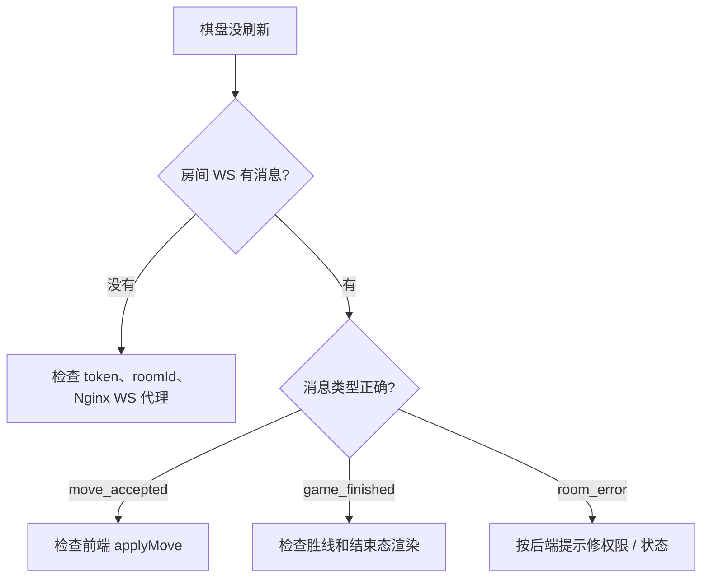

### 3) 井字棋 WebSocket 已连接但棋盘不刷新

检查游戏连接与房间连接是否连对：大厅 `/ws/game-center/lobby`，游戏 `/ws/games/jinzi`，房间 `/ws/games/jinzi/rooms/{roomId}`。落子后应直接应用 `move_accepted` / `game_finished` 的 payload，不要依赖 HTTP 轮询刷新。

### 4) AI 对手一直显示本地策略兜底

说明 Java 没拿到 Python / DeepSeek 的合法坐标。依次检查：`ai-server` 是否在 `5000` 端口；`FORUM_AI_INTERNAL_KEY` 是否一致；`DEEPSEEK_API_KEY` 是否有效；Python 返回坐标是否为空位。兜底不是错误，但如果 Python 已启动仍长期兜底，优先查 Python 日志里的 DeepSeek 调用失败原因。

### 5) 前端 403 / 白屏

通常是生产包没整体更新，导致 `index.html` 指向的 `assets` 不存在。不要只传单个 JS 文件；重新上传完整 `nginx/package`，服务器执行 `bash up.sh`，再跑 `./verify-frontend-dist.sh .`。

### 6) 审核一直显示异常

视频审核最常见是私有 OSS 导致 DashScope 无法拉取媒体，确认 ai-server 注入 OSS 变量并生成签名 URL。RabbitMQ 队列短暂 `NOT_FOUND` 多数是启动竞态，Java / Python 都起来后会恢复；持续存在时检查交换机和队列声明。

### 7) Redis / RabbitMQ 在游戏里分别负责什么

Redis 更适合短生命周期实时状态：大厅在线、游戏在线、匹配队列、房间快照、跨实例房间事件广播。RabbitMQ 更适合“必须最终处理”的事件：对局结束后异步结算、补偿任务、统计刷新和通知扩展。不要把实时棋盘权威状态只放进 MQ，棋盘最终裁决仍由 Java 房间服务完成。

### 8) 本地 RabbitMQ 端口对不上

开发 Compose 默认把 RabbitMQ AMQP 映射到 `56690`，而后端配置如果没有加载本地环境变量，可能仍按 `56720` 连接。启动后端前确认 `SPRING_RABBITMQ_PORT=56690`，或在本机显式启动与 `application.yml` 一致的 RabbitMQ 端口。

---

## 仓库结构

```text
luntan/
  backend/                 # Java 后端：API、WebSocket、积分、五子棋 / 井字棋、MQ
  ai-server/               # Python AI（审核 / 看板娘 / RAG）
  forum-vue/               # 用户端前端
  forum-vue-admin/         # 管理端前端
  nginx/                   # Compose、Nginx、FFmpeg、打包脚本
    scripts/
      make-package.ps1     # 一键打包
      build-all.ps1        # 构建前后端与镜像
      export-images.ps1    # 组装 package/
      verify-package.ps1   # 打包自检
      server-up.sh         # → package/up.sh
    ffmpeg/                # 视频压缩 / 审核抽帧
  scripts/
    dev-secrets.ps1.example
    load-dev-env.ps1       # 本地加载密钥到当前 PowerShell 会话
  luntan.code-workspace    # 多根工作区（可选）
```

**Git 忽略要点**：`.env`、`.codex/`、`nginx/package/`、`nginx/dist/`、`target/`、`node_modules/`、`ssl/*.pem`、`scripts/dev-secrets.ps1`、本地 `ai-server/config.local.yaml` 等，见根目录 `.gitignore`。
