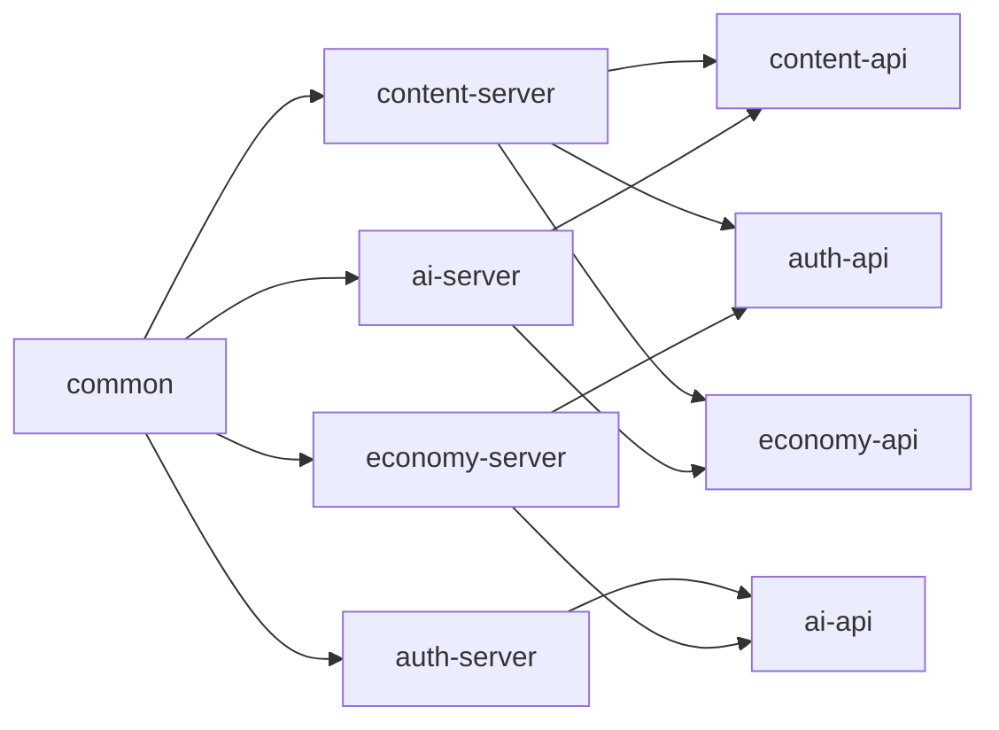

# 移除 platform 与接入 Nacos 配置中心计划

> 实施状态（2026-08-01）：`platform` 已从 Maven reactor、依赖管理与全部 server POM 移除；其业务代码已迁入所属服务，通用默认配置与验证码资源迁入 `common`，AI PostgreSQL 会话脚本迁入 `ai-server`。全量 15 模块 Maven 编译已通过。

## 1. 结论与目标

本计划确认移除 `platform` 模块。业务域保持两层结构：

- `xxx-api`：该域向其他 Java 服务提供的内部 HTTP 契约、请求 DTO、响应 VO 与错误语义。
- `xxx-server`：该域的 Controller、Service、Mapper、Entity、领域配置与启动入口。

服务之间不能共享 Entity、Mapper、Service 实现或业务 Converter。一个服务调用另一个服务时，只能显式依赖对方的 `xxx-api`，并通过 Nacos 发现服务实例。

`common` 可以保留，但必须是无业务归属的极薄基础库，且不得依赖任何 `xxx-api` 或 `xxx-server`。

图中的箭头是 Maven 编译依赖，而非所有服务都必须相互调用。每一次新增箭头都必须能对应到一个已有的跨域业务调用。

## 2. 已确认范围台账

| 状态 | 项目 |
| --- | --- |
| P0 | 删除 `platform` 聚合模块，改为服务对所需 `xxx-api` 的直接依赖。 |
| P0 | 将跨域调用收口为“消费方本地客户端 + 提供方 API 契约”。 |
| P0 | 将 Nacos 从仅服务发现扩展为服务发现和配置中心。 |
| 延后 | Nacos 服务端认证、Nacos RBAC、内部 HTTP 服务身份认证。 |
| 不在本轮 | Sentinel、Seata、分布式事务、替换 RabbitMQ、Feign 全量迁移为 HTTP Interface。 |
| 不在本轮 | 新业务能力、新表、新字段、改变既有业务状态流转。 |

## 3. 当前代码事实

1. 六个业务域均已存在 `api + server`：`auth`、`content`、`im`、`game`、`economy`、`ai`。
2. 根 POM 与所有 `server` POM 已不再声明 `platform`；各服务改为直接依赖其实际使用的 `xxx-api` 与 Spring Boot Starter。
3. 用户 Entity、用户服务与内部转换器归属 `auth-server`；消费方分别保有认证用户 Feign Client。IM 群聊会员额度通过 `economy-api` 的 VIP 快照读取，不再经用户实体跨域传递。
4. 默认配置、验证码图片分别归属 `common`，AI PostgreSQL 会话脚本归属 `ai-server`；它们不再由业务聚合模块承载。
5. 已接入 Nacos Discovery 与 Config，并通过 `spring.config.import` 加载共享及服务级 Data ID；Nacos 服务端认证和内部 HTTP 身份认证仍按范围延后。

## 4. 最终模块规则

### 4.1 `xxx-api`

- 允许：Spring MVC 路由注解、参数校验注解、内部请求 DTO、内部响应 VO、API 接口。
- 禁止：`@FeignClient`、Entity、Mapper、Service 实现、数据库和中间件配置、其他域的 API 依赖。
- API 路径继续使用 `/xxx/internal/**`，只描述已存在的跨域能力；不得借迁移之名增加业务流程。

### 4.2 `xxx-server`

- 直接依赖：`common`、本域 `xxx-api`、实际调用的其他域 `yyy-api`，以及本服务实际需要的 Spring Boot Starter。
- Controller 实现本域 API，但只进行参数接收与 Service 调用；不得直接调用 Mapper。
- 消费方在自身代码中定义客户端，例如 `content-server` 内的 `UserInternalFeignClient extends UserInternalApi`。
- 远程调用的异常处理、降级语义和本地业务组装留在消费方，不放回全局模块。

### 4.3 `common`

允许长期保留的内容仅限于：统一响应、基础异常、无业务含义的工具、分页与游标工具、JWT 编解码等纯技术协议。

必须迁出的内容包括：

- 任一领域 Entity、Mapper、领域 DTO/VO、领域 Converter。
- `cloud/feign/**` 与 `service/impl/remote/**`。
- 账号、内容、积分、成长、游戏、AI、IM 的领域 Service 与业务常量/枚举。
- 依赖特定业务路径或领域 Service 的拦截器、配置和任务。

中间件配置按实际消费者留在对应服务；例如内容审核消费者留在 `content-server`，游戏 WebSocket 留在 `game-server`。只有完全不含领域条件、并被多个服务实际复用的配置，才允许再评估是否保留在 `common`。

## 5. 已识别的直接 API 依赖

以下是当前 Feign 使用点所需的最小依赖集合；后续静态检查发现的直接 Service/Entity 跨域访问也必须按同一规则转换。

| 消费服务 | 提供 API | 当前用途 |
| --- | --- | --- |
| `auth-server` | `ai-api`、`content-api`、`economy-api` | 看板娘偏好、默认收藏夹、成长/积分等既有副作用。 |
| `content-server` | `auth-api`、`economy-api`、`im-api` | 用户/关注查询、表情权益、系统消息。 |
| `economy-server` | `auth-api`、`ai-api` | 用户存在性与会员面板中的 AI 用量。 |
| `ai-server` | `content-api`、`economy-api` | 帖子候选、文件转存、VIP 与积分能力。 |
| `im-server` | `auth-api` | 用户、成员关系与发信前校验。 |
| `game-server` | `auth-api`、`economy-api` | 用户身份与既有积分结算。 |

表中的依赖以源码引用为依据；实际迁移前要逐项确认调用是否仍被运行链路使用。无调用的旧远程适配直接删除，不为它保留 API。

## 6. 分阶段实施

### 阶段 A：建立可迁移边界

1. 为每个 `server` 补齐 `common`、本域 API 和实际远端 API 的直接 Maven 依赖。
2. 在各消费服务创建本地 `client` 或 `remote` 包，迁入对应 Feign Client 与远程适配。
3. 不改变路径、请求字段、返回字段和业务规则，只改变 Java 依赖位置。
4. 每迁一个消费服务，编译该服务及其 API 依赖，确认不再经由 `platform` 获得类型。

### 阶段 B：消除实现泄漏

1. 从使用最多的 `auth-api` 开始，将跨域的 `UserService`、用户 Entity、用户 Converter 引用替换为 `UserInternalApi` 的 VO 与客户端。
2. 依次处理 `economy-api`、`content-api`、`im-api`、`ai-api`、`game-api`。
3. 服务提供方的内部 Controller 必须委托 Service；本轮顺带修正当前内部 Controller 直接访问 Mapper 的情况。
4. 每个 API 只增加现有跨域调用已经需要的方法；新增契约必须记录调用方、提供方、读写性质和失败语义。

### 阶段 C：迁回领域代码并删除 platform

1. 将 `platform/entity`、领域 Service、领域 Converter、领域 Controller 支撑代码迁回所属 `xxx-server`。
2. 将中间件配置、MQ Consumer/Producer、WebSocket、定时任务迁回唯一业务所有者。
3. 删除未被引用的适配与代码后，移除根 POM 的 `platform` module 和 `dependencyManagement` 条目。
4. 以全仓库搜索确认不存在 `artifactId>platform`、`org.pluchon.forum.cloud.feign`、跨域 Entity/Service 导入，再删除目录。

实施结果：已完成。根 Maven reactor 已在无 `platform` 模块的条件下完成全量编译；源码树中的平台业务文件均已迁走或删除。

### 阶段 D：接入 Nacos 配置中心

这一步独立于 `platform` 删除，安排在阶段 A 的直接依赖已经稳定后执行，避免同时排查依赖错误与配置加载错误。

1. 为需读取 Nacos 配置的应用加入 `spring-cloud-starter-alibaba-nacos-config`。
2. 保留每个服务本地 `application.yml` 的最小启动信息：`spring.application.name`、Nacos 地址/凭据的环境变量引用与 `spring.config.import`。
3. 用 Namespace 隔离 `dev`、`test`、`prod`；同一环境使用一个固定 Group（建议 `FORUM`）。服务名用于发现，Data ID 用于配置归属。
4. 建立 `forum-common.yml` 与 `forum-{service}.yml` 两层 Data ID；服务配置覆盖共享默认值。密钥仍只由部署环境变量或受控配置来源提供，不写入 Git。
5. 生产配置使用必需的 `nacos:` 导入；开发环境可按启动策略决定是否使用 `optional:nacos:`。第一阶段不依赖动态刷新业务配置，配置变更通过重启受控生效。
6. Spring Cloud Alibaba 2025.x 使用 `spring.config.import`，不再使用 `bootstrap.yml`。Nacos Config/Discovery HealthIndicator 默认关闭；是否启用 Actuator 探针在部署验证阶段另行决定。

官方依据：

- [Spring Cloud Alibaba Nacos 快速开始](https://sca.aliyun.com/en/docs/2025.x/user-guide/nacos/quick-start/)
- [Spring Cloud Alibaba Nacos 高级配置](https://sca.aliyun.com/en/docs/2025.x/user-guide/nacos/advanced-guide/)
- [Nacos Namespace 与资源隔离概览](https://www.nacos.io/en/docs/latest/overview/)

## 7. 验收标准

### platform 删除验收

- 根 POM 和所有 server POM 不再声明 `platform`。
- Git 源码树不再包含 `platform` 模块，且没有平台 Feign、跨域 Entity 或跨域 Service 实现导入残留。
- 每个服务只依赖其实际使用的 `xxx-api`；任意 `xxx-api` 不依赖另一个业务 API 或 server。
- 每个内部 Controller 仅委托本域 Service；所有写操作仍保持事务、授权和原有状态流转。
- 已验证：无 `platform` 模块的根 Maven reactor 编译通过。待运行时验证：逐个启动服务，验证 Nacos 注册、配置加载与至少一条跨服务调用。

### Nacos 配置中心验收

- 每个服务在目标 Namespace 中注册为预期服务名。
- 共享 Data ID 与服务 Data ID 的优先级符合预期，环境变量未被配置中心意外覆盖。
- Nacos 不可用时，开发和生产按各自预期的启动策略表现；不能用“注册成功”替代配置加载验证。
- 配置中心内不提交或输出 JWT、数据库密码、Nacos token、验证码或其他密钥。

## 8. 当前未决与执行约束

- Nacos 认证与内部接口服务身份认证已明确延后，本计划不擅自加入。
- 迁移中若发现现有跨域调用无法由已有 API 表达，将先列出最小新增契约及调用证据，等待确认后再增加接口；不猜测业务规则。
- 本计划涉及多模块 POM 与大量 Java 文件。每个阶段开始前创建 Git checkpoint；每阶段结束后进行 Maven 编译与针对性运行验证。
